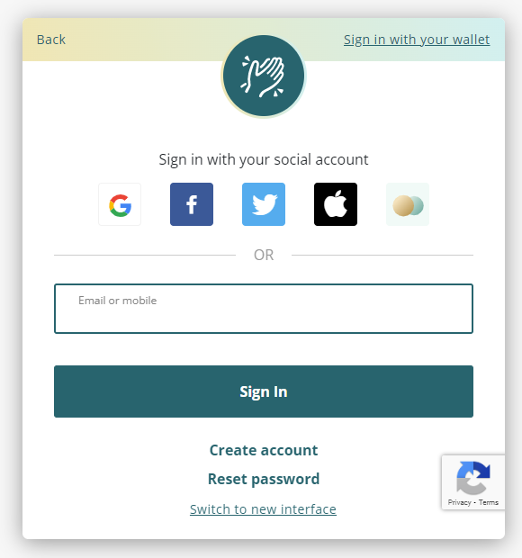
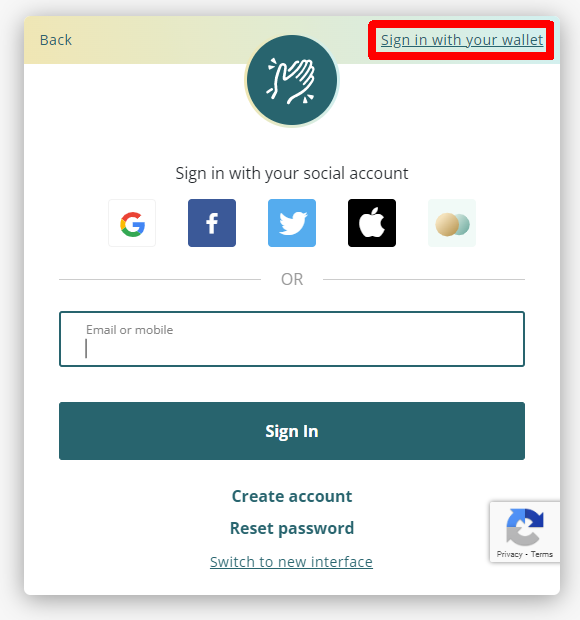
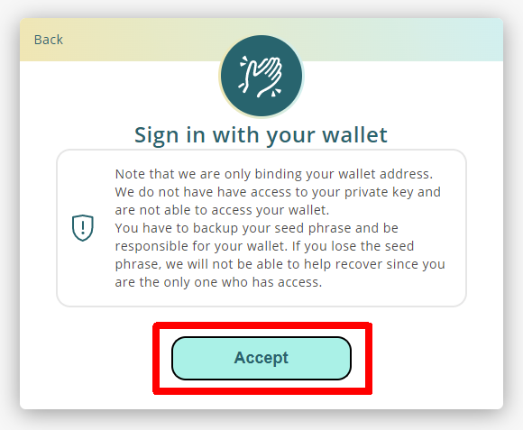
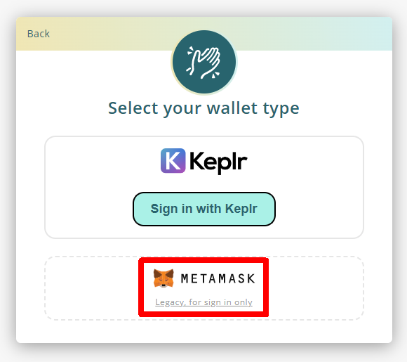

# Upgrade LikeCoin ERC-20 to LikeCoin chain

LikeCoin has been migrated from the ERC-20 to the Cosmos Ecosystem's [LikeCoin chain](../../governance/likecoin-chain.md), and users no longer need to use the MetaMask wallet to log in. Instead, they should use the [Liker Land app](../../../user-guide/liker-land/download.md) or [Keplr](../../../developer/likecoin-chain-api/sample/cosmjs/keplr.md). This document is only for legacy users who created a Liker ID with MetaMask but did not complete the Liker ID migration process.

Please note that all upgrade procedures must be done on a desktop computer and are not supported on mobile devices.

## Liker ID bond with MetaMask and Social Accounts

For those who fulfill the following conditions:

1. Can still log in to the MetaMask wallet bonded with the Liker ID
2. Have the Liker ID bonded with MetaMask and at least one social account (Google/Facebook/Twitter/Matters) besides MetaMask
3. Have ETH on MetaMask as Gas Fee

Please follow the steps below to upgrade from LikeCoin ERC-20 to the LikeCoin chain:

### Step 1: Log in to MetaMask

Log in to the MetaMask wallet bonded with your Liker ID. If you have changed your computer, please use your [Secret Recovery Phrase](https://community.metamask.io/t/what-is-a-secret-recovery-phrase-and-how-to-keep-your-crypto-wallet-secure/3440) or private key to restore your MetaMask wallet.


Note that if you cannot manage the MetaMask wallet bonded with your Liker ID, you will not be able to upgrade or access your LikeCoin in your wallet.

Also, using a MetaMask wallet that is not bonded with the Liker ID will not allow you to upgrade, meaning you cannot use the same Liker ID on the new LikeCoin chain.

Keeping the Secret Recovery Phrase or private key is the user's responsibility, as no one can reset your MetaMask wallet except for yourself.


### Step 2: Visit like.co/in 

Your task is to upgrade the LikeCoin in your MetaMask wallet to the LikeCoin chain. Therefore, the first step is to make sure that you have the MetaMask wallet with the correct address installed in your Chrome browser.

Go to [https://like.co/in](https://like.co/in) and click "Switch to legacy interface".

<figure><figcaption>
Go to https://like.co/in and click "Switch to legacy interface"
</figcaption></figure>

Log in to Chrome using your social account (Google/Facebook/Twitter/Matters).

<figure><figcaption>
Log in to Chrome using your social account (Google/Facebook/Twitter/Matters)
</figcaption></figure>

The system will then display the screen below (likely in English). Click "Migrate Now".

### Step 3.1: Read the introduction 

The system will take you to the migration page and guide you through upgrading your LikeCoin step by step. After reading the background introduction on the screen, click "Confirm".

### Step 3.2: Sign

The system will perform a transaction from your MetaMask wallet and require your signature for authorization. Click "Sign".

After clicking "Sign," the following MetaMask screens will be shown. Click "Connect" and then "Sign".

### Step 3.3: Wait for the Upgrading Process to Finish 

In this step, the system will first transfer your LikeCoin ERC-20 to a smart contract and then deposit LikeCoin into your new wallet on the LikeCoin chain. The process may take a few minutes, so please be patient. During the process, ETH will be deducted as Gas Fee.

### Step 4: Check your LikeCoin balance 

After the migration is completed, you can check your LikeCoin balance at [https://like.co/in](https://like.co/in).

### Step 5: Download the Liker Land app 

Please visit the Google Play Store or Apple App Store to [download the Liker Land app](../../../user-guide/liker-land/download.md). Log in using your social account and check your balance on the app. You can also perform various LikeCoin operations, such as transfers and delegation, on the app.

## Liker ID Bonded with MetaMask but Not with Social Accounts

If you log in to Liker ID using only the MetaMask wallet, you can still follow the instructions above.

Go to [https://like.co/in](https://like.co/in), click "Switch to legacy interface".

<figure><figcaption>
Go to https://like.co/in, click "Switch to legacy interface"
</figcaption></figure>

Then choose "Sign in with your wallet" on the upper right-hand corner of the login screen. Choose "MetaMask," and you will be asked to set up a new password during the process.

<figure><figcaption>
Choose "Sign in with your wallet" and choose "MetaMask,"
</figcaption></figure>

<figure><figcaption>
Click "Accept"
</figcaption></figure>

<figure><figcaption>
Click MetaMask
</figcaption></figure>

## If You Purchased Your LikeCoin on a Crypto Exchange

Transfer your LikeCoin to a MetaMask wallet, and then go to [https://migration.like.co/](https://migration.like.co/). Fill in the Cosmos wallet address of the Liker ID or Keplr wallet and facilitate the upgrade.

## If Your LikeCoin is Stored in a Hardware Wallet

Connect the hardware wallet with MetaMask, go to [https://migration.like.co/](https://migration.like.co/), and fill in the Cosmos wallet address of the Liker ID or Keplr wallet. Then, facilitate the upgrade.


* Do not use and directly input the crypto exchange Cosmos wallet address into [https://migration.like.co/](https://migration.like.co/). If that particular exchange requires Tag/Memo or other operations, you will not be able to deposit your LikeCoin. Therefore, please migrate the LikeCoin to your own wallet before performing other trades or operations.
* **Do not directly send your LikeCoin to the smart contract address.** You really have to use [https://migration.like.co/](https://migration.like.co/) to facilitate migration.
* Wrongly operating the LikeCoin ERC-20 migration will result in irreversible failure.

