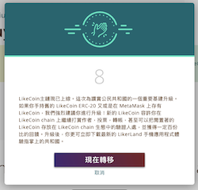
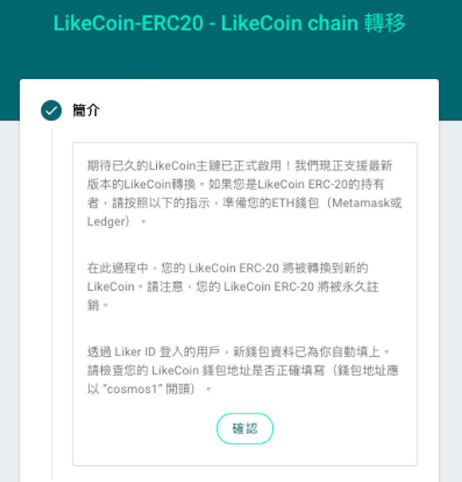
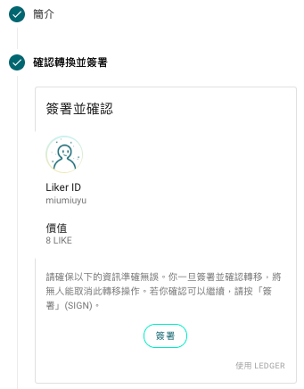
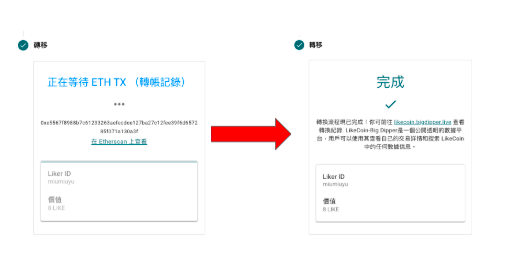
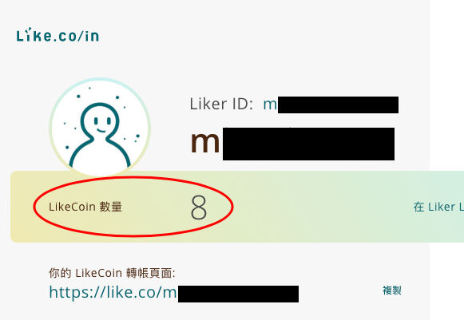
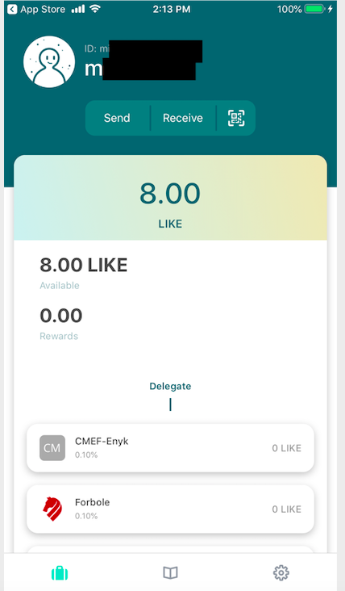
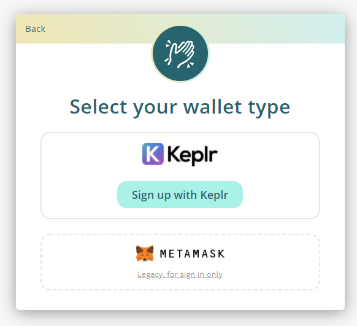

# Upgrade LikeCoin ERC-20 to LikeCoin chain

LikeCoin has been migrated to the Cosmos Hub ecosystem [LikeCoin chain](../../governance/likecoin-chain.md) from ERC-20 and users no longer need MetaMask wallet to login but should use [Liker Land app](https://liker.land/getapp) or Keplr instead.  This document is for legacy users who created Liker ID with MetaMask and did not complete the Liker ID migration process only.

Please note all upgrade procedures has to be done on desktop computer, not supporting mobile.

## Liker ID bond with MetaMask and Social Accounts

For those who fulfil the below conditions:

1. Can still login the MetaMask wallet bond with the Liker ID
2. Your Liker ID bond with MetaMask and at least one social accounts ( Google/Facebook/Twitter/Matters ) besides MetaMask
3. Have ETH on MetaMask as Gas Fee

Please follow the steps and upgrade from LikeCoin ERC-20 to LikeCoin chain.

### Step 1: Login MetaMask

Login the MetaMask wallet that bonds with your Liker ID, if you have change your computer, please use your [Secret Recovery Phrase](https://community.metamask.io/t/what-is-a-secret-recovery-phrase-and-how-to-keep-your-crypto-wallet-secure/3440) or private key to establish your MetaMask wallet again.


Please note if you cannot manage the MetaMask wallet bond with your Liker, you are not able to upgrade and access the LikeCoin in your wallet.

Moreover, using the MetaMask wallet that does not bond with the Liker ID cannot upgrade as well, which means, you cannot use the same Liker ID in the new LikeCoin chain.

Keep the Secret Recovery Phrase or private key is the responsibility of the user, no one can reset your MetaMask wallet unless yourself.


### Step 2: Visit Like.co/in 

Your task is to upgrade the LikeCoin in your MetaMask wallet to LikeCoin chain, so the first step is to make sure that you have the MetaMask with the correct wallet address installed in your Chrome browser.

Login [Liker Land](https://liker.land/) by Chrome with your social account ( Google / Facebook / Twitter / Matters ) and go to [https://like.co/in/](https://like.co/in/).  The system will pop up the screen below ( probably in English ).

### Step 3.1: Read the introduction 

The system will lead you to the migration page and help you upgrade your LikeCoin step by step.  After reading the background introduction in the below screen, click "Confirm".

### Step 3.2: Sign

The system is going to perform a transaction from your MetaMask, and need your signature for authorization. Click "Sign".

After clicking "Sign", the following MetaMask screens will be shown.  Click "Connect" and then "Sign".

### Step 3.3: Waiting for the upgrading process to be finished 

In this step, the system will firstly transfer your LikeCoin ERC-20 to a smart contract, and then deposit LikeCoin to your new wallet on the LikeCoin chain. The process needs a few minutes, please be patient. During the process, ETH as Gas Fee will be deducted.

### Step 4: Check your LikeCoin balance 

You can check your LikeCoin balance in [https://like.co/in](https://like.co/in) after migration completion.

### Step 5: Download the Liker Land app 

Please visit Google Play store or Apple App Store to [download the Liker Land app](https://liker.land/getapp). Login by your social account and check your balance on the app. You may also perform various operations of LikeCoin such as transfer and delegation there.

## Liker ID bond with MetaMask but doesn't bond with Social Accounts

If you login Liker ID by MetaMask wallet only, you can still follow the instruction above except that you should choose "Sign in with your wallet" on the upper right hand corner of the login screen, then choose "MetaMask" and you will be asked to set up a new password during the process.

## Upgrade without a Liker ID

Please [register a Liker ID by general method ( with authcore )](../../../user-guide/liker-id/register/) or a [Keplr wallet](../../../user-guide/liker-id/register-with-keplr.md) in order to obtain a Cosmos wallet address.

You may want to check this out for checking the Cosmos wallet address on Big Dipper:


[big-dipper.md](../big-dipper.md)


### If you purchased your LikeCoin in a crypto exchange

Transfer your LikeCoin to a MetaMask wallet, then go to [https://migration.like.co/](https://migration.like.co/) and fill in the Cosmos wallet address of the Liker ID or Keplr wallet and facilitate the upgrade.

### If your LikeCoin is stored in a hardware wallet

Connect the hardware wallet with MetaMask, go to [https://migration.like.co/](https://migration.like.co/) and fill in the Cosmos wallet address of the Liker ID or Keplr wallet and facilitate the upgrade.


Do not use and directly input the crypto exchange Cosmos wallet address into [https://migration.like.co/](https://migration.like.co/). If that particular exchange required Tag/Memo or other operations, you will not be able to deposit your LikeCoin. Therefore please migratie the LikeCoin to your own wallet before performing other trades or operations.

**Do not directly send your LikeCoin to the smart contract address.** You really have to use   [https://migration.like.co/](https://migration.like.co/) to facilitate migration.

Wrongly operated the LikeCoin ERC-20 migration will result in irreversible failure**.**

