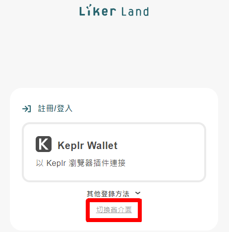

# 升級 LikeCoin ERC-20 到 LikeCoin chain

LikeCoin 經已從 ERC-20 轉移到以 Cosmos 生態系為基礎 [LikeCoin chain](../../governance/likecoin-chain.md)，用戶再不能使用 MetaMask 錢包登入而需要使用 [Keplr](../keplr/) 或 [Liker Land 手機應用程式](../../../user-guide/liker-land/download.md)。這篇文章是給以往使用 MetaMask 而並未完成轉移 Liker ID 的用戶參看。

留意所有升級步驟必須使用桌面電腦進行，不支援手機升級。

## Liker ID 已綁定 MetaMask 及社交帳號

若你乎合以下條件：

1. 仍然能登入與 Liker ID 綁定的 MetaMask 錢包
2. Liker ID 已同時綁定 MetaMask 及任何一個社交帳號 ( Google/Facebook/Twitter/Matters )
3. 在 MetaMask 上已有足夠的 ETH 作為礦工費 ( Gas Fee )

請按照以下步驟由 LikeCoin ERC-20 升級至全新的 LikeCoin chain。

### 步驟 1：登入 MetaMask

使用 MetaMask 登入與你 Liker ID 綁定的 MetaMask 錢包。假如你更換了電腦，請以 [Secret Recovery Phrase](https://community.metamask.io/t/what-is-a-secret-recovery-phrase-and-how-to-keep-your-crypto-wallet-secure/3440) 或私鑰重新導入錢包。


留意如果你經已不能操作與 Liker ID 綁定的 MetaMask 錢包將不能升級，也不能取用 MetaMask 錢包內的 LikeCoin。

此外，使用與 Liker ID 無關的 MetaMask 也不能進行升級操作，亦代表不能於 LikeCoin chain 重新使用該 Liker ID。

保管助記詞 ( Secret Recovery Phrase ) 或私鑰是用戶的個人責任，請留意任何人也不能為你重設你的 MetaMask 錢包。


### 步驟 2：訪問 like.co/in 

由於現在的目的是升級 Liker ID 綁定的 MetaMask 錢包中的 LikeCoin，所以你必須使用能操作該 MetaMask 錢包地址的電腦來執行以下步驟。

到 [https://like.co/in/](https://like.co/in/) 點「切換舊介面」或「Switch to legacy interface」。

<figure><figcaption>
到 https://like.co/in/ 點「切換舊介面」
</figcaption></figure>

以你常用的社交帳戶 ( Google / Facebook / Twitter / Matters ) 登入。

<figure><figcaption>
以 Google / Facebook / Twitter / Matters 登入
</figcaption></figure>

系統會彈出以下視窗。點「現在轉移」。

### 步驟 3.1：簡介原理

系統會帶你到另一個專門處理 LikeCoin 升級的頁面。

升級過程其實是把目前你在 MetaMask 上的 LikeCoin ERC-20 轉移到 LikeCoin chain 上。系統會助你簡易完成這個步驟。

第一個步驟是過程簡介，若有興趣明白更多的不妨一讀，然後請點擊「確認」。

### 步驟 3.2：簽署 

由於要在你的電子錢包轉帳，需要你的「簽署」。請點擊「簽署」。

點擊簽署後，MetaMask 會彈出以下的畫面。請點擊 "Connect" 及 "Sign"。

### 步驟 3.3：等候轉帳完成

這裡系統會先從你的 MetaMask 轉帳 LikeCoin ERC-20 到智能合約，再把新 LikeCoin 存款到你的 LikeCoin chain 錢包中。

過程一般需要幾分鐘，請耐心等候。轉帳期間會扣除 ETH 作為操作的 Gas Fee。

### 步驟 4：檢查 LikeCoin 金額 

&#x20;升級完成後，你可到 [https://like.co/in](https://like.co/in) 檢查你的 LikeCoin 餘額。\

### 步驟 5：下載 Liker Land 手機應用程式 

你可以到 Google Play store 或 Apple App store，[下載 Liker Land 手機應用程式](../../../user-guide/liker-land/download.md)，以你的社交帳號登入，便可在 app 中查閱你的 LikeCoin 餘額了。

## Liker ID 只綁定 MetaMask 但沒有綁定社交帳號

若你過往只以 MetaMask 錢包登入，從未綁定過其他的社交帳號登入方法的話，也可參照以上步驟：

到 [https://like.co/in/](https://like.co/in/) 點「切換舊介面」或「Switch to legacy interface」。

<figure><figcaption>
到 https://like.co/in/ 點「切換舊介面」
</figcaption></figure>

在登入頁面的右上角選擇「以錢包登入」後再選「MetaMask」。過程中，系統會要求你設定一組密碼。

<figure><figcaption>
選擇「以錢包登入」後再選「MetaMask」
</figcaption></figure>

<figure><figcaption>
點「接受」
</figcaption></figure>

<figure><figcaption>
點 MetaMask
</figcaption></figure>

## 假設你的 LikeCoin ERC-20 是從交易所中購買

請先將那些 LikeCoin 轉移到一個 MetaMask 錢包，接下來到 [https://migration.like.co/](https://migration.like.co/) 輸入 Cosmos 錢包地址，即可進行升級。

## 假如你的 LikeCoin ERC-20 儲存於硬件錢包

請直接將它與 MetaMask 連接，再以 [https://migration.like.co/](https://migration.like.co/) 輸入 Cosmos 錢包地址進行升級。


使用 [https://migration.like.co/](https://migration.like.co/) 升級時請不要直接輸入交易所的 Cosmos 錢包地址，假如某些交易所需要輸入 Tag/Memo 才能存幣，這樣會導致損失並有機會讓你不能成功存入你的 LikeCoin。請先將 LikeCoin 轉入自己的 Cosmos 錢包地址後才進行其他交易或轉換。

**也不要直接將幣倒進相關的 Smart Contract 地址。**你必須使用 [https://migration.like.co/](upgrading-likecoin-erc20-to-likecoin-chain.md#liker-land) 進行升級。

錯誤的 LikeCoin ERC-20 升級操作將無法挽回。

