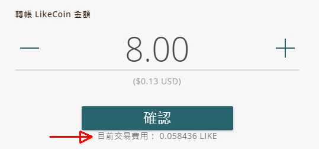

# 手續費

自2021年3月9日起，[LikeCoin chain](https://www.mintscan.io/likecoin) 秉承 [Cosmos Hub](https://hub.cosmos.network/) 疊代更新同步調整 Gas 參數與 Cosmos Hub 其他項目看齊。Gas 用於表達每項動作和交易對區塊所造成的壓力，亦是運行和讀寫內容到區塊鏈所需要花費的勞動力的表達方式。不單止是 Cosmos Hub，其他區塊鏈平台如以太坊 ( Ethereum ) 亦使用 Gas 作為計算單位。

## 手續費的重要性

LikeCoin chain 按照用戶執行不同類型的動作和交易 ( transaction – tx ) 所需要的程式運算步驟而衍生的 Gas 收取 Gas Fee，又可稱為 Transaction Fee 或手續費作為系統運作資源。假設毋須收取手續費而導致有人使用程式碼產生大量動作和交易佔據擠塞網絡，將嚴重影響 LikeCoin chain 的運作甚至造成惡意的無限迴圈 ( hostile infinite loops )，是以手續費能幫助提升 LikeCoin chain 的安全性。

## 手續費的估算方式

手續費是按照執行每項動作和交易估算所需的 Gas 而計算。由於不同動作和交易進行的時候區塊鏈網絡環境都有所不同，以下為估算的手續費數值：

* [轉帳 ( LIKE pay )](like-pay.md)：約 9 LIKE
* [委託](../stake/)：約 8 LIKE
* [取回委託](../stake/undelegation-of-likecoin/)：約 8 LIKE&#x20;
* [轉移委託](../stake/redelegation-of-likecoin/)：約 6 LIKE
* [領取收益](../stake/delegation-of-likecoin/#bu-zhou-san-ling-qu-shou-yi-tang-zhu-zuan-hui-bao-ba)： 約 10 LIKE

在 Liker Land 網頁或手機應用程式錢包確認轉帳、委託、取回委託、轉移委託或領取收益前都會顯示「詳細資料」，可點擊查看手續費的估算數值。

## 請在錢包留下手續費


建議錢包時常預留 2 至 10 LikeCoin 作手續費之用。假如錢包內的 LikeCoin 不足以支付手續費而導致操作失敗，嘗試過帳時已使用的手續費並不會退還。


因為你可能會在一些邊緣情況因為不夠錢支付手續費導致無法執行指令，例如：

* 無法把錢包中所有 LikeCoin 轉出，因為最少要留下少量 LIKE 支付手續費。如若錢包中只有 1 LIKE，最高只可轉帳約 0.94 LIKE 左右。
* 全數 LikeCoin 進行了委託後，無法領回，因為要留下少量 LIKE 支付委託操作的手續費。同樣道理，也無法把錢包中全數 LikeCoin 委託。
* 領取收益時必須確保錢包中有足夠手續費。

## 手續費付給誰人？

LikeCoin chain 的驗證人負責 7x24 營運伺服器群以核實所有 Likers 的資料記錄，包括代幣轉賬、內容發佈、投票動作等。他們幫忙記帳的回報來自通脹 / 增發 ( inflation )，而設定節點伺服器時可同時設定 min-gas-price 參數，決定處理每項動作和交易的最低要求。委託人委託 LikeCoin 予驗證人能獲得回報，因為他們也都在幫忙記帳。驗證人及委託人的回報被稱為區塊獎勵 ( Block Reward )，來自扣除了社群基金稅款後該區塊產生的所有手續費及通脹 / 增發。驗證人所佔區塊獎勵的份額取決於他所設定的佣金比率 ( Commission )。所以每一個 LikeCoin chain 使用者所付出的手續費最終將會按比例歸入各持份者的錢包及社群基金，而並不是由 Liker Land team 收取款項。

## 手續費的詳盡計算方式

> [談談轉帳 LikeCoin 的 gas 費用](https://matters.news/@edmond/%E8%AB%87%E8%AB%87%E8%BD%89%E5%B8%B3-like-coin-%E7%9A%84-gas-%E8%B2%BB%E7%94%A8-bafyreiaj5bbeu72rlt3bh5ukvaghzij6xhchswtckeza7kbzcqwbsuqqze)
