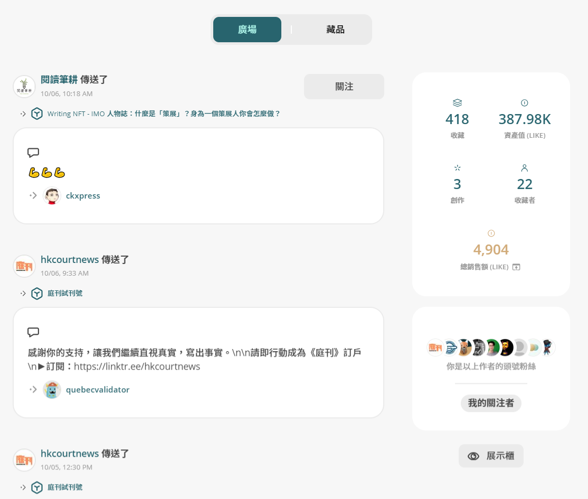

# 個人主頁

## Liker Land 網頁版

登入 Liker Land 後用戶可於[個人主頁](https://liker.land/zh-Hant/feed?view=town)使用以下功能：

### 廣場

在[廣場](https://liker.land/zh-Hant/feed?view=town)中，所有你關注的用戶動態都一目了然，發現新的同好和作品。你也可以從朋友的閱讀清單中，發掘更多你感到興趣的內容。

<figure><figcaption>
廣場
</figcaption></figure>

#### 更多詳情

[內容愛好者的廣場 – Liker Land 新功能](https://blog.like.co/zh/%E5%85%A7%E5%AE%B9%E6%84%9B%E5%A5%BD%E8%80%85%E7%9A%84%E5%BB%A3%E5%A0%B4-liker-land-%E6%96%B0%E5%8A%9F%E8%83%BD/)

### 藏品

[藏品](https://liker.land/zh-Hant/feed?view=collectibles\&tab=collected)列出用戶擁有的 NFT 收藏及創作。

<figure><figcaption>
藏品
</figcaption></figure>

### 整體數據

可查看個人的 NFT 的收藏、資產值 (LIKE)、創作數量及收藏者數量。點總銷售額 (LIKE) 可查看銷售收入、二手銷售及分潤。

<figure><figcaption>
整體數據
</figcaption></figure>

<figure><figcaption>
在我的書架點總銷售額 (LIKE) 可查看 NFT 的銷售收入、二手銷售及分潤
</figcaption></figure>

<figure><figcaption>
分潤實例
</figcaption></figure>

### 頭號粉絲及我的關注者

查看自己是誰人的頭號粉絲。點「我的關注者」可查看誰人正在關注自己。

<figure><figcaption>
頭號粉絲及我的關注者
</figcaption></figure>

查看我的關注者後，可點「匯出正在關注我的名單」匯出關注者清單。

<figure><figcaption>
點「匯出正在關注我的名單」匯出關注者清單
</figcaption></figure>

### 展示櫃

點展示櫃直接連結至個人公開的 [NFT 展示櫃](nft-portfolio.md)。

<figure><figcaption>
展示櫃
</figcaption></figure>

## 精選及隱藏 NFT

用戶可以透過精選或隱藏 NFT 項目（點右上角的星星進行）以調整自己的展示櫃。精選 NFT 將於版面置頂，而隱藏 NFT 將不會公開展示。

<figure><figcaption>
精選及隱藏 Writing NFT，點一下精選 NFT，再點一下即可隱藏
</figcaption></figure>

## Liker Land 手機應用程式及手機瀏覽器

登入 [Liker Land 手機應用程式](../../../user-guide/liker-land/download.md)或在手機瀏覽器登入 Liker Land 後點堆疊圖案再點「我的書架」查看廣場、藏品及整體數據等資訊。

<figure><figcaption>
登入 Liker Land 手機應用程式或在手機瀏覽器登入 Liker Land 後點堆疊圖案再點「我的書架」
</figcaption></figure>
