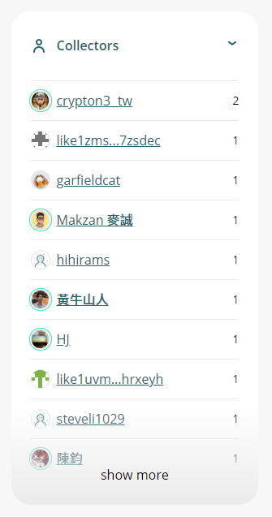

# NFT Portfolio

Besides collecting via NFT Widget, readers can also collect Writing NFT from the writer’s **NFT Portfolio** page ( Format https://liker.land/\[WalletAddress] ). Writers and Collectors can share the links of their collection by any channels.

<figure><figcaption></figcaption></figure>

## List by order

User can now view any NFT Portfolio by applying different sorting algorithm, choices:

* by time
* by price
* by owned quantity

<figure><figcaption></figcaption></figure>

## Showing collector’s avator

To better illustrate the relationship between creators and supporters, Liker Land display the avator of the collectors in the NFT collection page.

<figure><figcaption></figcaption></figure>
