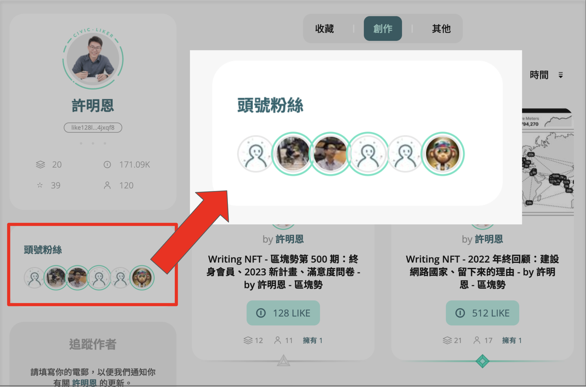
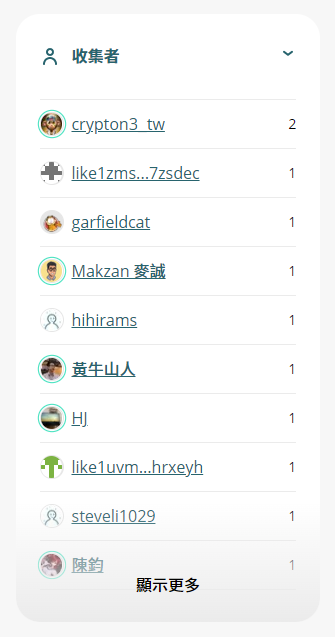

# NFT 展示櫃

讀者除了可於 NFT Widget 收集當前文章的 NFT 外，也可以到用戶的 **NFT 展示櫃** 頁面（網址為 https://liker.land/\[錢包地址]）直接購買正在發售中的 NFT。用戶也可以經任何渠道分享他的 NFT 藏品連結。

<figure><figcaption></figcaption></figure>

## NFT 寶石

除了以數字表達收藏品的價值以外，展示櫃頁面進一步以不同級數的寶石來反映 Writing NFT 的現價，鑲在同一篇作品上的寶石顏色和形狀會隨着市場價格改變，美化 Writing NFT 展示。

<figure><figcaption></figcaption></figure>

## 最愛作者及頭號粉絲

最愛作者及頭號粉絲功能，增進創作者與支持者之間的關係。

<figure><figcaption></figcaption></figure>

## 藏品排序

用戶可以透過不同的排序去查看任何 NFT 展示櫃，選擇包括：

* 依照時間
* 依照價值
* 依照擁有數量

<figure><figcaption></figcaption></figure>

## 顯示收藏者頭像

為了更好地展示創作者與支持者之間的關係，Liker Land 在 NFT 收藏頁面展示收藏者的頭像。

<figure><figcaption></figcaption></figure>
