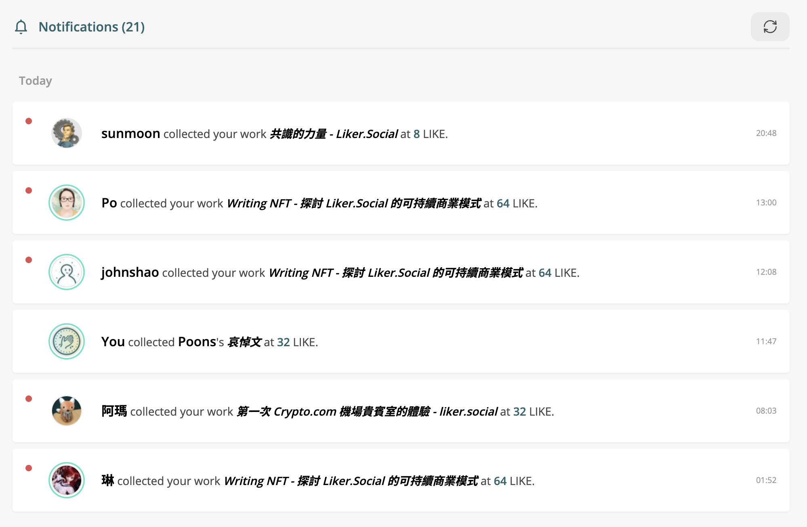

# Notifications

[**Notifications**](https://liker.land/en/notifications) record NFT gifts and collections. You can also check the messages from writers and collectors, continue to communicate and interact with each other.

## Liker Land web

On [Liker Land](https://liker.land/), Click the avatar in the upper right corner and the menu will pop up, then click on "[Notifications](https://liker.land/en/notifications)".

<figure><figcaption>
Writing NFT notification
</figcaption></figure>

## Liker Land app

Click :bell: on the [Liker Land app](../../../user-guide/liker-land/download.md) to check for notifications.

<figure><figcaption>
Click🔔on the Liker Land app
</figcaption></figure>

## Notification Settings

[After verifying the email](follow-creators.md#step-1-setup-email), you can set the "Notification Settings" to receive notifications when Transfer or Collect NFTs. You can also enter the amount of LikeCoin, and a notification will be sent when the transaction price is greater than the set value.

<figure><figcaption>
Notification Settings
</figcaption></figure>
