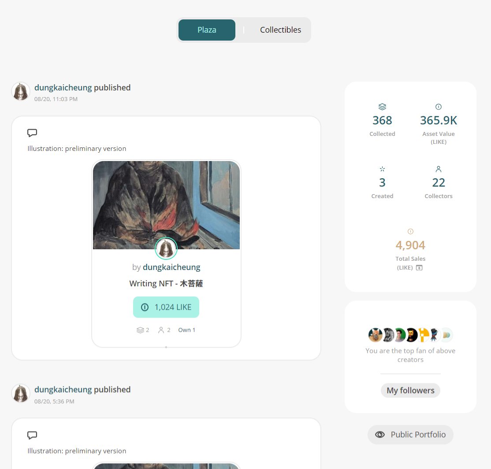

# My Dashboard

## **Liker Land web**

Upon logging in to Liker Land, users can utilize the following functions in [My Dashboard](https://liker.land/en/feed?view=town):

### Plaza

Within the [Plaza](https://liker.land/en/feed?view=town), you can quickly view all the user activities you are following, discover new friends and their creations. Additionally, you can explore captivating content from your friends' reading lists.

<figure><figcaption>
Plaza
</figcaption></figure>

### Collectibles

[Collectibles](https://liker.land/en/feed?view=collectibles\&tab=collected) lists NFTs collected and created by the user.

<figure><figcaption>
Collectibles
</figcaption></figure>

### Statistics

You can view the number of NFTs collected, Asset Value (LIKE), the number of NFTs created, and the number of NFTs collectors. Click on Total Sales (LIKE) to view NFT Sales Earnings, Resales Earnings, and Royalties.

<figure><figcaption>
Statistics
</figcaption></figure>

<figure><figcaption>
Sales Earnings sample
</figcaption></figure>

<figure><figcaption>
Royalties sample
</figcaption></figure>

### Top Fans and My Followers

Check out who the top fans of yours are among creators. Click on "My followers" to see who is following you.

<figure><figcaption>
Top Fans and My Followers
</figcaption></figure>

After viewing your followers, you can click on "Export my follower list" to export the list of followers.

<figure><figcaption>
Export my follower list
</figcaption></figure>

### Public Portfolio

Click on Public Portfolio to directly link to your personal public [NFT Portfolio](collect-writing-nft/nft-portfolio.md).

<figure><figcaption>
Public Portfolio
</figcaption></figure>

## Liker Land app

Log in to the [Liker Land app](../../user-guide/liker-land/download.md) or log in to Liker Land in a mobile browser. Click the stack icon and then click "My Bookshelf" to view information such as Plaza, Collectibles, and Statistics.

<figure><figcaption>
Log in to the Liker Land app or log in to Liker Land in a mobile browser, click the stack icon and then click "My Bookshelf"
</figcaption></figure>

## Feature and Hide

Users can organize their own portfolio by featuring or hiding NFT items (clicking the star on the top right hand corner). The featured NFT will be placed on top of the list, while the hidden NFT won’t be displayed in public view.

<figure><figcaption>
Feature and hide Writing NFT, click to feature NFT, click again to hide
</figcaption></figure>
