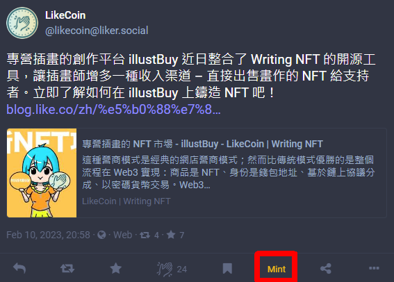

# Mint Writing NFT

### 📣Minting Writing NFT requires LikeCoin, users can get a small amount of LikeCoin from the [faucet](../faucet.md) for testing.

Authors can use [**Web3Press**](../../user-guide/wordpress.md) to publish articles, register ISCN and publish NFT in one go. If the author does not use WordPress:

**Option 1**: Writers can copy the URL of any webpage, paste it to [**NFT Portal** website a.k.a. the "Mint" tab of app.like.co](https://app.like.co/nft/url) to mint the page as Writing NFT. The Portal will scrape the og graphic, title and content of the webpage and store the information into distributed storage and registered as an ISCN, then publish the work as NFT

**Option 2**: Register text, PDF, picture, sound... into [ISCN](../decentralized-publishing/app.like.co.md) first, then paste the ISCN ID to [NFT Portal](https://app.like.co/nft/url) and publish as NFT

**Option 3**: Write on the Matters website and select "Register ISCN", then select the ISCN on the ["My Publishing" tab of app.like.co](https://app.like.co/works) to publish as NFT

**Option 4**: Publish NFT on [Liker.Social](https://liker.social/)

**Option 5**: Publish NFT [on illustBuy](https://illustbuy.com/)

**Option 6**: Batch send NFT to more than one wallet

Will talk about the options one by one.

After publishing the NFT, users can embed an [NFT Widget](collect-writing-nft/nft-widget.md) into any webpage by iframe. If the [LikeCoin button](../../user-guide/creator/) has been installed to the website, the NFT Widget will be displayed automatically.

## Login to NFT Portal&#x20;

Enter the [**NFT Portal**](https://app.like.co/nft/url) on the desktop computer browser and choose [Keplr](../wallet/keplr/), [Cosmostation](../wallet/cosmostation/), [Cosmostation app](../wallet/cosmostation-app/cosmostation-app-deposit-and-send-likecoin.md) or [Liker ID](../../user-guide/liker-land/download.md) to login and link to the website.

<figure><figcaption>
Login and link to NFT Portal with Keplr, Cosmostation, Cosmostation app or Liker ID
</figcaption></figure>

### Login method 1: Keplr

Please log into [Keplr Browser Extension](../wallet/keplr/) in your browser. After clicking "Keplr", a window will pop up requesting connection, click "Approve".

<figure><figcaption>
Click "Approve" on Keplr
</figcaption></figure>

### Login method 2: Cosmostation

Please log into [Cosmostation Browser Extension](../wallet/cosmostation/) in your browser. After clicking "Cosmostation", a window will pop up requesting connection, click "Confirm".

<figure><figcaption>
Click "Confirm" at Cosmostation
</figcaption></figure>

### Login method 3: Cosmostation app

A QR Code will appear after clicking "Cosmostation app".

<figure><figcaption>
After clicking the Cosmostation app, a QR code appears
</figcaption></figure>

On the[ Cosmostation app](../wallet/cosmostation-app/cosmostation-app-deposit-and-send-likecoin.md), click the QR Code icon to bring up the camera, and scan the QR Code.

<figure><figcaption>
Open the Cosmostation app, tap Wallet Connect to scan the QR code
</figcaption></figure>

Enter the PIN code to confirm.

<figure><figcaption>
PIN Code Authentication
</figcaption></figure>

Click "OK" to confirm.

<figure><figcaption>
Click "OK" to confirm
</figcaption></figure>

Connected successfully.

<figure><figcaption>
Successfully connected to NFT Portal
</figcaption></figure>

### Login method 4: Login with Liker Land app

A QR Code will appear after clicking "Liker ID".

<figure><figcaption>
After clicking Liker ID, a QR code appears
</figcaption></figure>

On the [Liker Land app](../../user-guide/liker-land/download.md), click the QR Code icon to bring up the camera, and scan the QR Code.

<figure><figcaption>
Open the Liker Land app, click and scan the QR Code
</figcaption></figure>

An ISCN window will pop-up, click "Approve".

<figure><figcaption>
An ISCN window pops up, click "Approve"
</figcaption></figure>


If there is connection problem, go to "Settings" "Wallet Connect" and click X to close the existing connection and try again.



After successful login, your wallet address will be displayed in the top right corner of the NFT Portal.

<figure><figcaption>
After successfully logging in to the NFT Portal, the wallet address is displayed in the top right corner
</figcaption></figure>

## Publish Writing NFT with an article URL

### Step 1/4: Register ISCN

If the article is not registered with an ISCN, please directly enter the article URL into the blank space and click "Register ISCN".


Please note if the URL is directly registered with ISCN in this way when publishing a Writing NFT, the system will automatically grab the article title and content as metadata.

**If you want your work to have detailed metadata, please** [**register an ISCN**](../decentralized-publishing/app.like.co.md) **and** [**publish Writing NFT with the ISCN ID**](nft-portal.md#publish-writing-nft-with-iscn-id)**.**


<figure><figcaption>
Enter the URL and click "Register ISCN"
</figcaption></figure>

#### Login with Keplr

When the Keplr window pops up, click "Approve". In the following steps, when you see the Keplr window pop up, just click "Approve".

<figure><figcaption>
When the Keplr window pops up, always click "Approve"
</figcaption></figure>

#### Login with Cosmostation

When the Cosmostation window pops up, click "Confirm". In the following steps, when you see the Cosmostation window pop up, just click "Confirm".

<figure><figcaption>
When the Cosmostation window pops up, always click "Confirm"
</figcaption></figure>

#### Login with Cosmostation app

When the Cosmostation app pops up the Request Transaction Sign window, click "Confirm". In the following steps, when you see the Cosmostation app window pop up, just click "Confirm".

<figure><figcaption>
When the Cosmostation app window pops up, always click "Confirm"
</figcaption></figure>

#### Login with Liker ID

When Liker Land app pops up a signature request window, click "Approve". In the following steps, when you see the Liker Land app window pop up, just click "Approve".

<figure><figcaption>
When the Liker Land app window pops up, always click "Approve"
</figcaption></figure>

### **Step 2/4: Preview NFT**

Preview your Writing NFT. You can change the NFT Cover, Title and Description by clicking ":pencil2:".

<figure><figcaption>
Modify the cover, title and description of Writing NFT
</figcaption></figure>

#### Change the NFT cover

Click ":pencil2:" on the picture and then click ":game\_die:" to generate a unique AI cover image. Click ":open\_file\_folder:" to upload or modify an existing picture. If you don't need to change it / the article has no picture, the default OG picture of the article will be displayed / no picture will be displayed.

More about AI Cover Image : [AI-Generated Article Cover Images](https://blog.like.co/en/ai-generated-article-cover-images/)

<figure><figcaption>
Generate a Writing NFT AI cover or upload a cover
</figcaption></figure>

<figure><figcaption>
Successfully generated Writing NFT AI cover
</figcaption></figure>

#### Edit Title

Click ":pencil2:" at the title and edit it directly.

<figure><figcaption>
Edit Writing NFT title
</figcaption></figure>

#### Edit Description

Click ":pencil2:" at the description to change the description of Writing NFT.

<figure><figcaption>
Edit Writing NFT description
</figcaption></figure>

Click "Next" to continue.

### Step 3/4: Add Creator message and Reserve Writing NFT

Creator message is a special paragraph of each article by the author. Unlike the Transfer message, all the Writing NFTs under the same collection shares the same creator message, and is stored on the NFT class data on chain.

Click "Add message to your collectors” to input the message.

<figure><figcaption>
Enter Writing NFT Creator message
</figcaption></figure>

A window pops up, enters the content and clicks "Confirm". Note that the message cannot exceed 256 characters.

<figure><figcaption>
Enters the content and clicks "Confirm"
</figcaption></figure>

Check whether the content is correct or not. If they need to be modified, you can press "Edit" to change it.

In addition, if you want to reserve some Writing NFT for yourself or change the initial price, click "More settings".

<figure><figcaption>
Edit Writing NFT Creator message and click "More settings"
</figcaption></figure>

Enter a number between 0-255 in "Numbers of NFTs reserved for giveaways":

Select 8, 128, 1024 or 4069 LIKE as Initial Price;&#x20;

then click "Next" to continue.

<figure><figcaption>
Enter the number of Writing NFT to reserve and set the Initial Price
</figcaption></figure>

### Step 4/4: Sign

Keplr, Cosmostation, Cosmostation app or Liker Land app windows will pop up, please click "Approve" or "Confirm" to sign and register ISCN ID (if not registered), Arweave ID, Class ID and mint NFT.

<figure><figcaption>
Sign to Register ISCN ID, Arweave ID, Class ID &#x26; Mint Writing NFT
</figcaption></figure>

Seeing Completed! and the 3D cover image means that the NFT has been minted. If the [LikeCoin button](../../user-guide/creator/) has not been installed on the website, you can directly paste the code of Embed NFT widget into your site, and the [NFT Widget](collect-writing-nft/nft-widget.md) can be displayed on any web page.

Click "View Your NFT" to view your Writing NFT.

<figure><figcaption>
Writing NFT minting completed, copy NFT Widget code
</figcaption></figure>

<figure><figcaption>
Check out the published Writing NFT
</figcaption></figure>

## Publish Writing NFT with ISCN ID

If your article is registered with ISCN, you can also use the [**NFT Portal**](https://app.like.co/nft/url) to publish Writing NFT.

### Method 1: Publish Writing NFT directly from ISCN

After the article is published and regsitered with ISCN, go to "[My Publishing](https://app.like.co/works)" of [app.like.co](https://app.like.co/) to find the ISCN of the article, and click "Mint NFT" on the top right corner to directly mint the ISCN as Writing NFT, the steps are exactly the same as [Publish Writing NFT with Article URL Step 2-2/4](nft-portal.md#step-2-4-preview-nft).

<figure><figcaption>
Click Mint NFT to mint ISCN into Writing NFT
</figcaption></figure>

### Method 2: Copy the ISCN ID and publish Writing NFT

Go to "[My Publishing](https://app.like.co/works)" at [app.like.co](https://app.like.co/) to find the ISCN ID of the registered article and copy it.

<figure><figcaption>
Minting ISCN ID as Writing NFT
</figcaption></figure>

Enter the ISCN ID in the [NFT Portal](https://app.like.co/nft/url) and click "Register ISCN". For the steps remaining, please refer to [Publish Writing NFT with Article URL Step 2-2/4](nft-portal.md#step-2-4-preview-nft).

<figure><figcaption>
Enter ISCN ID and click "Register ISCN" to mint Writing NFT
</figcaption></figure>

## Publish sound as Writing NFT

#### Tutorial



## Publish Matters article as Writing NFT

Users can choose to register ISCN before publishing in [Matters](../../user-guide/creator/matters.md).

<figure><figcaption>
Register ISCN with Matters
</figcaption></figure>

Then follow [Method 1: Publish Writing NFT directly from ISCN](nft-portal.md#method-1-publish-writing-nft-directly-from-iscn) to publish Writing NFT.

## Publish Writing NFT on Liker.Social

Click "Mint" on the [Liker.Social](https://liker.social/) toot to publish the post as Writing NFT.

<figure><figcaption>
Publishing Writing NFT on Liker.Social
</figcaption></figure>

#### Tutorial



## Publish Writing NFT on illustBuy

Publishing NFTs on [illustBuy](https://illustbuy.com/) is just as easy.

#### To Learn More

[illustBuy – The NFT marketplace for illustration](https://blog.like.co/en/illustbuy-nft-marketplace-for-illustration/)

#### Tutorial



## Batch send NFT to supporters

**Step 1**: Search for "Collectors" in your own wallet on the [LikeCoin NFT Dashboard](https://likecoin.github.io/likecoin-nft-dashboard/#/).

**Step 2**: Export all data.

**Step 3**: Import the csv of the data into a spreadsheet tool for sorting and organize the wallet addresses of supporters into a list.

**Step 4**: Select "Send NFTs" in the Tools of [LikeCoin NFT Marketplace](https://likecoin.github.io/likecoin-nft-marketplace/) and log in to Keplr.

**Step 5**: Find the NFT Class ID on the Writing NFT that will be distributed to supporters.

**Step 6**: Enter the NFT Class ID into the Send NFTs tool, and enter the supporters’ wallet addresses to the "Recipient Address list" and the "Transfer message", then press "Send" and sign in Keplr to batch send NFTs to supporters.

#### Tutorial



## Creator’s Introduction

Set your own introduction, profile picture, and display name so your supporters can know you better. ( Need to register a Liker ID ).


[edit-avatar-displayname.md](../../user-guide/liker-id/edit-avatar-displayname.md)

