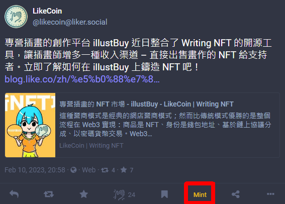

# 發行 Writing NFT

### 📣出版 Writing NFT 需要使用 LikeCoin，用戶可於[水龍頭](../faucet.md)取得少量 LikeCoin 以作測試

作者使用 [**Web3Press**](../../user-guide/wordpress.md) 可一氣呵成發佈文章、註冊 ISCN 及出版 NFT。若作者不使用 WordPress：

**選擇一：**可到 [**NFT Portal** 即 app.like.co 的 Mint Writing NFT 分頁](https://app.like.co/nft/url)貼上文章的網址，系統會自動抓取文章標題及把文章內容儲存到分散式檔案系統註冊成為 [ISCN](../decentralized-publishing/what-is-iscn.md) 並出版 NFT

**選擇二**：將文章的文字、PDF、圖片、聲音…先[註冊成 ISCN](../decentralized-publishing/app.like.co.md)，再將 ISCN ID 貼到 [NFT Portal](https://app.like.co/nft/url) 出版 NFT

**選擇三**：在 [Matters 網站](https://matters.news/)撰文並選擇「註冊 ISCN」，並於 [app.like.co 的 My Works 分頁](https://app.like.co/works)選擇該 ISCN 再點「Mint NFT」出版 NFT

**選擇四**：在 [Liker.Social](https://liker.social/) 出版 NFT

**選擇五**：在 [illustBuy](https://illustbuy.com/) 出版 NFT

**選擇六**：[群發 NFT 紀念品](nft-portal.md#batch-send-nft-to-supporters)到多個錢包

以下章節將一一進行介紹。

又，出版 Writing NFT 後可以 iframe 的方式把 [NFT Widget](collect-writing-nft/nft-widget.md) 嵌入文章展示，如網站已安裝 [LikeCoin button 讚賞鍵](../../user-guide/creator/)，將自動展示 NFT Widget

## 登入 NFT Portal 

在桌面電腦瀏覽器直接進入 [**NFT Portal**](https://app.like.co/nft/url) 並選擇以 [Keplr](../wallet/keplr/)、[Cosmostation](../wallet/cosmostation/)、[Cosmostation app](../wallet/cosmostation-mobile/) 或 [Liker ID](../../user-guide/liker-land/download.md) 任何一種方式連結並登入網站。

<figure><figcaption>
以 Keplr、Cosmostation、Cosmostation app 或 Liker ID 任何一種方式連結並登入 NFT Portal
</figcaption></figure>

### **登入方式 1：Keplr**

請於瀏覽器登入 [Keplr 瀏覽器擴充功能 ( Keplr Browser Extension )](../wallet/keplr/)，點「Keplr」後彈出視窗要求連結，點「Approve」。

<figure><figcaption>
在 Keplr 點「Approve」
</figcaption></figure>

### **登入方式 2**：Cosmostation

請於瀏覽器登入 [Cosmotation 瀏覽器擴充功能 ( Cosmostation Browser Extension )](../wallet/cosmostation/)，點「Cosmostation」後彈出視窗要求連結，點「Confirm」。

<figure><figcaption>
在 Cosmostation 點「Confirm」
</figcaption></figure>

### **登入方式 3**：Cosmostation app

點「Cosmostation app」後出現二維碼。

<figure><figcaption>
點 Cosmostation app 後出現二維碼
</figcaption></figure>

在 [Cosmostation 手機錢包](../wallet/cosmostation-mobile/)點「Wallet Connect」調用鏡頭，並掃瞄二維碼。

<figure><figcaption>
打開 Cosmostation app 點 Wallet Connect 掃瞄二維碼
</figcaption></figure>

輸入 PIN 碼確認。

<figure><figcaption>
PIN 碼認證
</figcaption></figure>

點「OK」確認連結。

<figure><figcaption>
點「OK」確認連結
</figcaption></figure>

成功連結。

<figure><figcaption>
成功連結 NFT Portal
</figcaption></figure>

### 登入方式 4：Liker ID

點「Liker ID」後出現二維碼。

<figure><figcaption>
點 Liker ID 後出現二維碼
</figcaption></figure>

在 [Liker Land 手機應用程式](../../user-guide/liker-land/download.md)點二維碼圖示調用鏡頭，並掃瞄二維碼。

<figure><figcaption>
在 Liker Land app 調用鏡頭，掃瞄二維碼
</figcaption></figure>

彈出 ISCN 視窗，點「允許」。

<figure><figcaption>
彈出 ISCN 視窗，點「允許」
</figcaption></figure>


如遇連接問題，可到「設定」「Wallet Connect」點 X 關掉現有連接後再作嘗試。



成功登入後右上角將顯示你的錢包地址及 NFT Portal 註冊頁面。

<figure><figcaption>
成功登入 NFT Portal，右上角顯示錢包地址
</figcaption></figure>

## 以文章網址出版 Writing NFT 

### 步驟 1/4：註冊 ISCN 

假如文章並未註冊 ISCN，請直接把文章網址輸入空格並點「Register ISCN」。


留意如果將網址直接以這個方式註冊 ISCN 並出版 Writing NFT，系統會自動抓取文章標題及內容作為元資料。

**如希望作品擁有詳盡元資料，請先** [**註冊 ISCN**](../decentralized-publishing/app.like.co.md) **再**[**以 ISCN ID 出版 Writing NFT**](nft-portal.md#publish-writing-nft-with-iscn-id)**。**&#x20;


<figure><figcaption>
輸入 URL 再點「Register ISCN」
</figcaption></figure>

#### 使用 Keplr 登入

將彈出 Keplr 視窗，點「Approve」。往後的步驟看見 Keplr 視窗彈出都點「Approve」即可。

<figure><figcaption>
Keplr 視窗彈出一律點「Approve」
</figcaption></figure>

#### 使用 Cosmostation 登入 

將彈出 Cosmostation 視窗，點「Confirm」。往後的步驟看見 Cosmostation 視窗彈出都點「Confirm」即可。

<figure><figcaption>
Cosmostation 視窗彈出一律點「Confirm」
</figcaption></figure>

#### 使用 Cosmostation app 登入

Cosmostation app 將彈出 Request Transaction Sign 視窗，點「Confirm」。往後的步驟看見 Cosmostation app 視窗彈出都點「Confirm」即可。

<figure><figcaption>
Cosmostation app 視窗彈出一律點「Confirm」
</figcaption></figure>

#### 使用 Liker ID 登入

Liker Land app 將彈出簽名請求視窗，點「允許」。往後的步驟看見 Liker Land app 視窗彈出都點「允許」即可。

<figure><figcaption>
Liker Land app 視窗彈出一律點「允許」
</figcaption></figure>

### 步驟 2/4：預覽 Writing NFT 

預覽你的 Writing NFT，你可以點「:pencil2:」修改封面、標題及簡介：

<figure><figcaption>
修改 Writing NFT 封面、標題及簡介
</figcaption></figure>

#### 修改封面 

在圖片位置點「:pencil2:」後再點「:game\_die:」即可生成獨一無二的 AI 封面圖，點「:open\_file\_folder:」則可上載或修改現有的圖片。如不需更改 / 文章沒有圖片，將顯示文章預設的 OG 圖 / 不顯示圖片。

關於 AI 封面的詳盡介紹：[AI 生成文章封面 – 文字創作利器？](https://blog.like.co/zh/ai-%E7%94%9F%E6%88%90%E6%96%87%E7%AB%A0%E5%B0%81%E9%9D%A2-%E6%96%87%E5%AD%97%E5%89%B5%E4%BD%9C%E5%88%A9%E5%99%A8/)

<figure><figcaption>
生成 Writing NFT AI 封面或上載封面
</figcaption></figure>

<figure><figcaption>
成功生成 Writing NFT AI 封面
</figcaption></figure>

#### 修改標題 

在標題位置點「:pencil2:」後直接修改標題。

<figure><figcaption>
修改 Writing NFT 標題
</figcaption></figure>

#### 修改簡介 

在簡介位置點「:pencil2:」更改 Writing NFT 的簡介。

<figure><figcaption>
修改 Writing NFT 簡介
</figcaption></figure>

完成後點「Next」。

### 步驟 3/4：輸入作者留言、預留 Writing NFT 及設定起始售價 

作者留言是作者於每篇文章顯示的特別段落。與收藏或轉贈時附加留言不同的是，同一個合集下的所有 Writing NFT 將共用同一段作者留言，並儲存於鏈上的 NFT class 資料中。

點「Add message to your collectors」輸入作者留言。

<figure><figcaption>
輸入 Writing NFT 作者留言
</figcaption></figure>

彈出視窗，輸入內容後點「Confirm」。注意訊息不能撰寫超過 256 個字元。

<figure><figcaption>
輸入完成後點「Confirm」
</figcaption></figure>

再次查看內容是否正確，如需要修改可點「Edit」。

此外如需要預留一些 Writing NFT 給自己及調整售價，點「More settings」查多更多設定。

<figure><figcaption>
修改 Writing NFT 作者留言及查看更多設定
</figcaption></figure>

在 Number of NFTs to premint 可輸入 0-255 之間的預先鑄造 NFT 數量；

在 Numbers of NFTs reserved for giveaways 可預留 0-255 份 NFT 作送贈之用；

點「Reserve All」可一次過預留所有預先鑄造及作為送贈之用的 NFT；

在 Sales Settings 可設定 Writing NFT 起始售價 ( Initial Price ) 為 8、128、1024 或 4096 LIKE，如不作設定，起始售價預設定 128 LIKE；

完成後再點「Next」。

<figure><figcaption>
輸入預留及送贈 Writing NFT 的數量，並設定起始售價
</figcaption></figure>


任何作者也能把 Writing NFT 設成「非賣品」，方法是填寫 “Number of NFTs to premint” 的數量**等同**於 “Number of NFTs reserved for giveaways”，即代表作者預留全數 NFT 作送贈之用，便能達到設定 NFT 成「非賣品」 的效果，因為已發行的 NFT 都被作者預留而不會於市面流通。作者預留了的 Writing NFT ，免費送出或經二級市場售賣均可。


### 步驟 4/4：完成簽署 

將彈出 Keplr、Cosmostation、Cosmostation app 或 Liker Land app 視窗，請分別點「Approve」、「Confirm」或「允許」進行簽署以註冊 ISCN ID（如未曾註冊）、Arweave ID、Class ID 及鑄造 NFT。

<figure><figcaption>
簽署以註冊 ISCN ID、Arweave ID、Class ID 及鑄造 Writing NFT
</figcaption></figure>

出現 Completed! 及 3D 封面圖即代表 NFT 已鑄造完成，如網站未曾安裝 [LikeCoin button 讚賞鍵](../../user-guide/creator/)可直接貼上 Embed NFT widget into your site 的代碼，即可在任何網頁展示 [NFT Widget](collect-writing-nft/nft-widget.md)。

點「View Your NFT」查看已發行的 Writing NFT。

<figure><figcaption>
Writing NFT 鑄造完成、複製 NFT Widget 代碼
</figcaption></figure>

<figure><figcaption>
查看已發行的 Writing NFT
</figcaption></figure>

## 以 ISCN ID 出版 Writing NFT 

假如你的文章經已註冊 ISCN，你同樣可以使用 [**NFT Portal**](https://app.like.co/nft/url) 網站出版 Writing NFT。

### 方法 1：查找 ISCN 後直接出版 Writing NFT

文章註冊 ISCN 後，到 [app.like.co](https://app.like.co/) 的「[My Works](https://app.like.co/works)」尋找已註冊文章的 ISCN，點右上角「Mint NFT」直接將 ISCN 鑄造為 Writing NFT，所需步驟與[以文章網址出版 Writing NFT 步驟 2-4/4](nft-portal.md#preview-nft-1) 完全相同。

<figure><figcaption>
點 Mint NFT 直接將 ISCN 鑄造為 Writing NFT
</figcaption></figure>

### 方法 2：複製 ISCN ID 再出版 Writing NFT

到 [app.like.co](https://app.like.co/) 的「[My Works](https://app.like.co/works)」尋找已註冊文章的 ISCN ID 並把它複製。

<figure><figcaption>
將 ISCN ID 鑄造為 Writing NFT
</figcaption></figure>

再到  [NFT Portal](https://app.like.co/nft/url) 的空格輸入 ISCN ID 並點「Register ISCN」，餘下步驟與[以文章網址出版 Writing NFT 步驟 2-4/4](nft-portal.md#preview-nft-1) 完全相同。

<figure><figcaption>
輸入 ISCN ID 並點「Register ISCN」鑄造 Writing NFT
</figcaption></figure>

#### 教學影片



## 把語音檔出版成 Writing NFT

#### 教學影片



## 為 Matters 文章出版 Writing NFT 

用戶可以在 [Matters](../../user-guide/creator/matters.md) 發佈文章前選擇一拼註冊 ISCN。

.png>)

再依照 [方法 1：查找 ISCN 後直接出版 Writing NFT](nft-portal.md#fang-fa-1-cha-zhao-iscn-hou-zhi-jie-chu-ban-writing-nft) 即可出版 Writing NFT。

#### 教學影片



## 在 Liker.Social 出版 Writing NFT 

點 [Liker.Social](https://liker.social/) 嘟文頁面的「Mint」可以將嘟文出版 NFT。

<figure><figcaption>
在 Liker.Social 出版 Writing NFT
</figcaption></figure>

#### 詳盡介紹

[在 Liker Social 出版 Writing NFT](https://blog.like.co/zh/liker-social-%E4%B9%9F%E5%8F%AF%E4%BB%A5%E5%87%BA%E7%89%88-writing-nft/)

#### 教學影片



## 在 illustBuy 出版 Writing NFT 

在 [illustBuy](https://illustbuy.com/) 出版 NFT亦同樣簡易。

#### 詳盡介紹

[專營插畫的 NFT 市場 – illustBuy](https://blog.like.co/zh/%E5%B0%88%E7%87%9F%E6%8F%92%E7%95%AB%E7%9A%84-nft-%E5%B8%82%E5%A0%B4-illustbuy/)

#### 教學影片



## 設置作者簡介 

設置個人簡介、圖片及顯示名稱讓你的支持者更加了解你吧！（必須註冊 Liker ID）


[edit-avatar-displayname.md](../../user-guide/liker-id/edit-avatar-displayname.md)

