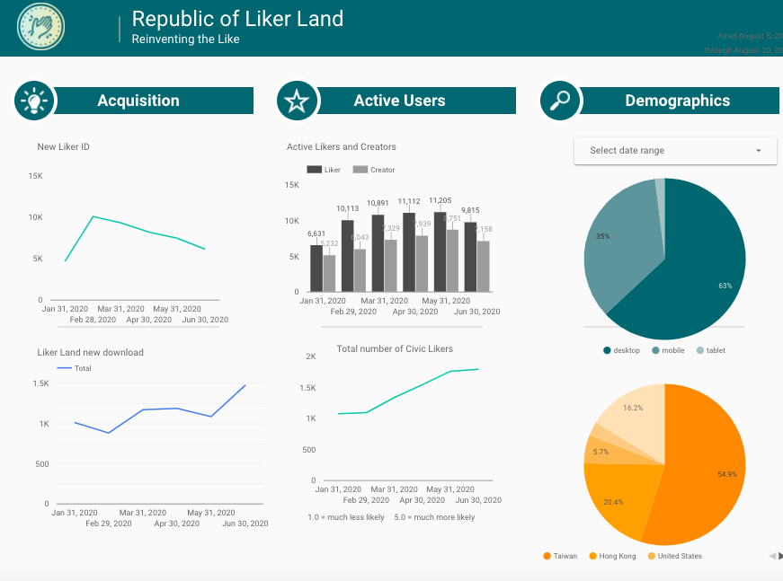

# NFT Portfolio

Besides collecting via NFT Widget, readers can also collect Writing NFT from the writer’s NFT Portfolio page. Writers and Collectors can share the links of their collection by any channels.

Portfolio page lists all NFTs and their estimated values. It is the place where user can transfer NFT and sell them to the secondary market.

