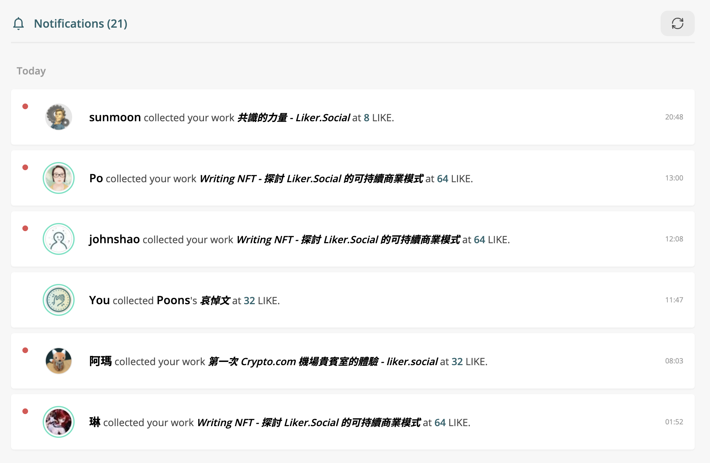

# 通知功能

[**通知功能**](https://liker.land/zh-Hant/notifications)讓贈送及收藏 NFT 記錄從此一目瞭然，你更可以查看收藏者給你的留言，接續進行交流互動。購買與收藏從此再不單向。

## Liker Land 網頁版

登入 [Liker Land 網頁版](https://liker.land/zh-Hant)後點右上角的頭像再點「[通知](https://liker.land/zh-Hant/notifications)」。

<figure><figcaption>
Writing NFT 通知功能
</figcaption></figure>

## Liker Land 手機應用程式

在 [Liker Land 手機應用程式](../../user-guide/liker-land/download.md)點:bell:查看通知。

<figure><figcaption>
點🔔查看通知
</figcaption></figure>

## 通知設定

認證電郵後，你可以在「通知設定」設定在發送或收藏 NFT 時收到通知。你也可以輸入 LikeCoin 數額，當交易價格大於該設定值時會發出通知。

<figure><figcaption>
通知設定
</figcaption></figure>
