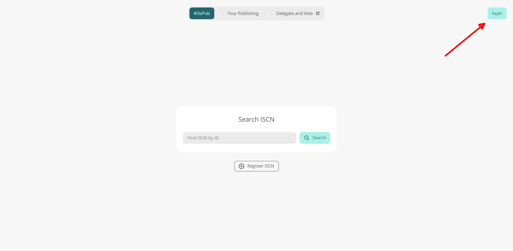
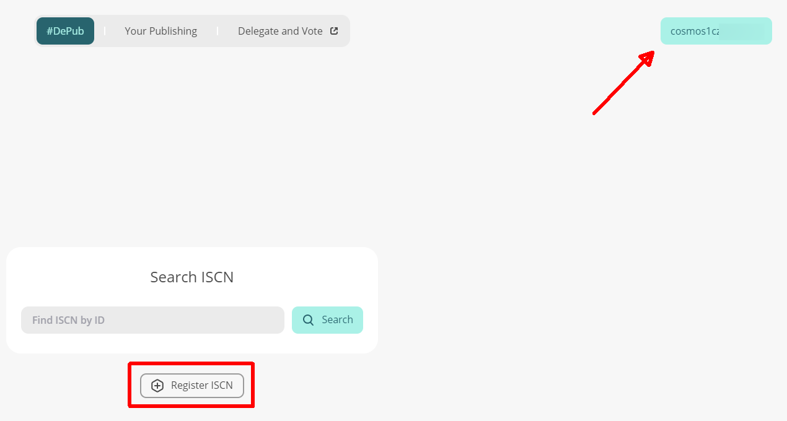
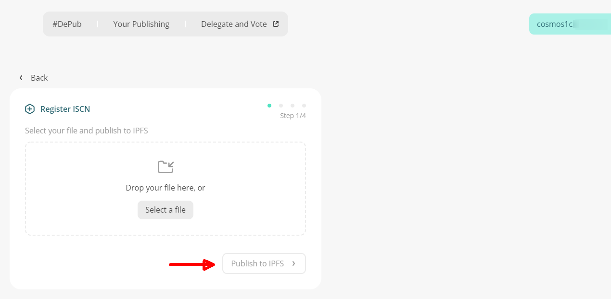
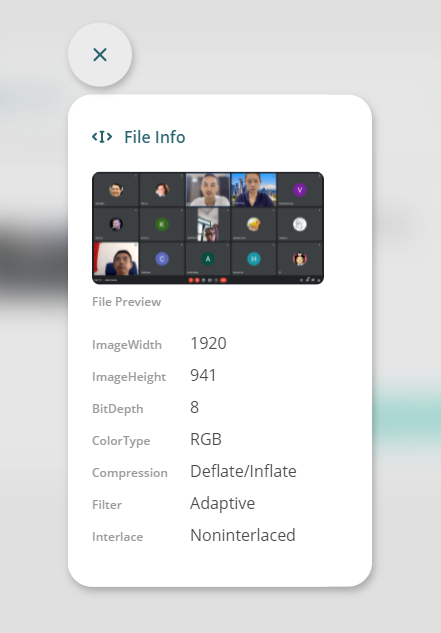
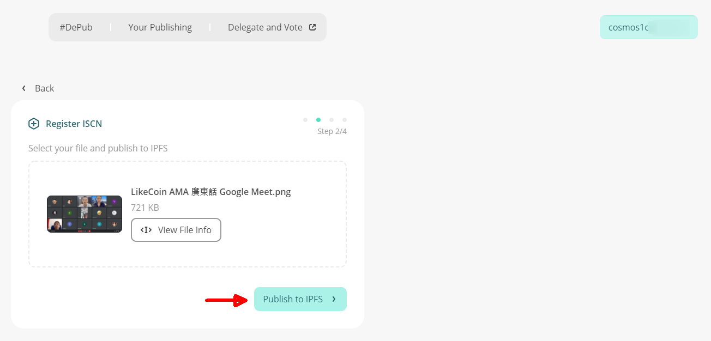
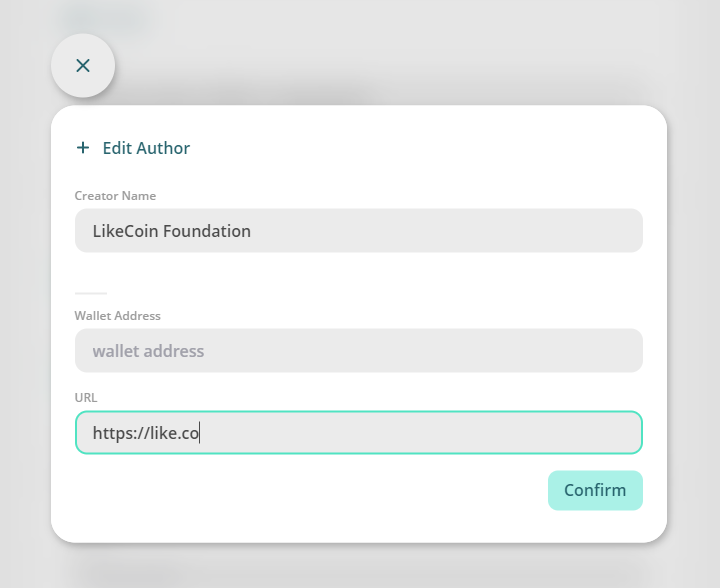
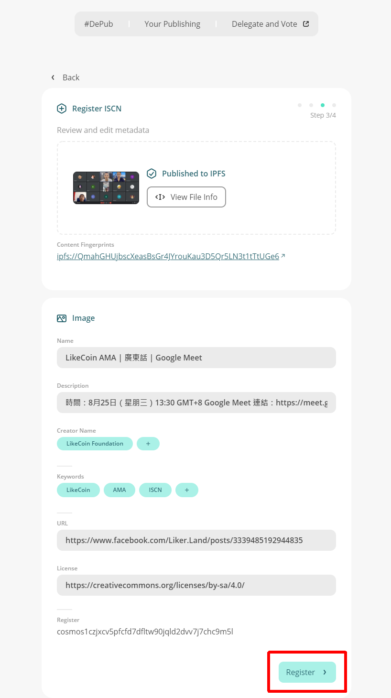
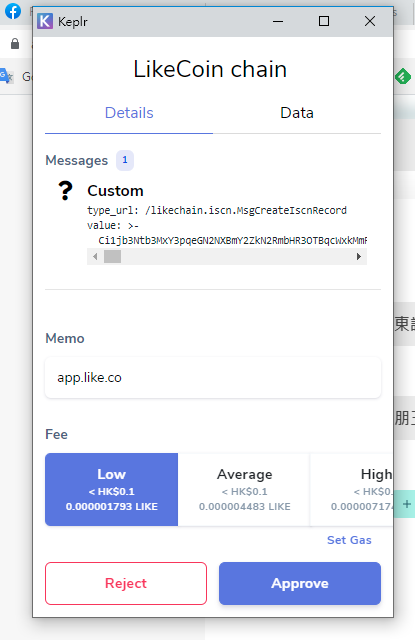
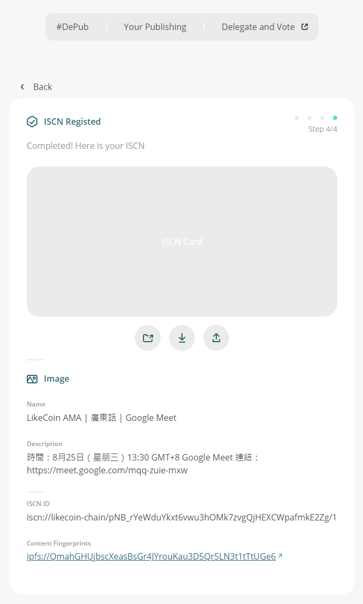
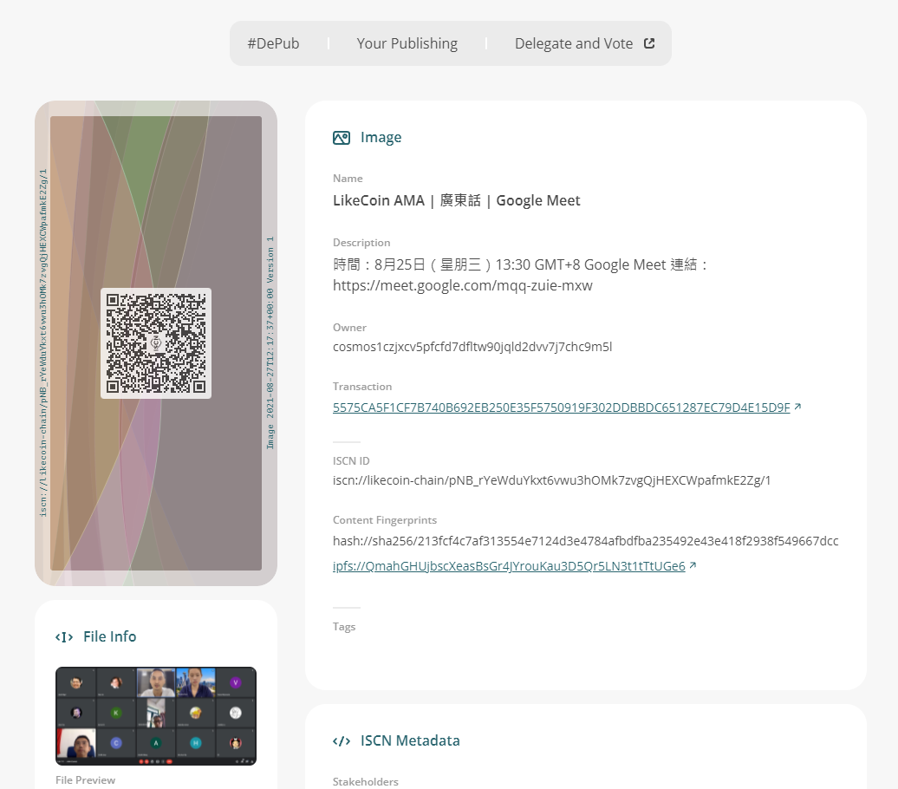

# 如何註冊 ISCN

用戶可經 [app.like.co](https://app.like.co/) 為每個內容註冊 ISCN，系統將基於 ISCN ID 隨機生成一幅獨一無異的美術圖卡。就算兩筆 ISCN 記錄只差之毫釐，ISCN 圖卡的圖案也會完全不同！

註冊 ISCN 到 LikeCoin chain 的同時，系統也會把內容上傳到 IPFS 或 Arweave。用戶只需付出少量 LikeCoin 以支付註冊及寄存的費用。

用戶也可在 app.like.co 查看每一筆 ISCN 記錄的詳細內容。

用戶可使用 [app.like.co](https://app.like.co/) 嘗試註冊自己的 ISCN。

### 步驟一：登入 app.like.co


請先註冊 Keplr 錢包方可註冊 ISCN。註冊 Keplr 有兩種方式：第一種是直接註冊 [Keplr 錢包去中心化管理你的 LikeCoin](../wallet/keplr.md)，不關聯任何 Liker ID。第二種是[以 Keplr 註冊 Liker ID](../../user-guide/liker-id/register-with-keplr.md)，你可以同時註冊 Keplr 錢包及獲取 Liker ID。留意假如用作註冊的電郵地址經已於 Liker Land 註冊 Liker ID，並不能同時於 Keplr 以相同電郵地址進行註冊。


請於瀏覽器登入 Keplr 錢包，並到 [app.like.co](https://app.like.co/) 點擊右上角「Keplr」，Keplr 錢包有機會要求簽署，請選「Approve」。

完成後會發現右上角顯示你的 Keplr 錢包地址，點擊「Register ISCN」開始註冊。

### 步驟二：上載內容

點擊「Select a file」上傳檔案，例如相片或影片等，又或者直接把檔案拖拉到中間的位置，甚至可以先點擊「Publish to IPFS」以後才上載檔案。 

上載完成後，可點擊「View File Info」查看檔案的屬性和狀態，例如相片的 EXIF 元資料包括拍照時的位置及相機配置等。

檢查完成後點擊「Publish to IPFS」。

### 步驟三：填寫元資料

填寫關於此項內容的元資料：

* Name 內容名稱
* Description 內容描述
* Author - Creator Name 創作者名字、可填上多於一名
* Author - Wallet Address 創作者的錢包地址
* Author - URL 創作者的網址 
* Keywords 關鍵字，幫助人們搜尋你的內容
* URL 該內容的網址
* License 內容授權，不妨參考共享創意的授權條款

雖然很多欄目也不是必填，但建議盡量填寫讓別人可容易發堀你的內容。

填寫作者時可加入多於一位作者。

完成後，點擊「Register」。

### 步驟四：獲取 ISCN

此時將彈出 Keplr 視窗，選擇所需要完成註冊的速度（慢 Low、平均 Average、快 High）並點擊「Approve」。暫時註冊 ISCN 費用少於 1 LikeCoin，大家可放心測試。

出版到區塊鏈過程只需數秒。

獨有的作品指紋 ISCN 立即面世。

點擊「Your Publishing」顯示所有你普經註冊 ISCN 的項目。

點擊項目出現已註冊的元資料內容明細。

