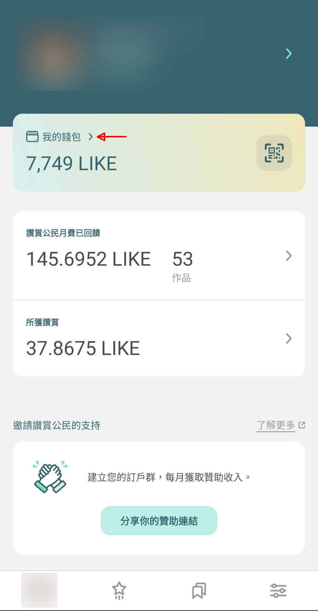
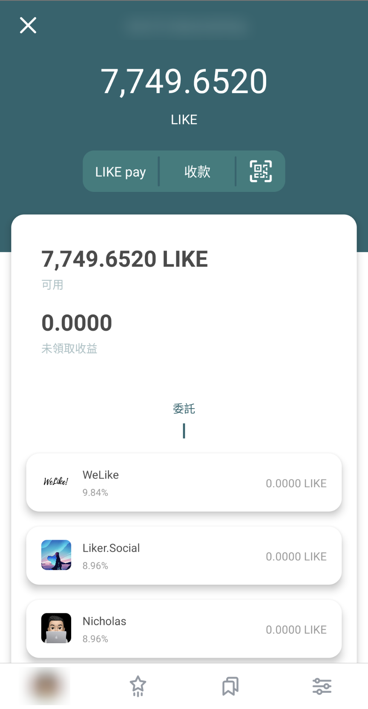
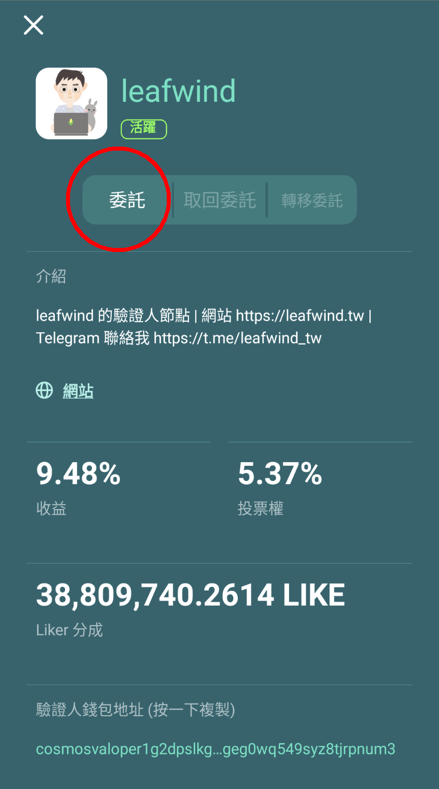

# 委託 LikeCoin

委託的意思是把 LikeCoin 委託給一個或多個[驗證人 ( Validator )](../governance/what-is-a-validator/)，讓他們代表你為 LikeCoin DAO 的議案投票，同時賺取回報。自 LikeCoin chain 升級 FoTan 後，每位經已委託 LikeCoin 予驗證人的持份者都可以直接就議案投票。


[direct-vote.md](../governance/direct-vote.md)


委託機制是 LikeCoin DAO [流動民主](../governance/liquid-democracy.md)自治機制非常重要的一環。

委託 LikeCoin 的方式有多種，我們建議使用 [dao.like.co](https://dao.like.co/)。 你也可以通過以下方式管理你的 LikeCoin：

* Omniflix: [https://likecoin.omniflix.co/](https://likecoin.omniflix.co/)
* BitSong: [https://wallet.bitsong.io/](https://wallet.bitsong.io/)
* Ping.Pub: [https://ping.pub/likecoin/](https://ping.pub/likecoin/)

## 使用 dao.like.co 委託 LikeCoin

### 步驟一：登入 dao.like.co

到 [dao.like.co](https://dao.like.co/) 網站後選 [Keplr Browser Extension](../../user-guide/liker-id/register-with-keplr.md)、[Cosmostation Browser Extension](../wallet/cosmostation/) 或 [Authcore](../../user-guide/liker-id/register/) 登入。

### 步驟二：選擇驗證人

登入後，到左手邊菜單選擇「Validators」顯示所有驗證人，點選你需要委託的驗證人。

### 步驟三：進行委託

在驗證人頁面右上角點「Stake」進行委託。

### 步驟四：輸入委託金額

出現 Stake 頁面，輸入你所需要委託的 LikeCoin 數量，再點「Next」。

### 步驟五：確認委託數量及手續費

確認委託數量及所需手續費無誤後再點「Next」。

### 步驟六：查看委託

系統要求簽署確認，Keplr 用戶點擊「Send」以後會彈出視窗或要求按鈕確認。Authcore 用戶直接點擊「Send」。

出現 Send and confirming 畫面後再出現 Successfully staked! 即順利完成委託。

 

點左手邊菜單選擇「Portfolio」，即可看查看已委託的驗證人及委託數量等。

### 步驟七：領取收益

到左手邊菜單選擇「Portfolio」，再點右上角「Claim Rewards」。

出現 Claim Rewards 頁面，點「Next」。

系統要求簽署確認，Keplr 用戶點擊「Send」以後會彈出視窗或要求按鈕確認。Authcore 用戶直接點擊「Send」。

出現 Send and confirming 畫面後再出現 Successfully withdrawal! 即成功領取收益。

 

## 使用 Liker Land app 委託 LikeCoin

### 步驟一：選擇驗證人

於 [Liker Land 手機應用程式](https://liker.land/getapp)的點擊「我的錢包」進入錢包內頁。在內頁中，除了可查看結餘以外，下部有一個列表列出一些驗證人，你可以按你喜歡選其中一個。

注意每個驗證人提供的回饋年回報率可能略有不同。

點選了其中一個驗證人後，顯示以下頁面，列出收益年率 ( Rewards )，投票權佔比 ( Voting Power )，已被委託的 LikeCoin ( Liker Share ) 等資料。

點擊「委託」進入下一頁。

### 步驟二：輸入委託金額

點擊「委託」後出現以下畫面。輸入你想委託給驗證人的金額，點擊「下一步」。

跳至確認畫面，顯示出驗證人的委託戶口地址，按「詳細資料」還可以核查委託款項及是次轉帳[手續費](../wallet/transaction-fee.md)的估算數值，

點擊「確認」，稍待幾秒，畫面上方會出現 "Transaction Completed" 字樣，代表已完成委託。

已委託的驗證人，會在下方列表中顯示為綠色。

### 步驟三：領取收益，躺著賺回報吧！

回到錢包的頁面，你可以下拉刷新錢包的狀態。

回饋金額會 5 至 6 秒派發一次 - 什麼？跟銀行的每月派息快太多了吧！你可在錢包驗證人頁面中的 「未領取收益」欄查看累積的回饋金額，或按「領取收益」把回報存進錢包，留意 Liker Land 手機應用程式最低收益存進數量為 1 LikeCoin，少於 1 LikeCoin 的收益將不能存進錢包。


留意領取收益需要[手續費](../wallet/transaction-fee.md)。


### 了解更多有關「委託」的原理

委託的功能，是 LikeCoin DAO「流動民主」機制的重要一環。想知道更多有關概念，請閱讀以下文章：

> [身為一個鏈上公民，感受質押世界的魅力！- 以 LikeCoin 為例](https://matters.news/@dablog/%E8%BA%AB%E7%82%BA%E4%B8%80%E5%80%8B%E9%8F%88%E4%B8%8A%E5%85%AC%E6%B0%91-%E6%84%9F%E5%8F%97%E8%B3%AA%E6%8A%BC%E4%B8%96%E7%95%8C%E7%9A%84%E9%AD%85%E5%8A%9B-%E4%BB%A5-like-coin-%E7%82%BA%E4%BE%8B-zdpuB1ePtb7TNzYpbfkdhNmf8REKkQxNX5MgRRir1BG6pWVts)

> [LikeCoin 新手的委託質押筆記](https://matters.news/@huanlin/like-coin-%E6%96%B0%E6%89%8B%E7%9A%84%E5%A7%94%E8%A8%97%E8%B3%AA%E6%8A%BC%E7%AD%86%E8%A8%98-bafyreifhicuom74neq4sojpkta6thdsia3y4zf7dmolgajvgph4c3usx5u)
