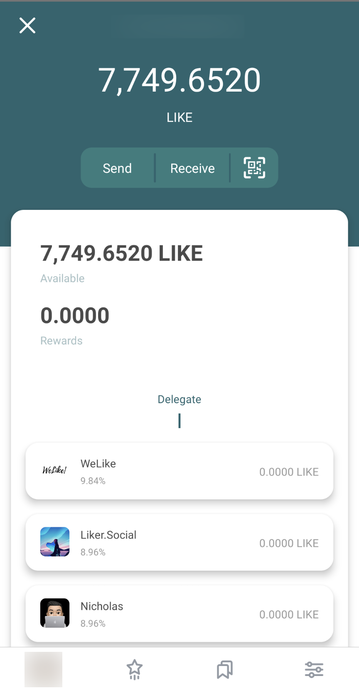
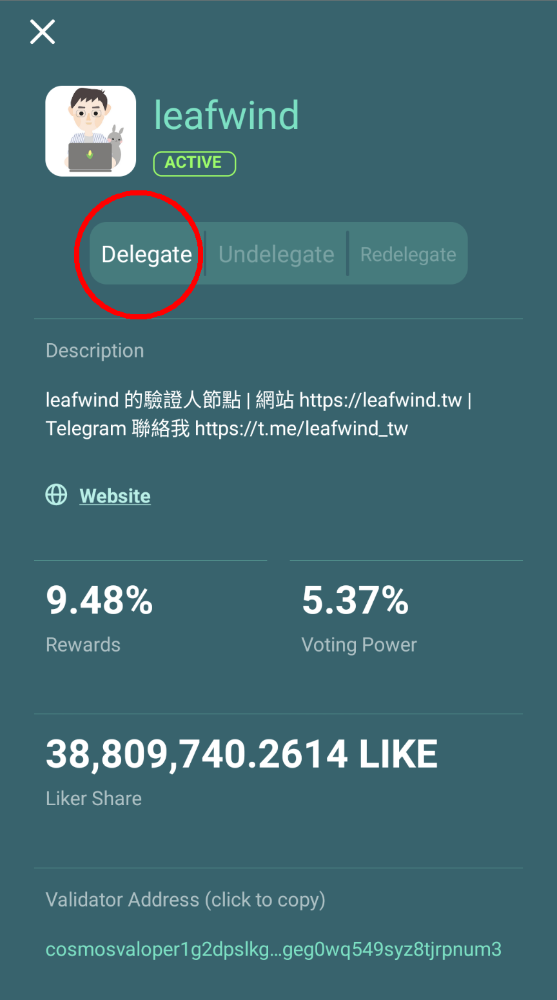

# Delegation of LikeCoin

Delegation means delegating LikeCoin to one or more [validators](https://docs.like.co/guides/governance/what-is-a-validator), letting them to represent you to raise proposals and vote for or against the proposals, and most importantly to earn rewards. Delegation demonstrates [liquid democracy](https://docs.like.co/guides/governance/liquid-democracy) and is vital to the autonomy for The Republic of Liker Land.

### Step 1: Select a validator

Open the [Liker Land mobile app](https://liker.land/getapp), click on \[My Wallet\] to enter into the wallet page. In this page you can check the LikeCoin amount that you have and there is a list of validators underneath. You can select one of them as you like.

![Click on \[My Wallet\]](../../.gitbook/assets/delegate-4-en.png)


Please note the commission rate of each validator may not be the same.

Select one of the validators and bring up the page below, it lists out percentage of Rewards, Voting Power and how much LikeCoin is being delegated to this validator \(Liker Share\).

Click \[Delegate\] and go to the next page.

### **Step 2: Input the amount of LikeCoin to delegate**

Click \[Delegate\] to bring up the following page, input the amount of LikeCoin that you would like to delegate to the validator, then click \[Next\]  

The confirmation page is displayed, showing the validator's wallet address, click \[Details\] to reconfirm the amount to delegate and check the [transaction fee](https://docs.like.co/guides/wallet/transaction-fee) estimation.

Click \[Confirm\], after a few seconds it displays "Transaction Completed", which means delegation of LikeCoin is completed.

### **Step 3: Relax and earn rewards!**

Going back to the wallet page, you can drag down the screen and refresh wallet status.

The LikeCoin rewards earned from delegation will be released every 5 or 6 seconds. quicker than monthly interest from the bank! You can check out the \[Delegating Rewards\] amount from the validator page, or click \[Withdraw Rewards\] to save the rewards back to your wallet. The minimum withdrawal amount on the Liker Land app is 1 LikeCoin.

Validator with your delegation will be displayed as green.

