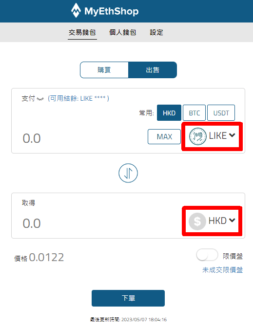

# 註冊及在 MyEthShop 交易


提示：進行任何大額交易前請先作少量嘗試


在 MyEthShop 買賣 LikeCoin 手續簡易，交易費用全免，網站界面友善，桌面及手機都通用。

### 步驟一：註冊 MyEthShop 帳號並通過實名認證

使用 [MyEthShop](https://www.myethshop.com/) 找換店的服務，必須先於 MyEthShop [開戶](https://www.myethshop.com/register)並通過實名認證。詳情可參考 MyEthShop 官方教學 [MyEthShop 開戶詳細說明](https://myethlabs.wordpress.com/2019/07/12/myethshop%E9%96%8B%E6%88%B6%E8%A9%B3%E7%B4%B0%E8%AA%AA%E6%98%8E/)。

### 步驟二：設定雙重認證

請參考 [MyEthShop雙重驗證(2FA)的設定教學](https://myethlabs.wordpress.com/2019/01/24/myethshop%E9%9B%99%E9%87%8D%E9%A9%97%E8%AD%892fa%E7%9A%84%E8%A8%AD%E5%AE%9A%E6%95%99%E5%AD%B8/)。

### 步驟三：找到 MyEthShop 帳戶的 LikeCoin 錢包地址

點「帳戶」鍵進入下方畫面，在上面綠色點擊「轉入」選 「LIKE」，又或者在一系列密碼貨幣當中選 LIKE 再點擊藍色「轉入」傳 LikeCoin 到 MyEthshop 以便賣出。你亦可以選「HKD」存入港幣買進 LikeCoin

點擊「轉入」 接下來畫面的上半部份會出現下圖的二維碼、cosmos 開始的一串長長的地址及 Liker ID myethshop，這便是 MyEthShop 的 LikeCoin 錢包地址。

### 步驟四：轉帳 LikeCoin 到 MyEthShop

打開 [Liker Land 手機應用程式](https://liker.land/getapp)，在畫面右下角選錢包介面，你會在這裡查到自己的 LikeCoin 結餘。點畫面上的 \[LIKE pay]（下圖紅圈位置）

進入下一頁後，點下圖紅圈位置的二維碼圖示。app 會跳進照相機介面讓你掃描二維碼，請掃描【步驟三】中 MyEthShop 的 LikeCoin 錢包二維碼，或可直接於「收款人的 Liker ID 或錢包地址」填上收款方 MyEthShop 的錢包地址或 Liker ID myethshop

輸入你想要轉帳的 LikeCoin 金額，然後點擊「確認」

轉帳指示已發出並於兩分鐘即可到帳，按下來我們要通知 MyEthShop 轉帳已達。

### 步驟五：複製哈希 Transaction Hash / TXID

回到 Liker Land 手機應用程式錢包介面，往下點擊 \[在 Big Dipper 查看開放數據]

會跳出畫開啟瀏覽器顯示 [北斗 Big Dipper](../wallet/block-explorer/big-dipper.md) 內容，選取剛進行的交易，會看見 Hash 下面一串（紅箭嘴）的就是哈希 Transaction Hash / TXID，並說明是從你的錢包地址轉帳到 MyEthshop 的錢包 cosmos1zr8fwqpkj0sydpjfjqa4uk4ptu6tahgfw8deyq。複製哈希地址

假如在手機開啟北斗時出現問題，你亦可使用桌面電腦，打開北斗網站 [https://likecoin.bigdipper.live/](https://likecoin.bigdipper.live/) 並在紅箭嘴位置輸入你的錢包地址，同樣可以查看交易內容。

### 步驟六：填寫哈希及確認 MyEthShop 收款

回到【步驟三】MyEthShop 網站轉入 LIKE 畫面，貼上並填寫已複製的哈希 Transaction Hash / TXID 及轉入金額，再點擊「轉入」

接下來便要等 MyEthShop 確認收款了。點選「帳戶」再點擊「交易/提存紀錄」可查看 LikeCoin 是否經已成功轉入，完成轉入後你亦會收到來自 MyEthShop 的確認電郵。

#### MyEthShop 官方教學

> [MYETHSHOP加密貨幣轉入詳細說明
> ](https://myethlabs.wordpress.com/2019/07/16/myethshop-2/)

### 步驟七：選個好價錢買入/賣出

點選「交易」，在畫面左上角選取「LIKE/HKD」，顯示價格會定時跳動報告即時賣出/買入價。看準價格，點擊「出售」，輸入「數量」再點擊「下單」即可售出 LikeCoin。同理，點擊「購買」即可以港幣購入 LikeCoin

至於「市價盤」與「限價盤」的分別在於「市價盤」是以即時賣出/買入價操作。而限價盤可讓你在「價格」一欄輸入心儀賣出/買入價，系統自動於指定價格為你賣出/買入。你可以在下方的「LIKE/HKD PRICE」圖表參看 LIKE/HKD 價格走勢以作決定

#### MyEthShop 官方教學

> [MYETHSHOP限價盤交易詳細說明
> ](https://myethlabs.wordpress.com/2019/07/16/myethshop%E9%99%90%E5%83%B9%E7%9B%A4%E4%BA%A4%E6%98%93%E8%A9%B3%E7%B4%B0%E8%AA%AA%E6%98%8E/)

### 步驟八：提幣

成功賣出後可進行提幣/提款流程，傳帳到你的 LikeCoin 錢包或銀行戶口。你亦可以隨時查看「交易/提存紀錄」了解進度。

#### MyEthShop 官方教學

> [MYETHSHOP港幣轉出詳細說明
>
>
> ](https://myethlabs.wordpress.com/2019/07/17/myethshop-3/)

> [MYETHSHOP加密貨幣轉出詳細說明](https://myethlabs.wordpress.com/2019/07/17/myethshop-4/)[
> ](https://medium.com/internet-meme/likecoin-chain-myethshop-715afcbfa03f)

> [MYETHSHOP 交易方法
> ](https://myethlabs.wordpress.com/2019/07/17/myethshop-%E4%BA%A4%E6%98%93%E6%96%B9%E6%B3%95/)

### 如有疑難，聯絡 MyEthShop 客服

若你在開戶或任何交易所服務的過程中遇到困難，請參考 [MYETHLABS 實用秘技](https://myethlabs.wordpress.com/category/%E5%AF%A6%E7%94%A8%E7%A7%98%E6%8A%80/) 或直接以 Facebook、Whatsapp 或電郵聯絡 MyEthShop 客服，詳情見 [MyEthShop 網頁](https://www.myethshop.com/) 右下角。
