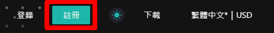
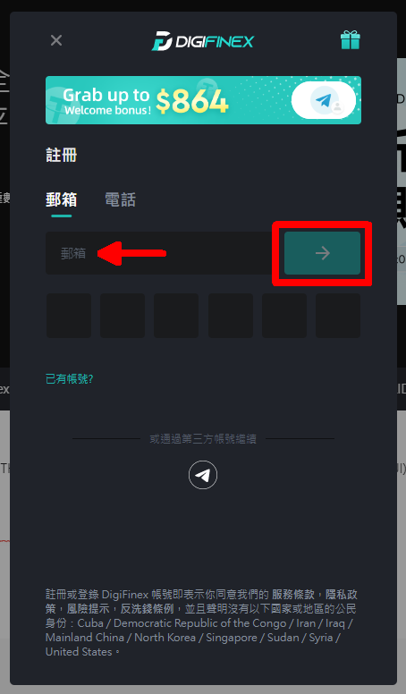
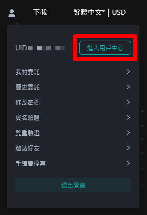

# 註冊 DigiFinex 帳號

在 DigiFinex 買賣 LikeCoin，請先註冊帳號。請到 [DigiFinex 網站](https://www.digifinex.com/)並按以下步驟註冊：

### 步驟一：確認密碼，及電子郵箱或手機號碼 

於網站右上角，點選「註冊」


留意你必須承諾不是來自美國或新加坡的用戶。2021年6月開始中國用戶不能使用 DigiFinex。


請輸入電子郵件信箱、自定登錄密碼及邀請碼（可選填）。你也可以選擇使用手機註冊（下圖紅圈位置）

留意無論你使用電郵或手機註冊，你也必須要先點選「發送」（上面箭咀位置），並完成安全認證，方可取得驗證碼 。在電郵或手機收取驗證碼後，輸入並點選「提交」，帳號便會即時開立。在接下來的開戶步驟中，你需要經常收取驗證碼進行驗證，而驗證碼只有十分鐘使用時限，故此請確保閣下在網絡環境穩定時才進行註冊

成功開戶後，會回到 DigiFinex 交易所的首頁。點擊右上角的人像「進入用戶中心」

然後會跳進至「基本訊息」頁面，你必須要進行身份證認及雙重驗證方可使用 DigiFinex 的服務。

#### DigiFinex 官方教學

> [【新手教程】- 如何註冊帳號
>
>
> ](https://digifinex.zendesk.com/hc/zh-tw/articles/360006576493--%E6%96%B0%E6%89%8B%E6%95%99%E7%A8%8B-%E5%A6%82%E4%BD%95%E8%A8%BB%E5%86%8A%E5%B8%B3%E8%99%9F)

### 步驟二：身份認證 

在「基本訊息」頁面的「身份認證」欄點選「未認證」出現下圖。掃瞄二維碼或到 [https://download.digifinex.xyz/](https://download.digifinex.xyz/) 下載 DigiFinex app

打開 app 後，點選右上角小鈴鐺（紅圈）登入帳號

輸入電子郵箱或手機號碼及密碼，點選 \[登錄]

點選 \[發送] 並於郵箱或手機取得驗證碼，輸入再點選 \[確定]

留意第一次在 DigiFinex app 登錄必須設定手勢密碼（或其他驗證方式，視乎手機系統而定），以後只需要使用它就可以簡單登入帳號而不需要輸入密碼，敬請牢記

點選左上角頭像出現選單，再點選 \[帳戶安全]

點選 \[身份認證] 中的 \[未認證]

填寫實名認證資料，選擇中國大陸用戶或非中國大陸用戶再點選 \[下一步]

填寫詳細資料，需提供國籍、證件上的名字、姓氏、證件類型、證件號碼等各種資料

按提示掃瞄證件後在拍攝手持照片並提交，請注意第三張照片，需要手持身份證，以及一張手寫 DigiFinex+當日上傳日期的紙條。留意圖片僅限 JPG、PNG 格式且大小不能超過 2MB


掃瞄實名認證人的人臉信息，提交後實時完成審核

如審核失敗請參考系統告知失敗原因，重新提交實名認證或[聯絡客戶服務](https://digifinex.zendesk.com/hc/zh-cn/articles/360000525241-%E5%A6%82%E4%BD%95%E5%AF%BB%E6%B1%82D%E7%BD%91-Digifinex-vip-%E5%AE%A2%E6%9C%8D%E5%B8%AE%E5%8A%A9)申請人工審核（申請人工審核選項會在認證失敗後自動彈出）

提交文件後，請耐心等候 DigiFinex 官方批核，一般需要一至三個工作天。

#### DigiFinex 官方教學

> [【新手教程】- 如何進行實名認證
>
> ](https://digifinex.zendesk.com/hc/zh-tw/articles/360006473334--%E6%96%B0%E6%89%8B%E6%95%99%E7%A8%8B-%E5%A6%82%E4%BD%95%E9%80%B2%E8%A1%8C%E5%AF%A6%E5%90%8D%E8%AA%8D%E8%AD%89)

### 步驟三：雙重驗證 

你必須要設定雙重驗證碼否則將不能提幣，請使用手機下載  Google Authenticator 應用程式

[安卓版下載鏈結](https://play.google.com/store/apps/details?id=com.google.android.apps.authenticator2\&hl=zh\_TW)\
[蘋果版下載鏈結](https://apps.apple.com/hk/app/google-authenticator/id388497605)

在「基本訊息」頁面的「雙重驗證」欄點選「未開啟」出現下圖，點選「下一步」

以 Google Authenticator 掃瞄頁面中的二維碼，再點選「下一步」

點選「發送」獲取驗證碼，並填寫從 Google Authenticator 獲得的 6 位雙重驗證碼，再點選「開啟」。假如你希望在登入時也使用雙重驗證，可選取「雙重驗證碼用於登錄」選項。否則你也可以在「安全中心」的「雙重驗證」設定該選項

#### DigiFinex 官方教學

> [【谷歌驗證】- 如何開啟谷歌驗證
>
>
> ](https://digifinex.zendesk.com/hc/zh-tw/articles/360007869553--%E8%B0%B7%E6%AD%8C%E9%A9%97%E8%AD%89-%E5%A6%82%E4%BD%95%E9%96%8B%E5%95%9F%E8%B0%B7%E6%AD%8C%E9%A9%97%E8%AD%89)

### 如有疑難，聯絡 DigiFinex 客服

若你在開戶或任何交易所服務的過程中遇到困難，請參考 [DigiFinex 幫助中心](https://digifinex.zendesk.com/hc/zh-tw)或直接聯絡 [DigiFinex 客服](https://digifinex.zendesk.com/hc/zh-tw/articles/360000525241)。點擊 DigiFinex 網站畫面右下角綠色的對話圖示即可獲得支援。
