# 在 DigiFinex 交易


提示：進行任何大額交易前請先作少量嘗試


DigiFinex 是一所在 CoinMarketCap 排名 20+，交易及流通量均位列國際頂級的交易所，提供 LIKE/USDT 交易對。若你還未有 DigiFinex 帳號，[請參考這篇](registering-on-digifinex.md)。此外你也需要下載 [Keplr](../wallet/keplr/) 錢包 或 [Liker Land 手機應用程式](https://liker.land/getapp)用來傳送/提取 LikeCoin。以下示範以 DigiFinex 網頁版為例，你亦可使用 [DigiFinex 手機應用程式](https://digifinex.zendesk.com/hc/zh-tw/articles/360000603862--%E5%AE%A2%E6%88%B6%E7%AB%AF%E4%B8%8B%E8%BC%89-%E5%A6%82%E4%BD%95%E4%B8%8B%E8%BC%89D%E7%B6%B2APP)進行交易。

### 步驟一：開立 DigiFinex 帳戶的 LikeCoin 錢包收款地址

第一步要把你的 LikeCoin 轉賬到 DigiFinex 交易所。點擊 DigiFinex 網站右上角的人像「進入用戶中心」
，再點選「我的資產」，並在搜尋欄輸入 "Like"，再點選「充幣」

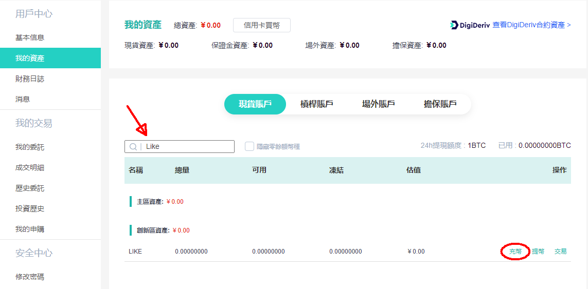


跳轉至「讚賞幣 ( LIKE ) 充值」頁面，點選「生成充幣地址」，系統會產在你在 DigiFinex 的 LikeCoin 錢包地址。你也可以在下方查看你的「充幣歷史」

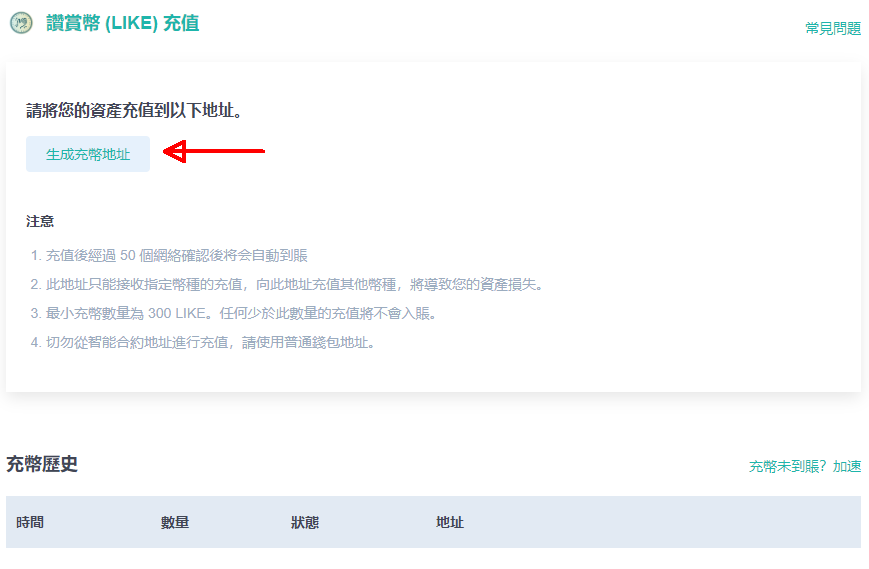

cosmos 起始的一連串數字就是你在 DigiFinex 的 LikeCoin 錢包地址，點選「顯示二維碼」就可以不用人手輸入這串地址了。而 **"TagMemo" 是很重要的原素**，因為沒有它，DigiFinex 就不能辨識你的存幣

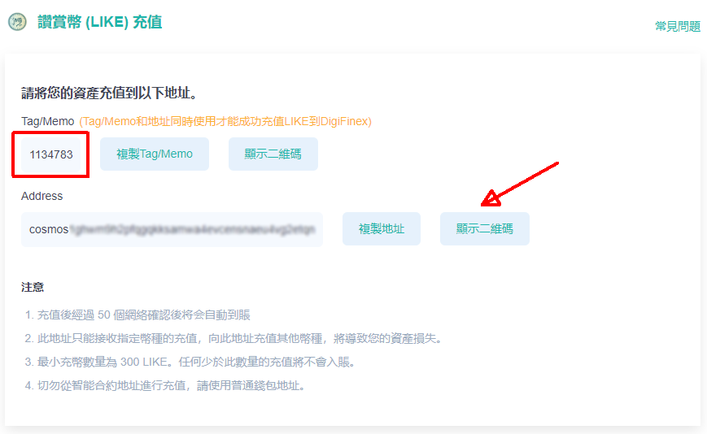

點選「顯示二維碼」出現你的 LikeCoin 錢包二維碼。

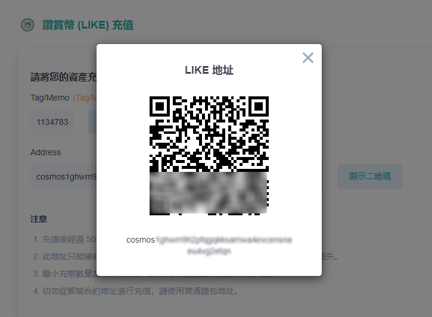


留意 DigiFinex 設有單筆最小充值量 **100 LikeCoin**，**未達此金額的存款將直接消失掉！**請務必看清楚才轉帳。


### 步驟二：轉帳 LikeCoin 到 DigiFinex

打開 [Liker Land 手機應用程式](https://liker.land/getapp)，點擊「我的錢包」，點畫面上的「LIKE pay」（下圖紅圈位置）

進入下一頁後，點下圖紅圈位置的二維碼圖示。app 會跳進照相機介面讓你掃描二維碼，請掃描【步驟一】中你的 DigiFinex 帳戶 LikeCoin 錢包二維碼

在「輸入 memo（可省略）」中輸入你的 Tag/Memo 號碼（**非常重要！**）

輸入你想要轉帳的 LikeCoin 金額，然後點擊「確認」

接下來便要等 DigiFinex 確認收款了。

使用 [Keplr](../wallet/keplr/) 錢包，請於 Memo (Optional) 一欄貼上 Tag/Memo 號碼。


DigiFinex 要求將 "Tag/Memo" 於轉帳期間同時寫入區塊鏈。充值未填寫/填錯 "Tag/Memo" 將會導致無法識別充值信息及不能入賬，需技術人員手動核實確認，預計需要 7-21 個工作日並需要扣除 10USDT手續費，你的 DigiFinex 賬號中也必須有等額或以上資產。請聯絡 [DigiFinex 客服](https://digifinex.zendesk.com/hc/zh-tw/articles/360000525241--%E6%96%B0%E6%89%8B%E6%95%99%E7%A8%8B-%E5%A6%82%E4%BD%95%E5%B0%8B%E6%B1%82D%E7%B6%B2-DigiFinex-%E5%AE%A2%E6%9C%8D%E5%B9%AB%E5%8A%A9)處理。


#### DigiFinex 官方教學

> [【充幣】- 如何充幣到D網（APP版）
>
> ](https://digifinex.zendesk.com/hc/zh-tw/articles/360002689614--%E5%85%85%E5%B9%A3-%E5%A6%82%E4%BD%95%E5%85%85%E5%B9%A3%E5%88%B0D%E7%B6%B2-APP%E7%89%88-)

### 步驟三：確認 DigiFinex 收款

你可以到【步驟一】中「我的資產」查看 LikeCoin 是否經已收妥。

### 步驟四：選個好價錢買入/賣出

在 DigiFinex 網頁的左上角有「行情」及「現貨交易」等選項。先看看行情

點選「行情」，在搜尋欄輸入 "Like" 出現走勢圖表（下圖由於 LikeCoin 剛上市，故未有顯示）

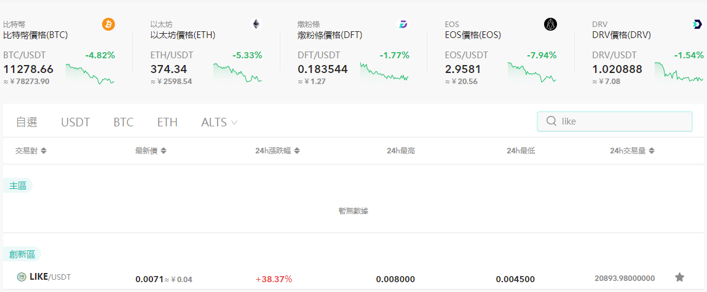

點選「現貨交易」，在左手邊的搜尋欄輸入 "Like"，點擊 LIKE/USDT 並進入交易頁面

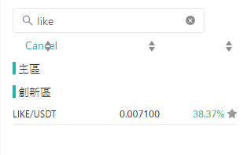

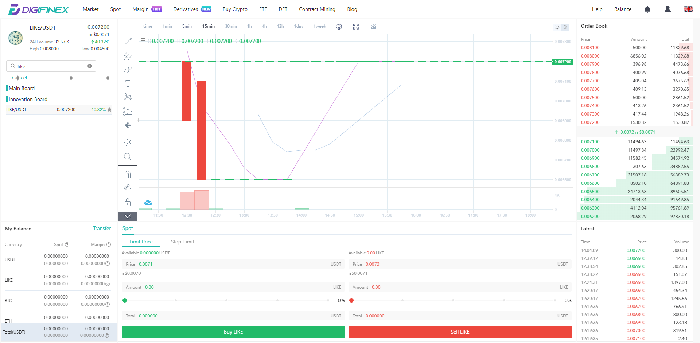

查看畫面右邊的「交易掛單」上方紅色列出的是掛出在市場上的「賣單」，以下圖的例子舉例，有人願意以 0.007200 USDT/LIKE 的價格賣出 500 LikeCoin，然後再有人願意以 0.007300 USDT/LIKE 的價格賣出 417.44 LikeCoin。假設你想買入 900 LikeCoin，你便可以最高價 0.007300 USDT/LIKE 的價格全數買入

若你想賣出 LikeCoin，你便要觀察綠色的「買單」找買家。以下圖為例，假設你想要賣出 200 LIKE，可保證以 0.007100 USDT/LIKE 的價格賣出，因為目前有人出的最高價是 0.007100 購買 300 LikeCoin

總而言之，賣 LikeCoin 時看下方綠色的買單；買 LikeCoin 時看上方紅色的賣單，此外你可以參考最下方的「最新成交」數據

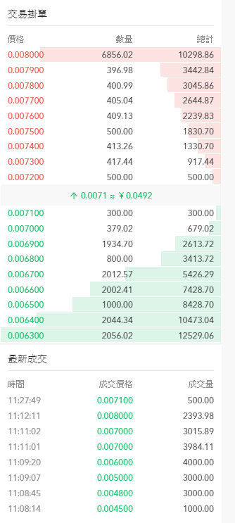

決定了買賣的價錢和數量後，可在畫面下方的「現貨交易」欄下單，以「限價交易」為例子說明

你需要輸入三項資料：

1. 確認選對了「買入 LIKE」或「賣出 LIKE」，這一步很多時候也會被忽略了然後做錯事
2. 輸入價格。以上圖的掛單簿為例，若我想賣出 LikeCoin 這裡應填上 "0.007100"
3. 輸入數量。若我想賣出 200 LikeCoin 這裡應填上 200。你也可以隨意選擇庫存的百份比

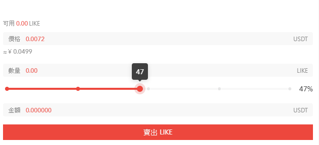

資料填妥後，系統會自動計算成交額。確認無誤後，點擊「賣出 LIKE」，操作完成！

#### DigiFinex 官方教學

> [【幣幣交易】- 如何進行幣幣交易（APP版）
>
> ](https://digifinex.zendesk.com/hc/zh-tw/articles/900002887983--%E5%B9%A3%E5%B9%A3%E4%BA%A4%E6%98%93-%E5%A6%82%E4%BD%95%E9%80%B2%E8%A1%8C%E5%B9%A3%E5%B9%A3%E4%BA%A4%E6%98%93-APP%E7%89%88-)

> [【幣幣交易】- 什麽是幣幣交易
>
> ](https://digifinex.zendesk.com/hc/zh-tw/articles/900002887843--%E5%B9%A3%E5%B9%A3%E4%BA%A4%E6%98%93-%E4%BB%80%E9%BA%BD%E6%98%AF%E5%B9%A3%E5%B9%A3%E4%BA%A4%E6%98%93)

### 步驟五：查看交易詳情

交易完成後，你可在畫面下方「歷史委託」，查看交易的詳情，你的錢包亦會反映餘額。

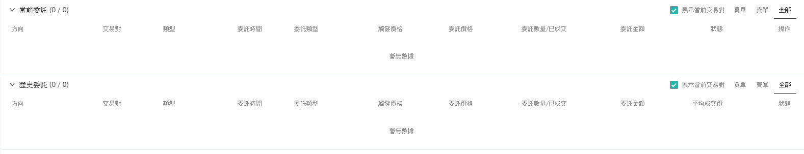

### 步驟六：提幣


關於單次最小提幣數量及手續費，可參考 [DigiFinex交易所费率说明](https://digifinex.zendesk.com/hc/zh-tw/articles/360000328422-DigiFinex%E4%BA%A4%E6%98%93%E6%89%80%E8%B4%B9%E7%8E%87%E8%AF%B4%E6%98%8E)
&#x20;，又，提幣前必須先完成[雙重認證](registering-on-digifinex.md#3-google-)。


回到【步驟一】中「我的資產」頁面尋找幣種，再點擊「提幣」並「添加提幣地址」添加你的 USDT 或 LikeCoin 轉帳地址，再按照指示即可完成提幣。

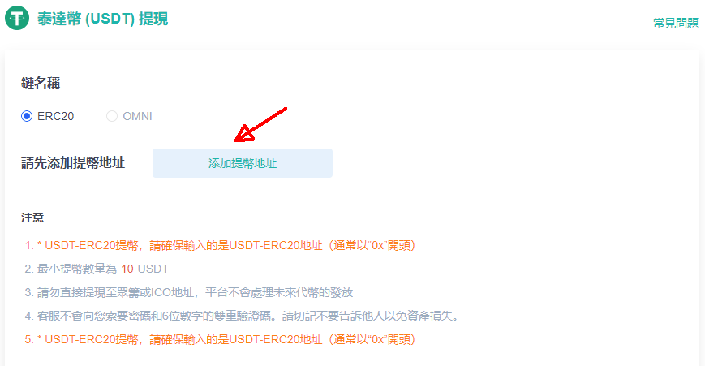

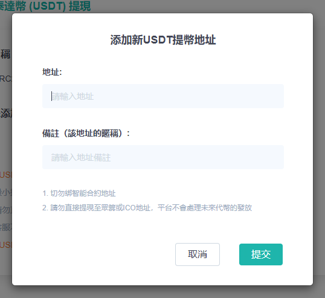

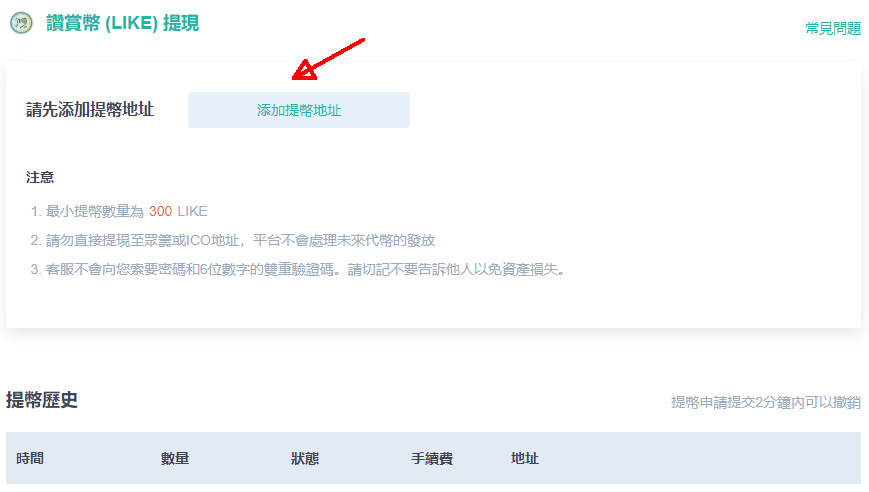

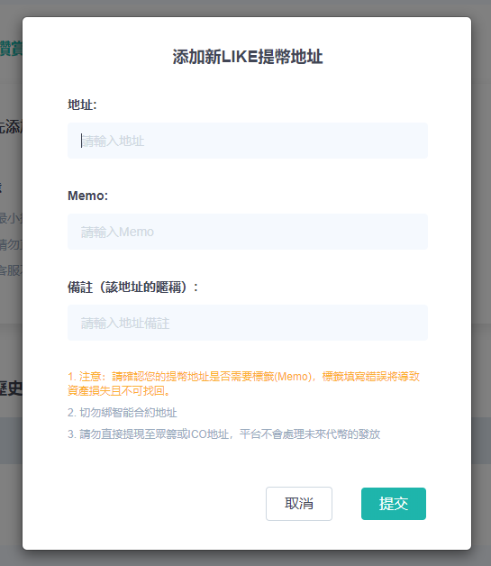

####

#### DigiFinex 官方教學

> [【提幣】- 如何從D網提幣到其他平臺（APP版）
>
> ](https://digifinex.zendesk.com/hc/en-us/categories/360000257814-User-Guide)
