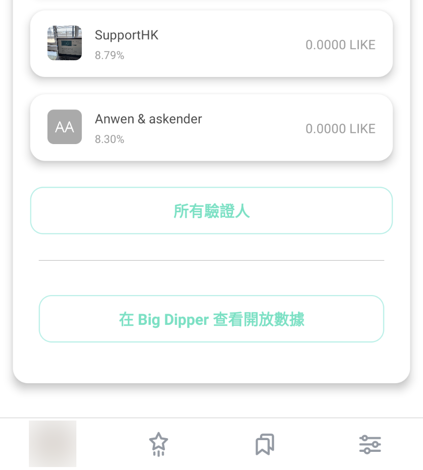
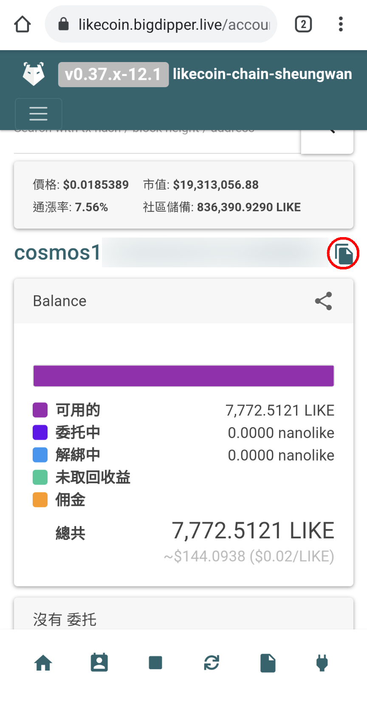
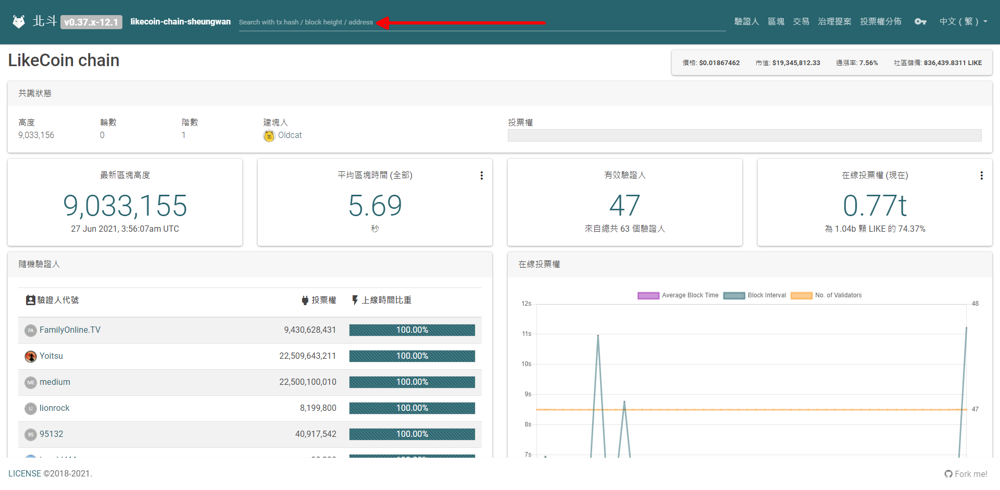

# Big Dipper

[北斗 BigDipper](https://likecoin.bigdipper.live/) 以簡便的介面，除了展示治理相關的議案內容、投票結果、驗證人的介紹、投票紀錄外，還有更基本的，所有交易證明。北斗就像個開放政府，讓公民查閱和搜尋共和國的所有開放數據。

Big Dipper 支援使用硬件錢包進行轉帳、委託、轉移委託、領取收益等操作，詳見：



## 如何使用 Big Dipper

在 [Liker Land 手機應用程式](https://liker.land/getapp)點擊「我的錢包」，再移動到最底，點擊「在 Big Dipper 查看開放數據」

瀏覽器彈出 Big Dipper 介面。你也可以使用複製（紅圈）功能記下 Cosmos 錢包地址，再於桌機輸入地址（紅箭嘴）瀏覽錢包明細。

