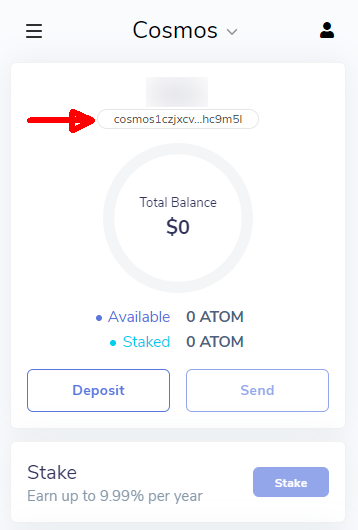
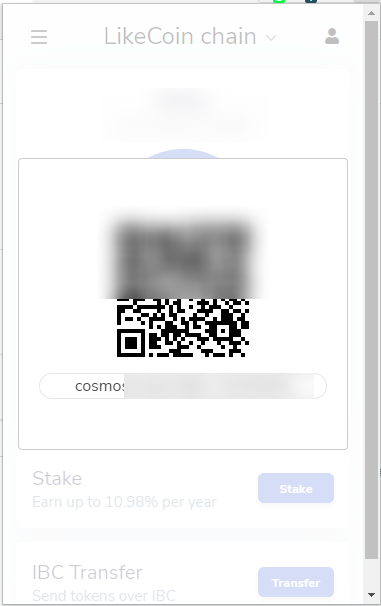
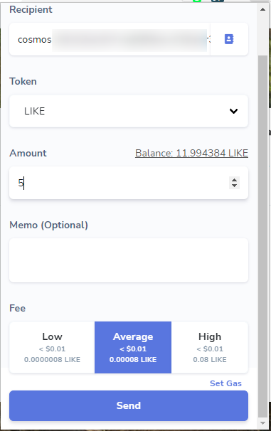
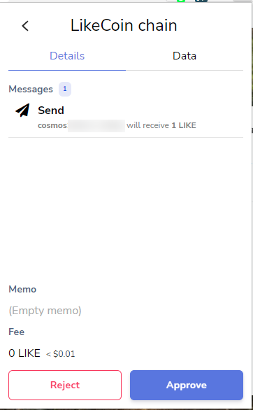
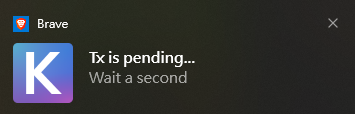

# Keplr

[Keplr](https://www.keplr.app/) 提供 Google Chrome 擴充功能，可在 Chrome 和 Brave 等瀏覽器安裝，支援包括 LikeCoin 在內的多條 Cosmos 生態系統區塊鏈。使用 Keplr 錢包你可以將自己的 LikeCoin 去中心化保存並自行掌握私鑰。

留意 Keplr 手機版暫不支援 LikeCoin chain。

請參考以下文章了解如何在桌面電腦安裝 Keplr：


[installation.md](installation.md)


你亦可以匯出你的 Liker Land 助記詞以使用 Keplr 錢包：


[export-seed-words.md](../../../user-guide/liker-id/export-seed-words.md)



[import-account.md](import-account.md)


## 使用 dao.like.co 轉帳、委託、投票及查看交易明細 

用戶需要先到 [dao.like.co](https://dao.like.co/) 將 LikeCoin chain 連結至 Keplr。你亦可以搭配 Keplr 進行各種操作，包括轉帳、[委託](../../stake/)、[投票](../../governance/direct-vote.md)及查看交易明細等。

到 [dao.like.co](https://dao.like.co/) 網站，點擊「Keplr Browser Extension」。

再點擊「Approve」。

看見這個畫面再「Approve」多一次。

你會看到你的 LikeCoin 餘額。

你也可以直接以 Keplr 註冊 Liker ID，或為現有的 Keplr 錢包綁定 Liker ID，詳見：


[register-with-keplr.md](../../../user-guide/liker-id/register-with-keplr.md)


## 其他可使用 Keplr 管理 LikeCoin 的錢包介面 

* Omniflix - [https://likecoin.omniflix.co/](https://likecoin.omniflix.co/)
* BitSong - [https://wallet.bitsong.io/](https://wallet.bitsong.io/)&#x20;
* ping.pub - [https://ping.pub/](https://ping.pub/)

## 在 Keplr 存入 LikeCoin 

### 步驟一

在入 LikeCoin 到 Keplr 錢包，請先把 Keplr 頂部的密碼貸幣菜單轉為顯示 LikeCoin chain。

假如你的 Keplr 錢包未能顯示 LikeCoin chain，請[先到 dao.like.co 為 Keplr 錢包連結 LikeCoin chain](./#dao-like-co)。

### 步驟二

然後點擊錢包地址進行複製並黏貼到所要的地方（交易所或另一個錢包）。又或者點「Deposit」出現二維碼。

直接使用 [LIKE Pay](../like-pay.md) 掃瞄二維碼就可以轉帳 LikeCoin 到你的 Keplr 錢包。建議最初只轉帳小量 LikeCoin 作測試。

### 步驟三

轉帳完成後查看你的 LikeCoin 餘額。

## 從 Keplr 轉帳 LikeCoin 到其他錢包 

### 步驟一 

你可以在 Keplr 介面直接轉帳 LikeCoin 到其他支援 LikeCoin 的錢包，把 Keplr 頂部的密碼貸幣菜單轉為顯示 LikeCoin chain 後點「Send」。

### 步驟二

在 Recipient 填入收款方的錢包地址、Token 經已自動選為 LIKE、Amount 填示錢包內的 LIKE 可用餘額。請填寫需要轉帳的 LikeCoin 數量，並留意必須預留[手續費](../transaction-fee.md)。Memo (Optional) 一欄填進收款方需要 Tag/Memo（如有）。再點「Send」。

### 步驟三

出現確認畫面，確認一切無誤後選「Approve」。

Keplr 出現 Tx is pending 並回到 LikeCoin 餘額畫面，轉帳完成。

