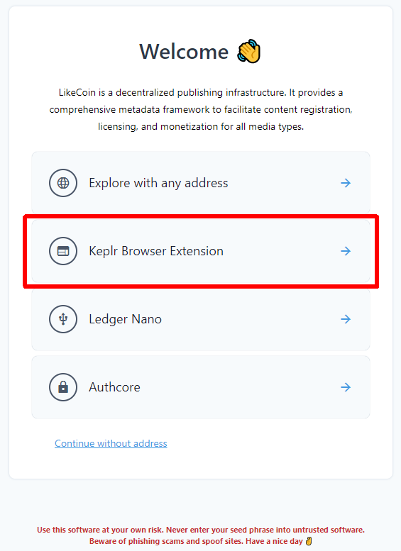
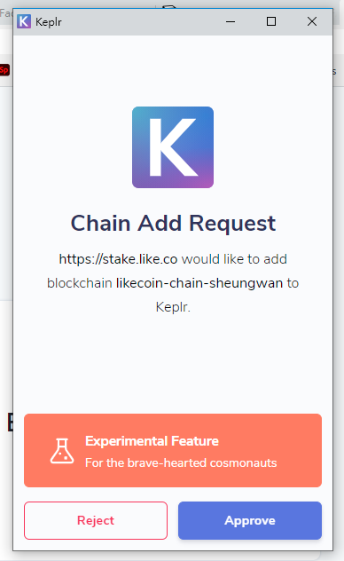
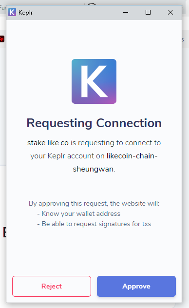
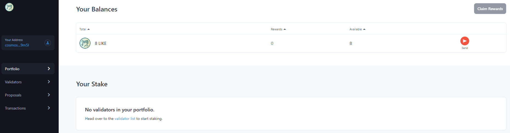

# Keplr：存入、轉帳、委託、投票及查看交易明細

## 使用 dao.like.co 存入、轉帳、委託、投票及查看交易明細 

用戶需要先到 [dao.like.co](https://dao.like.co/) 將 LikeCoin chain 連結至 Keplr，並搭配 [Keplr 瀏覽器擴充功能](how-to-install-keplr-extension.md)進行各種操作，包括存入、轉帳、[委託](../../stake/)、[投票](../../governance/direct-vote.md)及查看交易明細等。

### 步驟一

到 [dao.like.co](https://dao.like.co/) 網站，點擊「Keplr Browser Extension」。

<figure><figcaption></figcaption></figure>

### 步驟二

再點擊「Approve」。

### 步驟三

看見這個畫面再「Approve」多一次。

### 步驟四

你會看到你的 LikeCoin 餘額。

<figure><figcaption></figcaption></figure>

## 其他可使用 Keplr 管理 LikeCoin 的錢包介面 

* Omniflix - [https://likecoin.omniflix.co/](https://likecoin.omniflix.co/)
* BitSong - [https://wallet.bitsong.io/](https://wallet.bitsong.io/)&#x20;
* ping.pub - [https://ping.pub/](https://ping.pub/)
