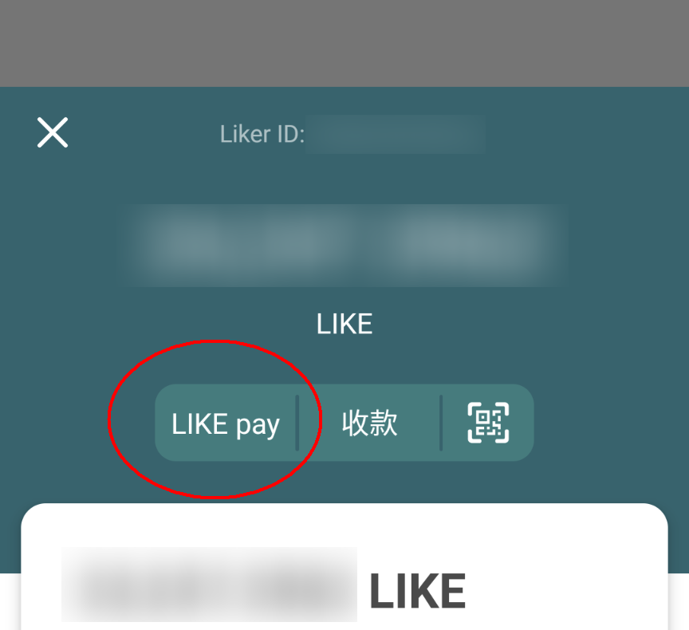
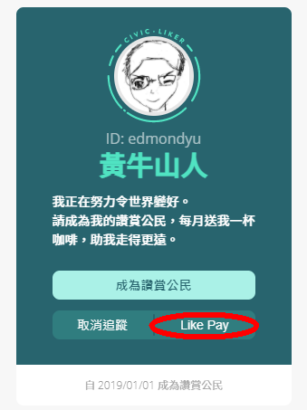

# LIKE pay

## 使用 Liker Land 手機應用程式轉帳 LikeCoin

### **步驟一**

首先你需要安裝、[以一般方法 ( Authcore ) 註冊 Liker ID](../../user-guide/liker-id/register/) 並登入 [Liker Land 手機應用程式](https://liker.land/getapp)。

### **步驟二**

打開手機應用程式後，點擊「我的錢包」，打開你的錢包。點擊畫面上方的「LIKE pay」。

### **步驟三**

你可直接於「收款人的 Liker ID 或錢包地址」填上收款方的 Liker ID 或錢包地址。也可用掃瞄二維碼的方法：收款人先打開錢包，再點擊「收款」，展示錢包二維碼。然後你可以點擊下圖紅圈位置，調用照相機掃瞄收款人的錢包二維碼。

### **步驟四**

Liker Land 手機應用程式會打開你手機的相機鏡頭，請對著收款方的二維碼掃瞄。然後再按「下一步」。

### **步驟五**

某些交易所需要用戶在區塊鏈上加上 Tag/Memo，你可以在這個畫面「輸入 memo（可省略）」下方輸入內容，否則按「下一步」略過。

### **步驟六**

輸入要轉帳的金額，選「下一步」出現確認畫面，你可點擊「詳細資料」查看是次轉帳[手續費](transaction-fee.md)的估算數值。請確定你的錢包在轉帳以外留有足夠手續費，再點擊「確認」 即可完成轉帳。

## 使用 Liker Land 網頁版轉帳 LikeCoin

### 步驟一

請先登入 [Liker Land 網頁版](../../user-guide/liker-land/download.md#liker-land-web)

### 步驟二

在瀏覽器連接支付頁面，格式是 https://like.co/\[Liker ID] 假設對方的 Liker ID 為 ckxpress，支付頁面就是 [https://like.co/ckxpress](https://like.co/ckxpress)輸入需要轉帳的 LikeCoin 數量，請留意錢包內需要有定夠[手續費](transaction-fee.md)，再點擊「確認」 即可完成轉帳。


[Matters](../../user-guide/creator/matters.md) 使用者可任意對任何一篇文章「支持作者」轉帳，詳見[Matters 支付與提現功能指南（2020.08.14更新）](https://matters.news/@hi176/matters-%E6%94%AF%E4%BB%98%E8%88%87%E6%8F%90%E7%8F%BE%E5%8A%9F%E8%83%BD%E6%8C%87%E5%8D%97-2020-08-14%E6%9B%B4%E6%96%B0-bafyreicfgnpk4jamnhkjecq32kdlmhhtp6xrwpkxoalp37wayd4sqmjo54)

