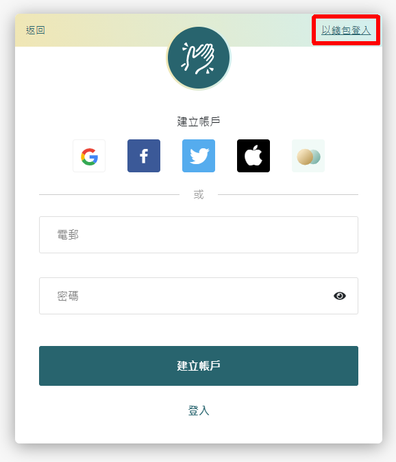

# 升級 LikeCoin 到 LikeCoin chain

LikeCoin 經已轉移到 [LikeCoin chain](../../governance/likecoin-chain.md)，用戶再不能使用 MetaMask 登入而需要使用 [Liker Land 手機應用程式](https://liker.land/getapp)。這篇文章是給以往使用 MetaMask 而並未完成轉移 Liker ID 的用戶參看。

若你乎合以下條件：

1. 在 MetaMask 上有 LikeCoin 餘額
2. 在 MetaMask 上已有足夠的 ETH 作為礦工費 \( Gas Fee \)
3. Liker ID 已同時綁定 MetaMask 及任何一個社交帳號 \( Google/Facebook/Twitter/Matters \)

請按照以下步驟升級至全新的 LikeCoin。

### 步驟 1：訪問 Like.co/in 

由於現在的目的是升級 MetaMask 中的 LikeCoin，所以你必須使用能操作該 MetaMask 錢包地址的電腦來執行以下步驟。

請以你常用的社交帳戶 \( Google/Facebook/Twitter/Matters \) 登入 [Liker Land](https://liker.land/) 再訪問 [https://like.co/in/](https://like.co/in/)。系統會彈出以下視窗。點擊「現在轉移」。

### 步驟 2.1：簡介原理

系統會帶你到另一個專門處理 LikeCoin 升級的頁面。

升級過程其實是把目前你在 MetaMask 上的 LikeCoin ERC-20 轉移到 LikeCoin chain 上。系統會助你簡易完成這個步驟。

第一個步驟是過程簡介，若有興趣明白更多的不妨一讀，然後請點擊「確認」。

### 步驟 2.2：簽署 

由於要在你的電子錢包轉帳，需要你的「簽署」。請點擊「簽署」。

點擊簽署後，MetaMask 會彈出以下的畫面。請點擊 "Connect" 及 "Sign"。

### 步驟 2.3：等候轉帳完成

這裡系統會先從你的 MetaMask 轉帳 LikeCoin ERC-20 到智能合約，再把新 LikeCoin 存款到你的 LikeCoin chain 錢包中。

過程一般需要幾分鐘，請耐心等候。轉帳期間會扣除 ETH 作為操作的 Gas Fee。

### 步驟 3：檢查 LikeCoin 金額 

 升級完成後，你可到 [https://Like.co/in](https://like.co/in) 檢查你的 LikeCoin 餘額。  

### 下載 Liker Land 手機應用程式 

你可以到 Google Play store 或 Apple App store，[下載 Liker Land 手機應用程式](https://liker.land/getapp)，以你的社交帳號登入，便可在 app 中查閱你的 LikeCoin 餘額了。


**若你過往只以 MetaMask 電子錢包登入**，從未綁定過其他的社交帳號登入方法的話，也可參照以上步驟，但請在登入頁面的右上角選擇「以錢包登入」後再選「Metamask」。過程中，系統會要求你設定一組密碼。


