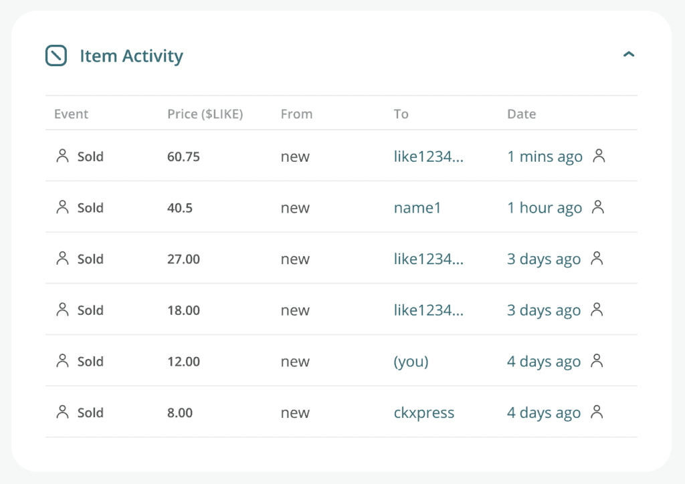

# 動態定價

我們明白作者最希望的是專注創作，就算要參與推廣也應著重於介紹作品及跟讀者建立關係，其他行銷相關的工序可免則免。

Writing NFT 為作者處理兩個令人頭痛的參數：1）定價；2）數量。

Writing NFT 的定價會隨著市場供求，按一條曲線上升，需求愈大價錢會自動調升，每上升一級定價乘以兩倍。讀者角度，每篇文章的 NFT 定價同一時間只有一個。若有人在二級市場放售，當前定價便會以二級市場的最低價為準。

Writing NFT 的數量原則上沒有上限，每當有人要買，系統便會鑄造一個新的 NFT 並按需求曲線的定價賣出。然而因為需求增加會導致定價持續上升，當價格到達一個市場不能接受的高度，便不會再有人願意出價鑄造出新的 NFT，總流通數量因而停止增加。

