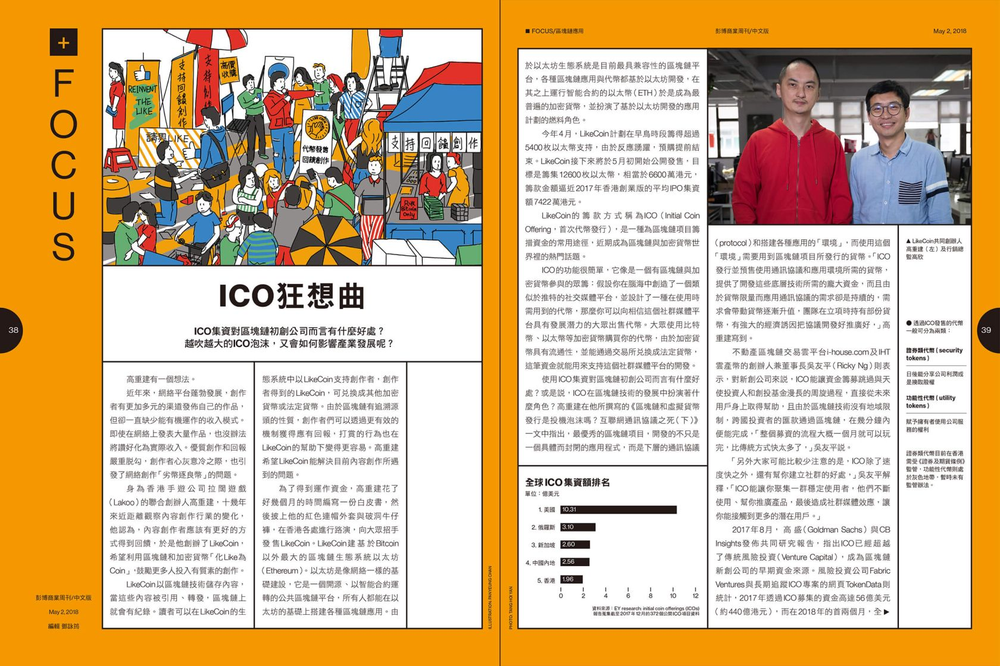
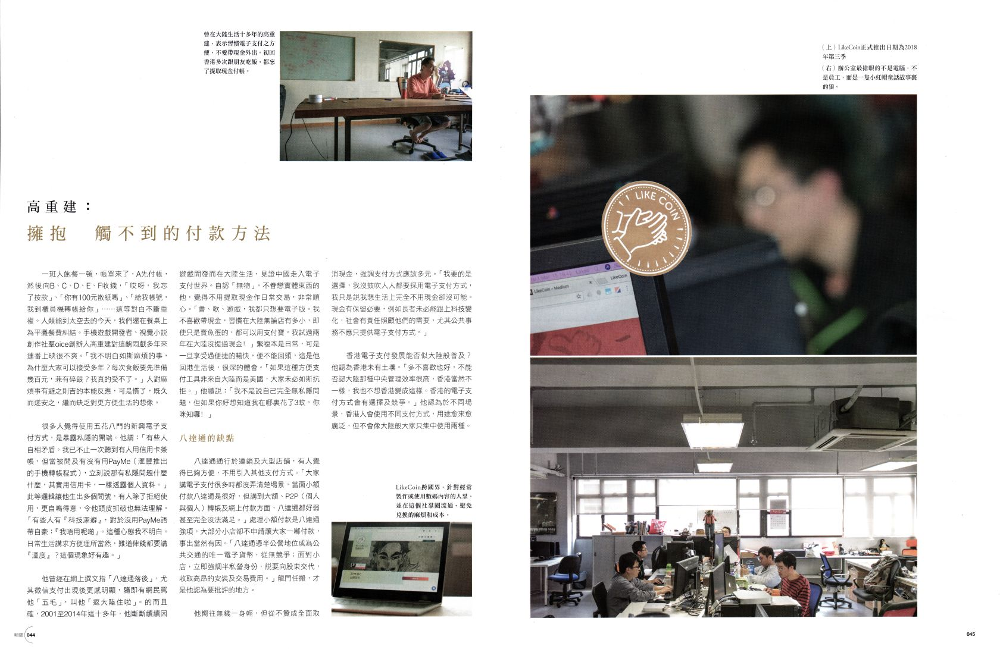
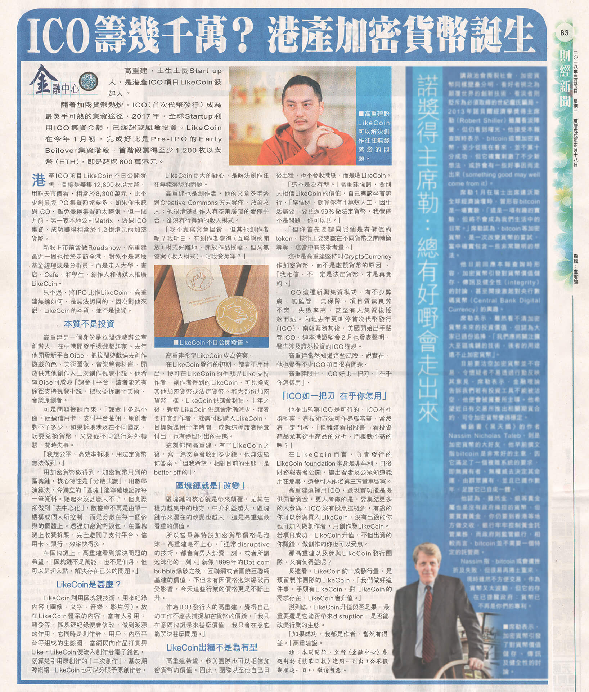

# Interview



### 08/11 Lighthouse Consultant Limited - Virtual Book Fair

[Virtual Book Fair](https://www.linkedin.com/posts/lighthouse-consultant-limited_lighthouseconsultant-eventplanning-eventmanagement-activity-6698471598539845632-1hFO)

### 08/07 香港無線電視財經 ‧ 資訊台 看出個未來

[未來發幤人](https://programme.tvb.com/info/futurescope)



### 07/15 區塊勢



### 05/15 港故仔



### **03/10 寶博士**

【寶博朋友說】區塊鏈打賞: 按讚就能讓人賺幣致富?! - 專訪 讚賞公民共和國 LikeCoin 創辦人 高重建 Kin Ko｜EP23



### 02/19 Meet 創業小聚

【創業新聲帶】EP4 LikeCoin｜按讚有錢賺！LikeCoin 用區塊鏈打造創作者生態系，實現創作可當飯吃｜Meet 創業小聚



### 02/10 Meet 創業小聚

創業之星 - LikeCoin 一分鐘快問快答！



### 02/05 Meet 創業小聚



### 01/14 Meet 創業小聚



### 01/02 CUHK Engineering Faculty Alumni Association \(ERGAA\).

中大工程校友「你問我答」第一回：區塊鏈



🔚 



### 12/7 区块链研究院



### 10/9 AIre VOICE



### 09/05 WP Builds





### 7/31 CIBS節目：區塊鏈與你 \(Blockchain and You\) 

第四集



### 06/14 區塊勢



### 06/04 Global Voices



### 05/24 iMoney 智富雜誌

[ 「創作可以當飯吃」 港人推LikeCoin望聚集讚賞公民](https://imoney.hket.com/article/2360745/%E3%80%8C%E5%89%B5%E4%BD%9C%E5%8F%AF%E4%BB%A5%E7%95%B6%E9%A3%AF%E5%90%83%E3%80%8D%20%E6%B8%AF%E4%BA%BA%E6%8E%A8LikeCoin%E6%9C%9B%E8%81%9A%E9%9B%86%E8%AE%9A%E8%B3%9E%E5%85%AC%E6%B0%91)

### 05/24 明報

[「讚賞公民」運動 化讚賞為作者收入](https://www.mpfinance.com/fin/daily2.php?node=1558639282687&issue=20190524)

### 05/22 眾新聞

{% embed url="https://www.hkcnews.com/article/20686/%E8%AE%9A%E8%B3%9E%E5%85%AC%E6%B0%91-likecoin-%E7%9C%BE%E6%96%B0%E8%81%9E-20686/%E3%80%8C%E8%AE%9A%E8%B3%9E%E5%85%AC%E6%B0%91%E3%80%8D%E8%A8%88%E5%8A%83%E5%95%9F%E5%8B%95-%E7%B6%B2%E5%AA%92%E7%9A%84%E6%9C%AA%E4%BE%86%EF%BC%9A%E6%9C%89like%E5%B0%B1%E6%9C%89coins%EF%BC%9F" %}

### **05/21 立場新聞**

{% embed url="https://www.thestandnews.com/media/likecoin-%E6%98%AF%E7%B6%B2%E5%AA%92%E5%87%BA%E8%B7%AF-%E5%89%B5%E5%A7%8B%E4%BA%BA%E9%AB%98%E9%87%8D%E5%BB%BA-%E6%9C%9F%E6%9C%9B%E5%8C%96%E8%AE%9A%E7%82%BA%E8%B3%9E-%E8%AE%93%E5%85%AC%E6%B0%91%E6%94%AF%E6%8C%81%E5%89%B5%E4%BD%9C%E8%80%85/" %}

### 01/01 新頭殼 Newtalk



🔚 



### 12/29 新頭殼 Newtalk



### 09/20 港台電視31 講錢。講呢啲：21世紀揾錢搞革命都靠條鏈?



### **08/17 HK01**

{% embed url="https://www.hk01.com/%E5%B0%88%E9%A1%8C%E4%BA%BA%E8%A8%AA/222574/%E5%B0%88%E8%A8%AA-%E5%89%B5%E6%84%8F%E6%9C%89%E5%83%B9-%E7%B6%B2%E6%B0%91%E6%8C%89likecoin%E9%8D%B5-%E5%8F%AF%E5%8A%A9%E5%89%B5%E4%BD%9C%E8%80%85%E6%97%A5%E9%80%B2%E5%8D%83%E9%87%91" %}

{% embed url="https://www.hk01.com/%E5%B0%88%E9%A1%8C%E4%BA%BA%E8%A8%AA/222576/likecoin%E5%B0%88%E8%A8%AA-%E9%AB%98%E9%87%8D%E5%BB%BA-%E6%96%B0%E5%B9%A3%E6%99%AE%E5%8F%8A%E4%B8%8D%E6%98%93-%E6%9C%80%E9%87%8D%E8%A6%81%E6%9C%89%E6%98%8E%E7%A2%BA%E5%AE%9A%E4%BD%8D" %}

{% embed url="https://www.hk01.com/%E5%B0%88%E9%A1%8C%E4%BA%BA%E8%A8%AA/222575/likecoin%E5%B0%88%E8%A8%AA-%E5%80%9F%E7%B6%B2%E6%B0%91%E8%88%89%E5%A0%B1%E6%8A%84%E8%A5%B2%E8%A1%8C%E7%82%BA-%E9%AB%98%E9%87%8D%E5%BB%BA-%E9%9B%A3%E7%A6%81%E7%B5%95%E4%BD%86%E6%AF%94%E7%8F%BE%E6%B3%81%E5%A5%BD" %}

### 08/05 D100

[《對沖人生路》主持：錢志健 『 Likecoin』 嘉賓：高重建、Bonita Wang](https://www.d100.net/%E3%80%8A%E5%B0%8D%E6%B2%96%E4%BA%BA%E7%94%9F%E8%B7%AF%E3%80%8B%E4%B8%BB%E6%8C%81%EF%BC%9A%E9%8C%A2%E5%BF%97%E5%81%A5-%E3%80%8E-likecoin%E3%80%8F-%E5%98%89%E8%B3%93%EF%BC%9A%E9%AB%98%E9%87%8D%E5%BB%BA/)



### **08/01 突破書誌 054期 搵真銀**

\*\*\*\*[價值重組實驗](https://like.co/pdf/articles/breakazine.pdf)

### 06/11 Cryptocurrency Satellite

[【LikeCoin\(ライクコイン\)】Kin\(キン\)CEOへインタビュー](https://web.archive.org/web/20180724091850/https://cryptocurrency-sat.com/topic/interview/likecoin-ceo/)

### 06/06 HK01

{% embed url="https://www.hk01.com/%E8%B2%A1%E7%B6%93%E5%BF%AB%E8%A8%8A/196190/%E6%B8%AF%E7%94%A2ico-likecoin%E9%9B%86%E8%B3%87%E9%80%BE4000%E8%90%AC-%E5%86%80-%E5%8C%96like%E7%82%BAcoin-%E5%9B%9E%E9%A5%8B%E5%89%B5%E4%BD%9C%E4%BA%BA" %}

### 06/01 
Liquid

QUOINE x LikeCoin: The Future of the Like



### 05/23 **壹**周刊









### 
05/14 opensource.com





### 05/10 Crypto Times



### **05/02 彭博商業周刊/中文版 第114期**

\*\*\*\*[ICO 狂想曲](http://hk.bbwc.cn/avxzbp.html) [PDF](https://www2.deloitte.com/content/dam/Deloitte/cn/Documents/financial-services/deloitte-cn-fs-bloomberg-business-megazine-ico-zh-180518.pdf)

### 05/01 Cryptoground





### 04/19 區塊客



### 04/09 信報財經新聞

[首隻港產加密幣點讚成金 創辦人冀改網絡歪風](http://startupbeat.hkej.com/?p=57661)

### 04/09 ejinsight



### 04/02 香港電台普通話台 AM621 CIBS 節目 - 追趕科技世界 \(The World towards Information Technology\) 科技Band房

第十三集







### 03/30 文化土豆

[042 爱国我说不出口【張潔平, 高重建】](http://www.culturepotato.com/blog/042)

### 03/23 香港無線電視財經台 「錢」進新世代

[以「Like」維生？](https://programme.tvb.com/news/freshmanfinance/episode/20180323/)



### 03/21 區塊客



### 03/19 明周

[【當金錢變成數碼】高重建：擁抱觸不到的付款方法 化like成coin支持創作](https://www.mpweekly.com/culture/%e9%9b%bb%e5%ad%90%e8%b2%a8%e5%b9%a3-%e9%9b%bb%e5%ad%90%e6%94%af%e4%bb%98-%e6%94%af%e4%bb%98%e5%af%b6-69230)

### **03/18 INSIDE**



### **03/17 iMoney 智富**

[首隻港產加密貨幣 化Like為Coin](https://imoney.hket.com/article/2031727/%E9%A6%96%E9%9A%BB%E6%B8%AF%E7%94%A2%E5%8A%A0%E5%AF%86%E8%B2%A8%E5%B9%A3%20%E5%8C%96Like%E7%82%BACoin)

### 03/09 Mr.Block 區塊先生

Winnier of Mr.Block x Blockshow Taipei Meetup







### 03/05 香港蘋果日報

[金融中心：ICO籌幾千萬？港產加密貨幣誕生](https://hk.appledaily.com/finance/20180305/HBHYRDIFNDKOXIV2RYX4CJAJHU/)

### **01/01 903**

高重建 為明日革命

🔚 



### 11/29 香港無線電視財經台 創科導航

[熱炒以太幣](https://programme.tvb.com/news/innovationgps/episode/20171129/)



### **10/08 明報**

\*\*\*\*[科網世代﹕LikeCoin將Like變成錢有可能？ 直落創作人口袋](https://news.mingpao.com/pns/%E5%89%AF%E5%88%8A/article/20171008/s00005/1507399895326/%E7%A7%91%E7%B6%B2%E4%B8%96%E4%BB%A3-likecoin%E5%B0%87like%E8%AE%8A%E6%88%90%E9%8C%A2%E6%9C%89%E5%8F%AF%E8%83%BD-%E7%9B%B4%E8%90%BD%E5%89%B5%E4%BD%9C%E4%BA%BA%E5%8F%A3%E8%A2%8B)

🔚 



