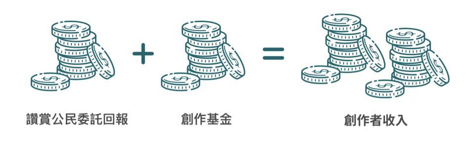

# 讚賞公民

### 【[成為讚賞公民](be-a-civic-liker.md)】

讚賞公民是一場回饋優秀內容的運動，讓讀者化讚為賞，回饋創作。

### 讚賞公民 Web3

用戶只需以綁定 Liker ID 的錢包地址，委託最少 5,000 LikeCoin 到「讚賞公民節點」，即可成為讚賞公民。讚賞公民節點獲得的**委託回報**將全數讓用戶以按讚的方式回饋作者。

### 不花分毫，即能回饋創作

讚 ＝ 賞。任何網站都可安裝 **LikeCoin button**，令讚賞公民每一按讚，同時分配**委託回報**的收益給作者，不用消耗委託的本金。

委託給「讚賞公民節點」的金額愈大，產生的**委託回報**便愈多，能回饋創作的金額也愈大。

> **例：**
>
> 假設 Alice 委託了 25,000 LIKE 給「讚賞公民節點」，若委託的年回報率為 15%。 每月產生的回報 ＝ 25,000x0.15/12 = 312.5 LIKE。按讚分配委託回報金，無需動用本金，即能回饋創作。
>
> 用戶可隨時取回已委託的 LikeCoin 本金（冷卻期 21 天）。

.png>)

### 按讚分配「創作基金」&#xD;

創作者所得的回饋來自兩部份：除了讚賞公民的委託回報外，還有「[創作基金](creators-fund.md)」奬勵。

創作基金來自 LikeCoin 的社群池，數額參考讚賞公民節點的委託回報總和，按讚賞公民的總 Like 數攤分，回饋給創作者。委託給讚賞公民節點的金額愈大，對創作基金的影響力也愈大。創作基金每天大約 12:00 GMT+8 發放。

免費 Liker 按讚也能令作者獲得少量創作基金資助。

### 成為持份者，參與 LikeCoin DAO

委託了的 LikeCoin 代表投票權，可直接參與 [LikeCoin DAO 議案投票](../../guides/governance/direct-vote.md)。委託的 LikeCoin 愈多，投票權也愈大。

### 鼓勵開放多元&#xD;

我們相信讚賞付出的每分每亳應該用作鼓勵開放多元，因此作者只管在慣用的平台繼續發表作品，不需把作品收在付費牆後犧牲觸及率都能獲得讀者支持。當然，只選擇開放部份內容以讚賞公民方式營運亦是一個選項。

鼓勵更多讚賞公民用戶加入，等於鼓勵更多開放的內容誕生。

### &#xD;NFT 收藏品

成為讚賞公民，有機會獲得專屬的 NFT 收藏品。

### 讚賞公民的背景

讚賞公民運動始於 2019年1月1日，早期版本讀者能透過每月訂閱，以按讚分配每月贊助金額，化讚為賞回饋創作。截至 2022年2月，24,000 位作者透過計劃獲得超過 5,000 萬 LikeCoin 收入。

讚賞公民於 2022年2月21日，改版至 Web3 版本，讓讀者以委託回報的收益來回饋創作，並終止支援信用卡付款 - 即「讚賞公民 Web3」。

請鼓勵更多人加入讚賞公民，共建更健康的創作生態。

_\*創作者收到讚賞幣需自行兌換成當地貨幣。_


[faq.md](faq.md)


### 【[成為讚賞公民](be-a-civic-liker.md)】

