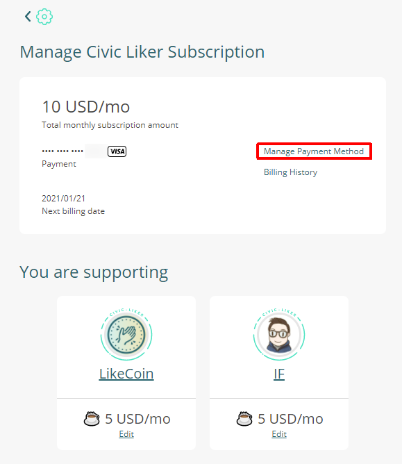

# Change Credit Card Information

Please follow the steps:

Step 1: Login in [Liker Land web](https://liker.land/), click on the menu at the top right hand corner, select "settings".

Step 2: In the Setting page, select "Civic Liker". It shows "Subscribing", click on it.

Step 3:  For Civic Liker old scheme, there is a link for "Change",  click on it.

For Civic Liker 2.0, click on "Manage Payment Method".

Step 4: Going into the Billing interface and change your credit card information.

