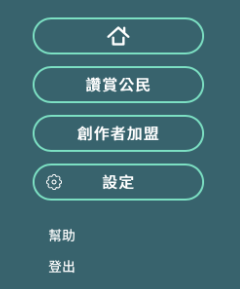
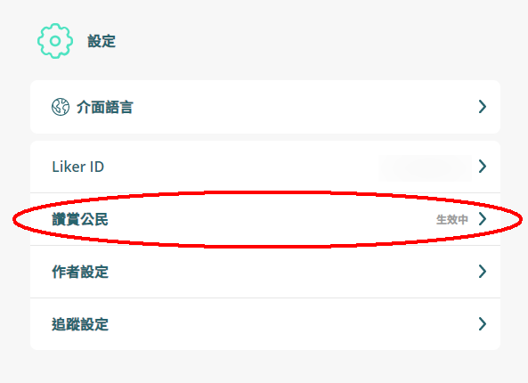

# 如何修改付款信用卡資料

請跟隨以下簡單步驟：  
  
步驟一：到 [Liker Land 網頁版](https://liker.land/)登入，打開位於畫面右上角的菜單，選「設定」。

步驟二：進入設定頁後，選第二個選項「讚賞公民」。正常你會見到帳號狀態是「生效中」。

步驟三：舊制讚賞公民的用戶進入頁面後你會見到「修改」的鏈結。點擊進入資料修改的頁面。

讚賞公民 2.0 用戶點擊「管理付款方法」。

步驟四：進入帳單修改頁面後，點擊「添加支付方式」，填入新的信用卡資料，設為默認。

