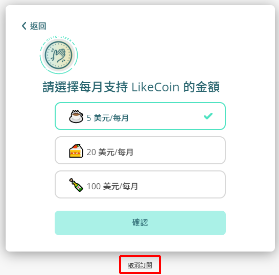

# 如何退訂「讚賞公民」

請跟隨以下簡單步驟：  
  
步驟一：到 [Liker.land 網頁版](https://liker.land/)登入，打開位於畫面右上角的菜單，選「設定」。

步驟二：進入設定頁後，選第二個選項「讚賞公民」。正常你會見到帳號狀態是「生效中」。  

步驟三：舊制讚賞公民的用戶進入頁面後你會見到取消「讚賞公民」訂閱的鏈結。點擊即可完成取消訂閱。

讚賞公民 2.0 用戶點擊「編輯」

再點擊「取消訂閱」連結即可完成取消訂閱。

請留意，成功取消訂閱後，已付的金額不會退還，訂閱將於下一個帳單結算日自動終止。

