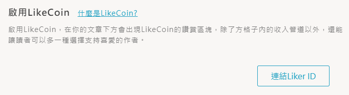

# Vocus

安裝讚賞鍵以前，請先 [註冊 Liker ID](https://docs.like.co/v/zh/user-guide/liker-id/how-to-register-a-liker-id)。

2020年3月31日[方格子](https://vocus.cc/)與 LikeCoin 正式合作，為華文創作者拓展更廣闊的內容變現空間。

方格子是一個超過 11,000 名作者參與的華文寫作平台，很高興方格子進一步整合 LikeCoin，壯大讚賞公民共和國的陣容。

在方格子中加入讚賞鍵 LikeCoin button 功能只需兩個簡單步驟：

步驟一：用戶登入方格子帳號，在「帳號設定」功能點選連結 Liker ID

步驟二：輸入你的 Liker ID 再點擊「儲存設定」

系統會自動在每篇文章下方預設加入讚賞鍵。​

### 參考文章

> [支持作者的新方法：LikeCoin 讚賞鍵功能上線](https://vocus.cc/writer_support/5e733005fd897800014b649f)

> [內容有價 X 化讚為賞：當華文創作第一站遇上 LikeCoin](https://vocus.cc/vocus_story/5e7837c6fd897800014ec41e)

