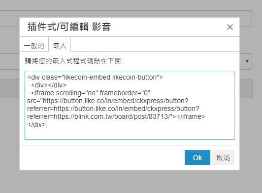
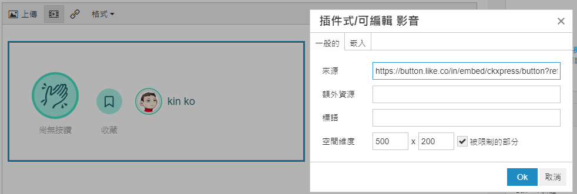

# Blink

安裝讚賞鍵以前，請先 [註冊 Liker ID](../../liker-id/)。

先登入 [Blink](https://blink.com.tw/)，撰寫文章並發佈。

依照以下格式製作你的讚賞鍵鏈結：

```
https://button.like.co/in/embed/[LikerID]/button?referrer=[網頁URL]
```

假設你的 Liker ID 是 ckxpress，網頁 URL 是 https://blink.com.tw/board/post/83713/

讚賞鍵的鏈結便是 https://button.like.co/in/embed/ckxpress/button?referrer=https://blink.com.tw/board/post/83713/

接著點「插件式/可編輯」影音，再選擇「嵌入」，將以下程式碼加到你需要顯示讚賞鍵的地方，留意要把 `{{ src }}` 的部份替換為讚賞鍵鏈結

```
<div class="likecoin-embed likecoin-button">
  <div></div>
  <iframe scrolling="no" frameborder="0" src="{{ src }}"></iframe>
</div>
```

亦即是這樣

```
<div class="likecoin-embed likecoin-button">
  <div></div>
  <iframe scrolling="no" frameborder="0" src="https://button.like.co/in/embed/ckxpress/button?referrer=https://button.like.co/in/embed/ckxpress/button?referrer=https://blink.com.tw/board/post/83713/"></iframe>
</div>
```

再按「OK」，讚賞鍵便會出現在文章中



你可以點「一般的」，再更改「空間維度」調整讚賞鍵顯示大小。



### 參考文章

> [likecoin / LikeCoinButton-integration iframe](https://github.com/likecoin/LikeCoinButton-integration/tree/master/web#2iframe)
