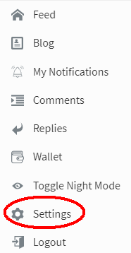
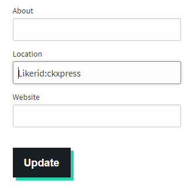

# SteemCN

Before adding the LikeCoin button, please [register a Liker ID](../../liker-id/).

Login SteenCN, click "Settings"

Input Liker ID into the "Location" field, the format is likerid:\[LikerID]. For example if you Liker ID is ckxpress, the content to input is Likerid:ckxpress

Then, click "Update"

LikeCoin button will appear in each and every of our articles.
