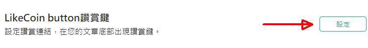
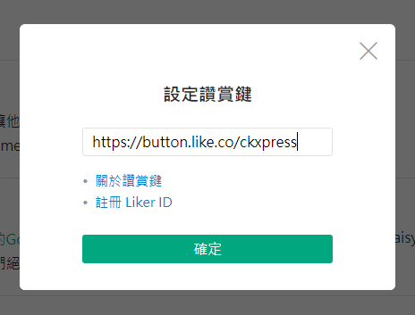

# 探路客 TIMELOG

安裝讚賞鍵以前，請先 [註冊 Liker ID](../../liker-id/)。

[探路客 TIMELOG](https://www.timelog.to/) 於2020年8月11日開始支援讚賞鍵功能。

在探路客 TIMELOG 中加入讚賞鍵 LikeCoin button 功能只需兩個簡單步驟：

步驟一：用戶登入探路客帳號，在「帳號設定」中的「LikeCoin button讚賞鍵」點選「設定」

步驟二：

假設你的 Liker ID 是 ckxpress，讚賞鍵的鏈結便是 https://button.like.co/ckxpress

在「輸入讚賞鍵網址」填寫
你的讚賞鍵鏈結再點擊「確定」

系統會自動在每篇文章下方預設加入讚賞鍵。​

### 參考文章

> [New功能推出！LikeCoin button讚賞鍵。\#讚賞探路客 \#化讚為賞
](https://timelog.timelog.to/a81998381#)

