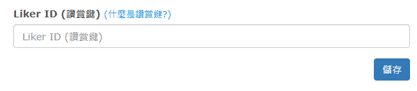

# Tipga

安裝讚賞鍵以前，請先 [註冊 Liker ID](../../liker-id/)。

[Tipga](https://www.tipga.com/) 於2021年3月13日開始支援讚賞鍵功能。

在 Tipga 中加入讚賞鍵 LikeCoin button 功能只需一個簡單步驟：

用戶登入 Tipga 帳號，在「網誌設定」中的「Liker ID (讚賞鍵) 」點「設定」，再輸入你的 Liker ID，然後再儲存。

系統會自動在每篇文章下方預設加入讚賞鍵。​

### 參考文章

> [如何在 Tipga 內使用 LikeCoin Button 讚賞鍵](https://www.tipga.com/e/604b832f3286fe29c032daba)
