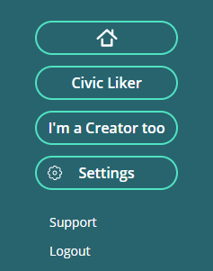

# Creator Pitch

In order to get more sponsors to become your [Civic Liker](https://docs.like.co/user-guide/civic-liker), an attractive creator pitch will help to leverage your image.
 The setup is easy, please follow the steps:

Step 1: Login in Liker Land web, click on the menu at the top right hand corner, select "settings".

Step 2: In the Setting page, select "Creator Settings".

Step 3: Click on "Edit" and write your creator pitch, click "Confirm" after editing. Please note that the content must be within 150 words.

Step 4: Your creator pitch will appear in various Liker Land scenarios:





