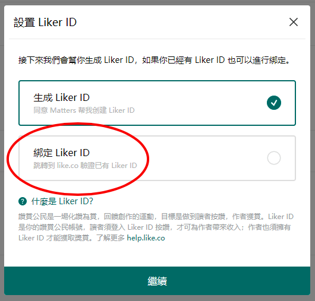
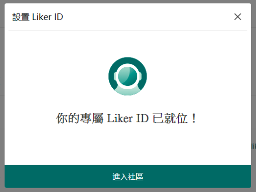
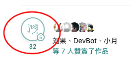
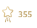

# Matters

Matters 預設已經整合讚賞鍵。只需綁定 Liker ID 及 Matters ID，你的作品便立即可以化讚為賞了。假如你還未有 Liker ID，建議你在 Matters 註冊並一拼生成 Matters ID 及 Liker ID。

假若你經已有 Liker ID 請留意綁定細節，否則有機會在註冊 Matters 時生成了多餘的 Liker ID。


Matters 並不支援綁定[以 Keplr 註冊的 Liker ID](../liker-id/register-with-keplr.md)。


## 如何綁定現有 Liker ID

### 步驟一

訪問 [Matters 網站](https://matters.news/)。

### 步驟二

畫面會彈出以下視窗。**若你已註冊了 Liker ID，請點擊「綁定 Liker ID」**；若你還未註冊 Liker ID 並想立即生成一個新的 Liker ID，點擊「生成 Liker ID」。

### 步驟三

若你未登入 Liker ID，系統會請你登入，然後會出現一個授權畫面。請點擊「接受」

步驟四：綁定完成！你會見到以下確認畫面：

#### Matters 專屬的讚賞鍵，就緒。

Matters 的讚賞鍵很簡潔，位於文章的最底部，見下圖。

送出 [Super Like](../liker-land/superlike.md) 的狀態如圖。

你還可以在 Matters 介面點擊自己的頭像，再點選「[讚賞我的](https://matters.news/me/appreciations/received)」查看自已獲得的拍手。

留意在 Matters「設定」、「錢包設定」中的所顯示的「我的創作價值」是你在 Matters 創作所獲得的 LikeCoin 數量，並不代表該 Liker ID 所獲得的整體 LikeCoin 數量。

### 參考文章

> [玩轉 Matters 實用指南](https://matters.news/guide)

## 「一鍵搬家」功能

Matters 於 2020年3月推出[一鍵搬家](https://matters.news/migration)功能，所有擁有 Medium 帳號的作者，都可以透過這個便捷的功能，快速一鍵搬家，把文章搬到 Matters ，化讚為賞。

### 參考文章

> [一鍵從 Medium 搬家到 Matters
> ](https://matters.news/@mingnhsu/%E4%B8%80%E9%8D%B5%E5%BE%9E-medium-%E6%90%AC%E5%AE%B6%E5%88%B0-matters-bafyreiggcgm7kn2el26rxsydny6obyklqlfo6rd3dphkc27olio4eqiyxi)

> [Medium「一鍵搬家」功能試用手記](https://matters.news/@fkh01/medium-%E4%B8%80%E9%8D%B5%E6%90%AC%E5%AE%B6-%E5%8A%9F%E8%83%BD%E8%A9%A6%E7%94%A8%E6%89%8B%E8%A8%98-bafyreigbozowkdvkn7hujosrwsgonjdyzhtohiunlkhsakmgxk2gr3og3a)

> [一樣菜 百樣賣：Medium一鍵搬家到Matters的試用心得
> ](https://matters.news/@islander/%E4%B8%80%E6%A8%A3%E8%8F%9C-%E7%99%BE%E6%A8%A3%E8%B3%A3-medium%E4%B8%80%E9%8D%B5%E6%90%AC%E5%AE%B6%E5%88%B0matters%E7%9A%84%E8%A9%A6%E7%94%A8%E5%BF%83%E5%BE%97-bafyreicoek6ybzguk3vwwtajuwt2dmxf5367qsahpgpstyp3sryu6wtfle)
