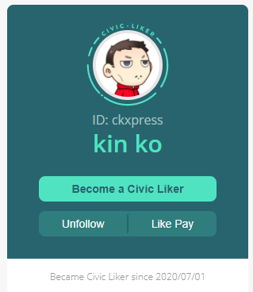

# Portfolio Page

## How to access your Portfolio Page

Portfolio Page helps content creators to share their reading history, there are two ways to access it.

Method 1: Click on avatar on the LikeCoin button.

Method 2: The Portfolio Page url is https://liker.land/\[Your Liker ID\], if your Liker ID is ckxpress, your link is going to be https://liker.land/ckxpress. 

## Personal Information

The left hand side of the Portfolio Page displays information of the content creator, including name, Liker ID, the date became Civic Liker with the following functions:

* Become a Civic Liker - If Readers click on it and become Civic Liker, Content Creator can receive USD5 equivalent LikeCoin bonus upon each successful Civic Liker referral, to read more please go to [LikeCoin Token・Making LikeCoin](https://docs.like.co/user-guide/likecoin-token/how-do-i-make-likecoin)
* Follow - Click and follow Content Creator as a Content Jockey
* LIKE Pay－Transfer LikeCoin to the Content Creator

## Works

If the Content Creator Super Liked his/her own works, they will be displayed in here.

## Super Likes

Super Likes history displayed all the other works and articles Super Liked by the Content Creator.

