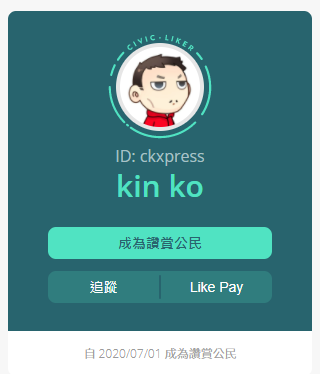

# 個人主頁

## 如何打開個人主頁

個人主頁可讓作者向讀者分享閱讀足跡，訪問它有兩種方法。

方法一：點擊 LikeCoin button 作者頭像

方法二：個人主頁的網址是 https://liker.land/\[你的 Liker ID\] ，例如 Liker ID 是 ckxpress，鏈結便是 https://liker.land/ckxpress。

## 個人資訊

頁面的左手邊展示作者個人資訊，包括姓名、Liker ID及成為讚賞公民的日期：

* 成為讚賞公民－讀者點擊專屬連結成為讚賞公民能讓作者獲得約 5 美元的等值 LikeCoin 奬勵，更多詳情請參閱 [獲得 LikeCoin・推薦朋友](https://docs.like.co/v/zh/user-guide/likecoin-token/how-do-i-make-likecoin#tui-jian-peng-you)
* 追蹤－點擊並追蹤作為內容伯樂的作者
* Like Pay－直接轉帳 LikeCoin 予作者

## 作品

假若作者曾 Super Like 自己的文章均會展示於此頁。

## 已 Super Like 的內容

Super Like 履歷功能展示作者曾經 Super Like 過什麼好文。

