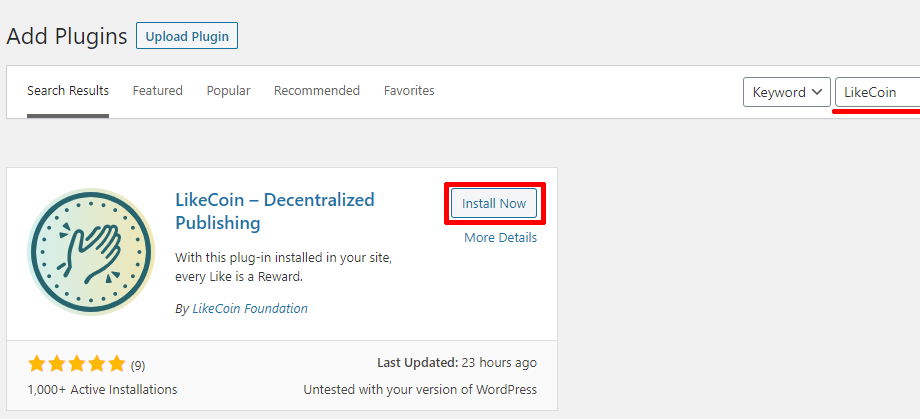
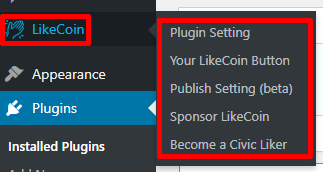

# WordPress

## How to add LikeCoin button on WordPress

Installing LikeCoin WordPress plugin is easy-peasy, it takes only a few steps, within one minute.

### Install LikeCoin plugin  

Before installing the LikeCoin plugin, please [register a Liker ID](https://docs.like.co/user-guide/liker-id/register).

Follow the steps:

1. Go to the WordPress admin panel and login \( For example if your website is www.abc.com, the admin panel address is usually on www.abc.com/wp-admin\).

2. Click on the Menu on the left, go to "Plugin" and click on "install plugin" on top.

3. Search for "LikeCoin" and find the LikeCoin plugin, click "Instal Nowl" and wait for the system to finish the job, then click "Activate".

4. After installation, there will be an "LikeCoin" option in the menu. Congratulations,  installation is done!

## Configuring LikeCoin plugin

Before configuring the LikeCoin plugin, please [register a Liker ID](https://docs.like.co/user-guide/liker-id/register).

On the menu, select "LikeCoin",  then fill in your Liker ID in the Liker ID field.

Then click "Confirm",  your LikeCoin button setup is finished.

After completing the above procedures, your LikeCoin button will appear underneath each article of your WordPress site. You can also use shortcode \[likecoin\] to display extra LikeCoin buttons.

## How to support multiple Liker ID on a WordPress site

There are many creators in one website, each of them got their own Liker ID, can LikeCoin button support rewarding individual creators?

Sure, the LikeCoin plugin supports multiple Liker ID by default.

1. In the LikeCoin plugin setting, there is an option  "Enable site Liker ID - Override all LikeCoin button with site Likder ID".  Please make sure that the option is "**NOT**" being selected.

2. You can add new WordPress users as usual, and this part is not related to the LikeCoin plugin. After adding new users, they can use their own WordPress account to login and set up their own Liker ID and LikeCoin button.

## Publish Setting \(beta\)

From now on you can sync your WordPress article to Matters. Simply login your Matters email and password then write an article, the content will be on Matters as well. There are 3 options:

* Auto save draft to Matters - Posts drafted will be sync to your Matters's draft box
* Auto publish post to Matters - A copy of the post will be automatically published to Matter when you publish a post in your WordPress site.
* Add post link in footer - Link of the original WordPress post will be added to the post in Matters.

By publishing on Matters, your articles will be stored to the distributed InterPlanetary File System \(IPFS\) nodes.

