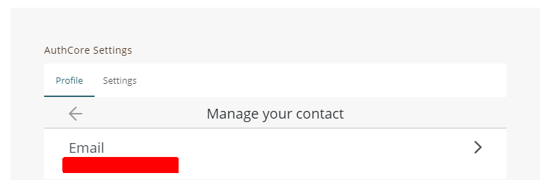

# Monthly Achievement

"Liker Land monthly report" delivers to those content creators who receive LikeCoin rewards for the month. And you are going to receive the report on e.g. August 1 for the month of July.

These are 2 circumstances that you do not receive your email report:

1. You switch off the "Receive email notification for LikeCoin transaction and news update", go to Settings [https://like.co/in/settings/others](https://like.co/in/settings/others) and turn it on.
2. You registered with a mobile number and did not provide any email address, please go to [https://like.co/in/settings/](https://like.co/in/settings/), on "AutoCore Settings" or "Liker ID Settings" click "Profile", then click "Contact". Add your email address and complete authentication, check out "[Securing my Liker ID - Confirm your email address](../liker-id/register/verifying-email-address.md#confirm-your-email-address)".

