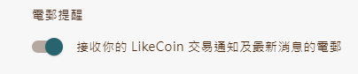
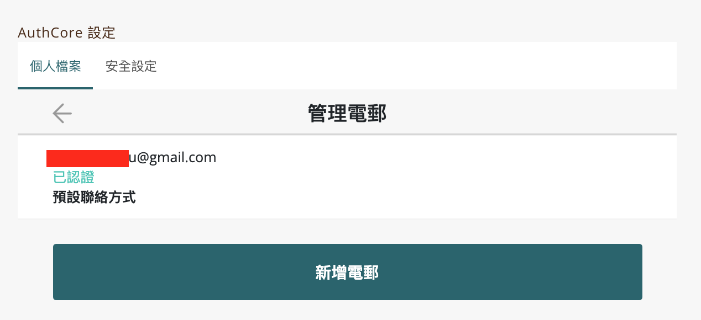

# 每月創作進度

「Liker Land 每月報告」電郵只會發給該月有收入的作者。例：你會在8月1日收到7月份的報告。

另有兩種情況，會導致收不到電郵報告：

* 你關閉了接收電郵選項。請訪問「Liker ID 設定」或 [https://like.co/in/settings/others](https://like.co/in/settings/others) 並打開電郵提醒。

<figure><figcaption></figcaption></figure>

* 你用了手機號碼註冊，沒有提供電郵地址。請訪問 [https://like.co/in/settings](https://like.co/in/settings) ，在「AuthCore 設定」或「Liker ID 設定」下點擊「個人檔案」，再點「聯絡方式」管理電郵部份，新增電郵地址並進行認證，詳見[保護你的 Liker ID 認證電郵地址](../liker-id/register/verifying-email-address.md#confirm-your-email-address)。

