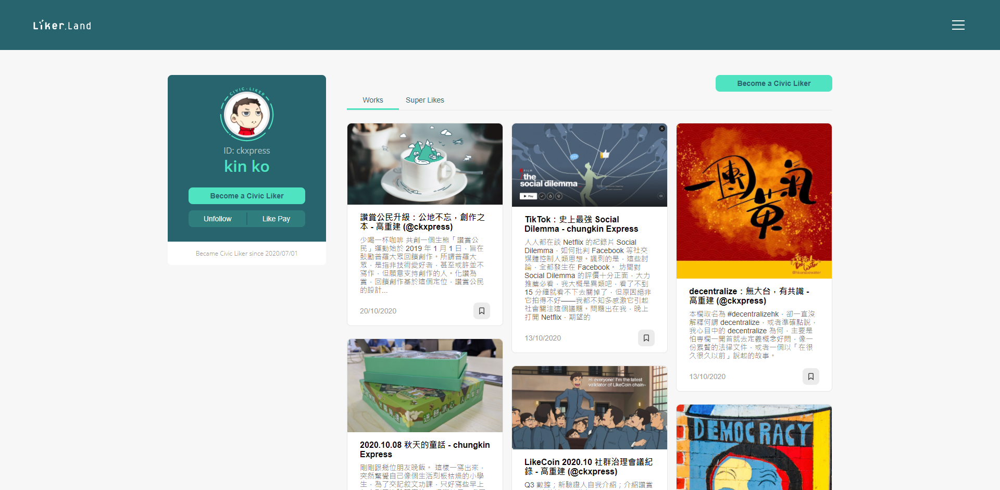

# Portfolio Page

## How to access your Portfolio Page

Portfolio Page helps user to share their reading history, The Portfolio Page url is https://liker.land/\[Your Liker ID\], if your [Liker ID](https://docs.like.co/user-guide/liker-id) is ckxpress, your link is going to be [https://liker.land/ckxpress](https://liker.land/ckxpress). 

## Personal Information

The left hand side of the Portfolio Page displays information of the user, including [Liker ID](https://docs.like.co/user-guide/liker-id), name and [creator pitch](https://docs.like.co/user-guide/creatortools/creators-pitch). If the user is a [Civic Liker](https://docs.like.co/user-guide/civic-liker), the date he/she started to be a Civic Liker and with the following functions:

* Become a Civic Liker - If Readers click on it and become a Civic Liker, the content creators can receive monthly support in LikeCoin. Read more about [Civic Liker](https://docs.like.co/user-guide/civic-liker). 
* Follow - Click and follow the user as a [Content Jockey](https://docs.like.co/user-guide/liker-land/superlike)
* [LIKE Pay](https://docs.like.co/guides/wallet/like-pay)－Transfer LikeCoin to the user

## Works

If the content creator [Super Liked his/her own works](https://docs.like.co/user-guide/liker-land/superlike), they will be displayed here. Content creators have to [be a Civic Liker](https://docs.like.co/user-guide/civic-liker/be-a-civic-liker) to Super Liker their own work and this action cannot earn LikeCoin.

## Super Likes

Super Likes history displayed all the other works and articles Super Liked by the user.

