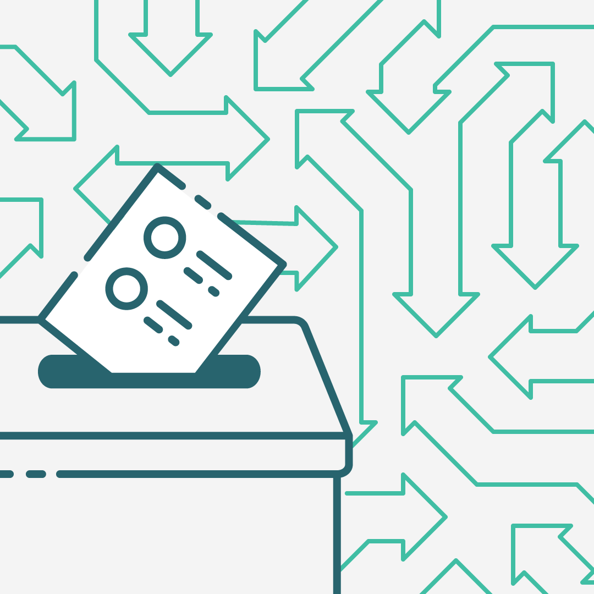

# Proposals

Proposals of the Republic of Liker Land recorded below:

## Proposal 1

Validator [Matters](https://matters.news/@likecoin/like-coin-chain-proposal-1-relaxing-validator-requirements-to-transform-like-coin-chain-to-a-permissionless-b-po-s-mechanism-bafyreienrrgu5a35wvgztutzjzl6hey5csqdhimukzrpxfp64xn223fi5q) raised the [1st proposal](https://likecoin.bigdipper.live/proposals/1) on Feb 8, 2020, and gathered 1,000,000 LikeCoin delegation on March 3 as deposit. There are 3 changes in this proposal:

1. To increase the number of active validators from 7 to 10.
2. To make validator permissionless. i.e. anyone may set up a server to nominate her/him/themselves as a validator of the LikeCoin chain.
3. To allow a range of commission rate between 40%-60%, set by a validator independently.

The proposal 100% passed on March 16.

## Proposal 2

[Proposal 2](https://likecoin.bigdipper.live/proposals/2) was raised by [NTUT](https://www.ntut.edu.tw/)'s representative [Ju-Chun Ko](https://matters.news/@dAAAb/like-coin-chain-proposal-2-increasing-the-number-of-active-validators-from-10-to-25-bafyreic2jaqtzaaql2dkauay5ogybtqy3tlltwzrj665ong2sg7uks7zsu) on June 17, 2020, consent to increasing the number of active validators from 10 to 25. The proposal 100% passed on July 8.

## Proposal 3

[Proposal 3](https://likecoin.bigdipper.live/proposals/3) was raised by [NTUT](https://www.ntut.edu.tw/) on July 10, 2020. This proposal is to make a decisive change to the node parameters according to Proposal 2, which is to update max validators number to 25. The proposal 100% passed on July 26.

