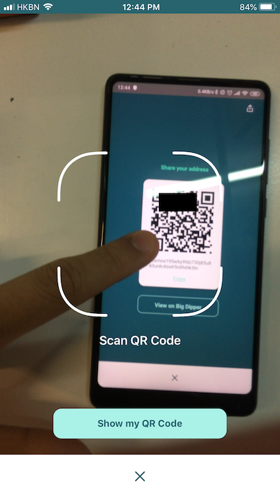

# LIKE pay

### **步驟一**

首先你需要安裝 [Liker Land 手機應用程式](https://liker.land/getapp)。我們暫時不支援在桌面電腦上瀏覽器操作轉帳。

### **步驟二**

打開手機應用程式後，選畫面右下角的帳戶頭像，再點上方「我的錢包」，打開你的錢包。點擊畫面上方的「LIKE pay」按鍵。

### **步驟三**

你可直接於「收款人的 Liker ID 或錢包地址」填上收款方的 Liker ID 或錢包地址。也可用掃描二維碼的方法：收款人先打開錢包，再點擊「收款」按鍵，展示錢包二維碼。然後你可以點擊下圖紅圈位置，調用照相機掃描收款人的錢包二維碼。

### **步驟四**

Liker Land 手機應用程式會打開你手機的相機鏡頭，請對著收款方的二維碼掃描。然後再按「下一步」。

### **步驟五**

某些交易所需要用戶在區塊鏈上加上 Tag/Memo，你可以在這個畫面「輸入 memo（可省略）」下方輸入內容，否則按「下一步」略過。

### **步驟六**

輸入要轉帳的金額，選「下一步」出現確認畫面，你可點擊「詳細資料」查看是次轉帳手續費的估算數值。請確定你的錢包在轉帳以外留有足夠手續費，再點擊「確認」 即可完成轉帳。

