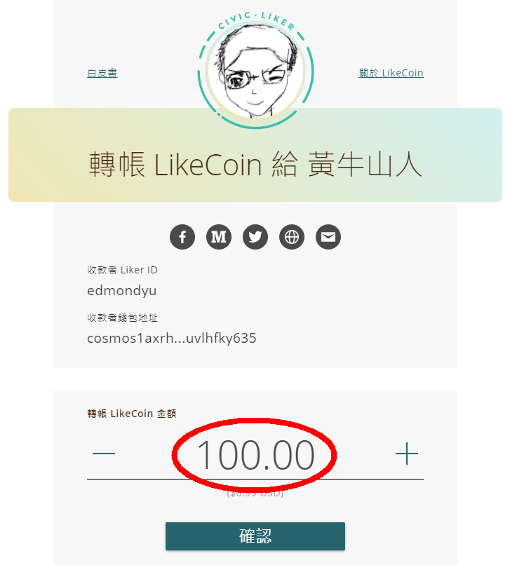

# LIKE pay

## 使用 Liker Land 手機應用程式轉帳 LikeCoin

### **步驟一**

首先你需要安裝並登入 [Liker Land 手機應用程式](https://liker.land/getapp)。

### **步驟二**

打開手機應用程式後，選畫面右下角的帳戶頭像，再點上方「我的錢包」，打開你的錢包。點擊畫面上方的「LIKE pay」。

### **步驟三**

你可直接於「收款人的 Liker ID 或錢包地址」填上收款方的 Liker ID 或錢包地址。也可用掃描二維碼的方法：收款人先打開錢包，再點擊「收款」，展示錢包二維碼。然後你可以點擊下圖紅圈位置，調用照相機掃描收款人的錢包二維碼。

### **步驟四**

Liker Land 手機應用程式會打開你手機的相機鏡頭，請對著收款方的二維碼掃描。然後再按「下一步」。

### **步驟五**

某些交易所需要用戶在區塊鏈上加上 Tag/Memo，你可以在這個畫面「輸入 memo（可省略）」下方輸入內容，否則按「下一步」略過。

### **步驟六**

輸入要轉帳的金額，選「下一步」出現確認畫面，你可點擊「詳細資料」查看是次轉帳[手續費](https://docs.like.co/v/zh/user-guide/likecoin-token/transaction-fee)的估算數值。請確定你的錢包在轉帳以外留有足夠手續費，再點擊「確認」 即可完成轉帳。

## 使用 Liker Land 網頁版轉帳 LikeCoin

### 步驟一

請先登入 [Liker Land 網頁版](https://docs.like.co/v/zh/user-guide/reader/download#liker-land-wang-ye-ban-httpslikerland)，並於[個人主頁](https://docs.like.co/v/zh/user-guide/creator/portfolio-page)點擊 LIKE pay。

### 步驟二

在轉帳頁面輸入需要轉帳的 LikeCoin 數量，再點擊「確認」 即可完成轉帳。


留意使用 Liker Land 網頁版轉帳並不會顯示手續費估算數值，轉帳前請確認你有足夠手續費完成此項操作。



你也可以使用 Keplr 錢包保存你的 LikeCoin，請參考文章[下一步的去中心化，可以用 keplr 来保存你的 LikeCoin 了](https://matters.news/@guanyun/%E4%B8%8B%E4%B8%80%E6%AD%A5%E7%9A%84%E5%8E%BB%E4%B8%AD%E5%BF%83%E5%8C%96-%E5%8F%AF%E4%BB%A5%E7%94%A8-keplr-%E6%9D%A5%E4%BF%9D%E5%AD%98%E4%BD%A0%E7%9A%84-like-coin-%E4%BA%86-bafyreifltlte6545fgx4mdjosaz2eoml2gypmtirnkt5ub4fdoxym6bzai)


