# 註冊及在 MyEthShop 交易

在  MyEthShop 買賣 LikeCoin 手續簡易，交易費用全免，網站界面友善，桌面及手機都通用。

### 步驟一：註冊 MyEthShop 帳號並通過實名認證

使用 [MyEthShop](https://www.myethshop.com/) 找換店的服務，必須先於 MyEthShop [開戶](https://www.myethshop.com/register)並通過實名認證。詳情可參考 MyEthShop 官方教學 [MyEthShop 開戶詳細說明](https://myethlabs.wordpress.com/2019/07/12/myethshop%e9%96%8b%e6%88%b6%e8%a9%b3%e7%b4%b0%e8%aa%aa%e6%98%8e/)。

### 步驟二：設定雙重認證

請參考 [MyEthShop雙重驗證\(2FA\)的設定教學](https://myethlabs.wordpress.com/2019/01/24/myethshop%e9%9b%99%e9%87%8d%e9%a9%97%e8%ad%892fa%e7%9a%84%e8%a8%ad%e5%ae%9a%e6%95%99%e5%ad%b8/)。

### 步驟三：找到 MyEthShop 帳戶的 LikeCoin 錢包地址

點「帳戶」鍵進入下方畫面，在上面綠色點擊「轉入」選 「LIKE」，又或者在一系列密碼貨幣當中選 LIKE 再點擊藍色「轉入」傳 LikeCoin 到 MyEthshop 以便賣出。你亦可以選「HKD」存入港幣買進 LikeCoin

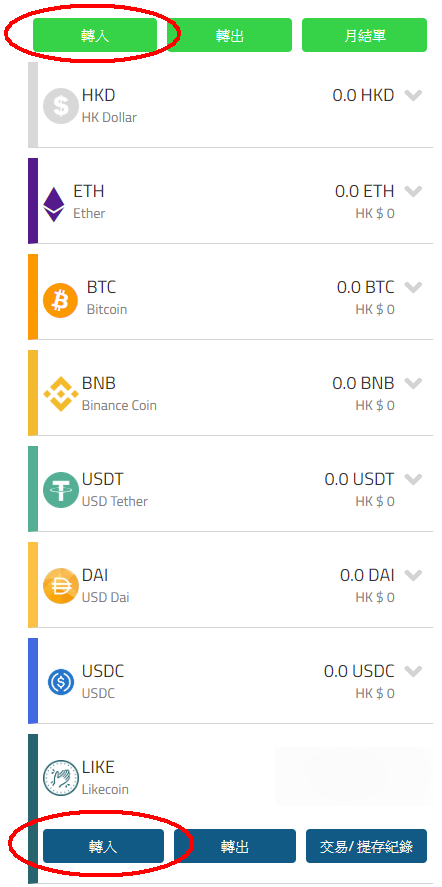

在 LIKE 點擊「轉入」 後會出現以下警告，由於 MyEthShop  仍然支援舊版 LikeCoin ERC-20 交易故有此提示，點擊「我知道了」

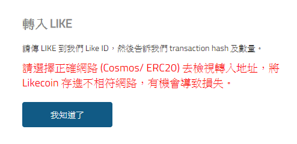

接下來畫面的上半部份會出現下圖的二維碼、cosmos 開始的一串長長的地址及 Liker ID myethshop，那便是 MyEthShop 的 LikeCoin 錢包地址。

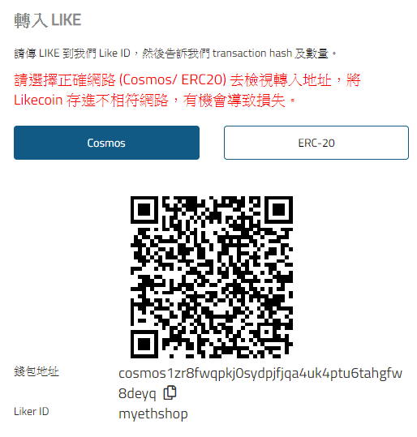

### 步驟四：轉帳 LikeCoin 到 MyEthShop

打開 [Liker Land 手機應用程式](https://like.co/in/getapp)，在畫面右下角選錢包介面，你會在這裡查到自己的 LikeCoin 結餘。點畫面上的「轉帳」 / \[Send\] 鍵（下圖紅圈位置）

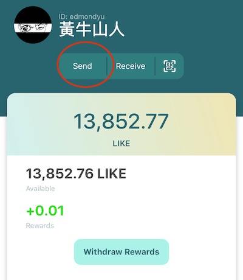

進入下一頁後，點下圖紅圈位置的二維碼圖示。app 會跳進照相機介面讓你掃描二維碼，請掃描【步驟三】中 MyEthShop 的 LikeCoin 錢包二維碼，或可直接於 \[Enter receiver address\] 填上收款方 MyEthShop 的錢包地址或 Liker ID myethshop

輸入你想要轉帳的 LikeCoin 金額，然後點擊「確認」 / \[Confirm\]

轉帳指示已發出並於兩分鐘即可到帳，按下來我們要通知 MyEthShop 轉帳已達。

### 步驟五：複製哈希 Transaction Hash / TXID

回到 Liker Land 手機應用程式錢包介面，往下點擊 \[View on Big Dipper\]

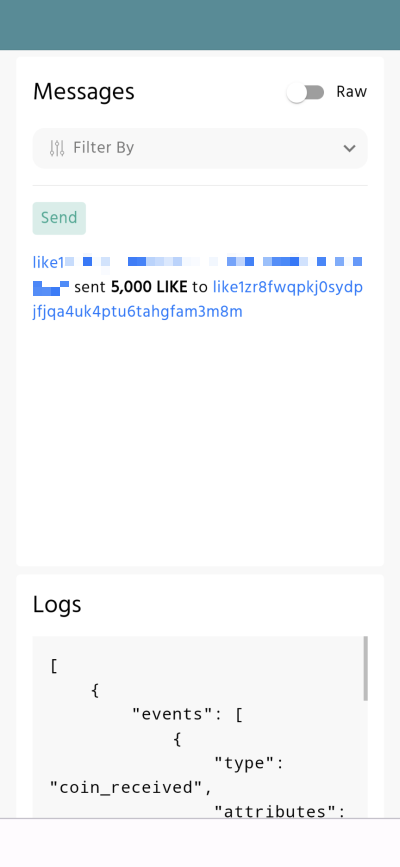

會跳出畫開啟瀏覽器顯示 [北斗 Big Dipper](https://docs.like.co/v/zh/user-guide/likecoin-chain/big-dipper) 內容，\# 號開始的就是哈希 Transaction Hash / TXID，並說明從你的錢包地址轉帳到 MyEthshop 的錢包 cosmos1zr8fwqpkj0sydpjfjqa4uk4ptu6tahgfw8deyq。按哈希打開交易明細，並複製哈希地址

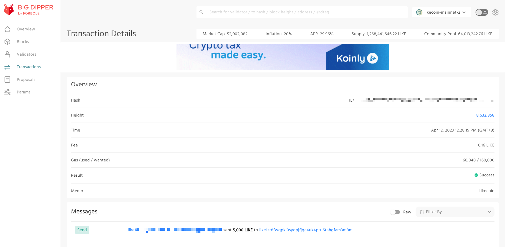

假如在手機開啟北斗時出現問題，你亦可使用桌面電腦，打開北斗網站 [https://likecoin.bigdipper.live/](https://likecoin.bigdipper.live/) 並輸入你的錢包地址，同樣可以查看交易內容。

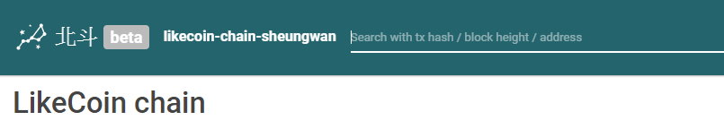

### 步驟六：填寫哈希及確認 MyEthShop 收款

回到【步驟三】MyEthShop 網站轉入 LIKE 畫面，填寫哈希  Transaction Hash / TXID 及轉入金額，再點擊「轉入」

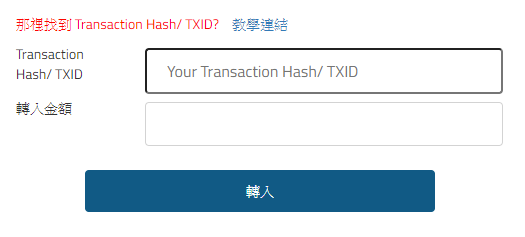

接下來便要等 MyEthShop 確認收款了。點選「帳戶」再點擊「交易/提存紀錄」可查看 LikeCoin 是否經已成功轉入，你亦會收到來自 MyEthShop 的確認電郵。

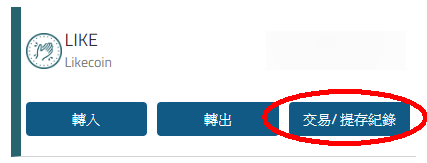

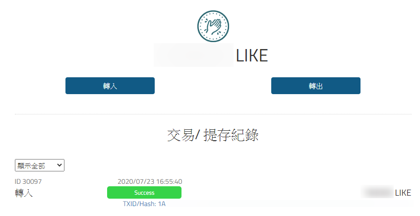

### 步驟七：選個好價錢買入/賣出

點選「交易」，在畫面左上角選取「LIKE/HKD」，顯示價格會定時跳動報告即時賣出/買入價。看準價格，點擊「出售」，輸入「數量」再點擊「下單」即可售出 LikeCoin。同理，點擊「購買」即可以港幣購入 LikeCoin

至於「市價盤」與「限價盤」的分別在於「市價盤」是以即時賣出/買入價操作。而限價盤可讓你在「價格」一欄輸入心儀賣出/買入價，系統自動於指定價格為你賣出/買入。你可以在下方的「LIKE/HKD PRICE」圖表參看 LIKE/HKD 價格走勢以作決定

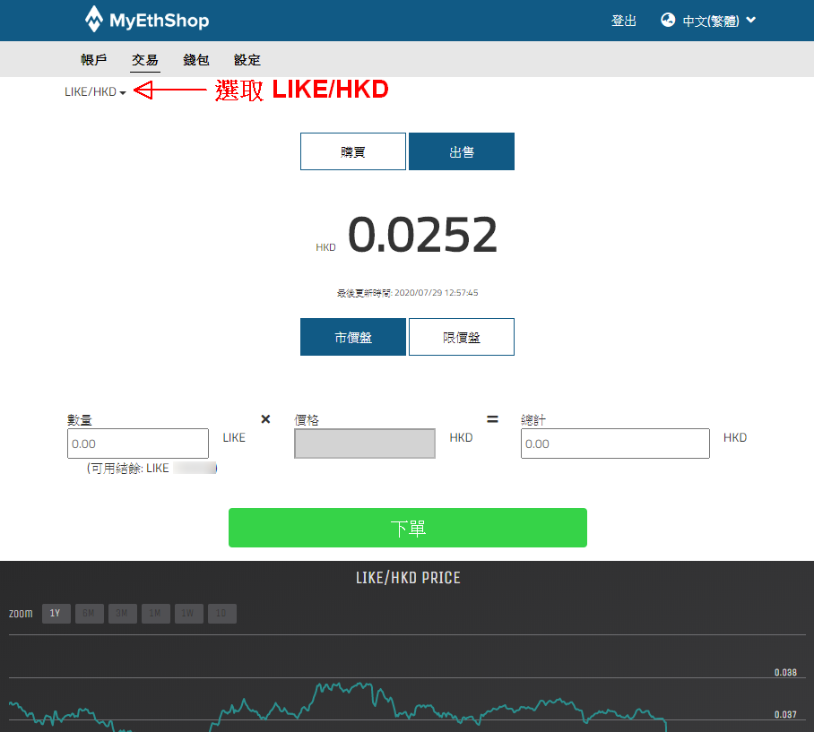

#### MyEthShop 官方教學

> [MYETHSHOP限價盤交易詳細說明
](https://myethlabs.wordpress.com/2019/07/16/myethshop%e9%99%90%e5%83%b9%e7%9b%a4%e4%ba%a4%e6%98%93%e8%a9%b3%e7%b4%b0%e8%aa%aa%e6%98%8e/)

成功賣出後可進行提幣/提款流程，傳帳到你的 LikeCoin 錢包或銀行戶口。你亦可以隨時查看「交易/提存紀錄」了解進度。

#### MyEthShop 官方教學

> [MYETHSHOP港幣轉出詳細說明
](https://myethlabs.wordpress.com/2019/07/17/myethshop-3/)

#### 參考文章

> [全新 LikeCoin chain 版本：LikeCoin 兌換港幣 MyEthShop 全攻略
](https://medium.com/internet-meme/likecoin-chain-myethshop-715afcbfa03f)

### 如有疑難，聯絡 MyEthShop 客服

若你在開戶或任何交易所服務的過程中遇到困難，請參考 [MYETHLABS 實用秘技](https://myethlabs.wordpress.com/category/%e5%af%a6%e7%94%a8%e7%a7%98%e6%8a%80/) 或直接以 Facebook、Whatsapp 或電郵聯絡 MyEthShop 客服，詳情見 [MyEthShop 網頁](https://www.myethshop.com/) 右下角。

