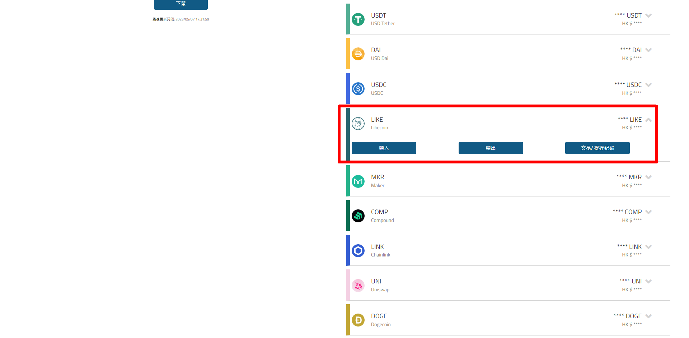
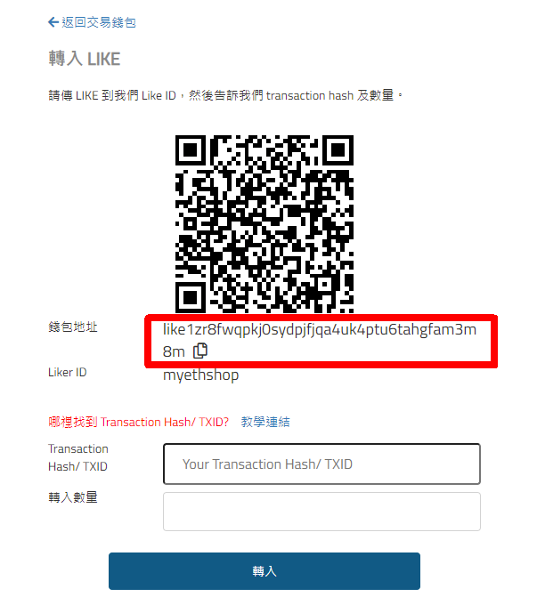
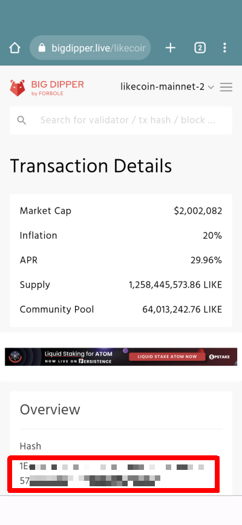
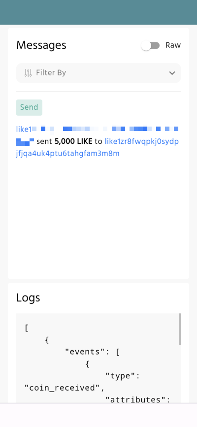

# 註冊及在 MyEthShop 交易

在  MyEthShop 買賣 LikeCoin 手續簡易，交易費用全免，網站界面友善，桌面及手機都通用。

### 步驟一：註冊 MyEthShop 帳號並通過實名認證

使用 [MyEthShop](https://www.myethshop.com/) 找換店的服務，必須先於 MyEthShop [開戶](https://www.myethshop.com/register)並通過實名認證。詳情可參考 MyEthShop 官方教學 [MyEthShop 開戶詳細說明](https://myethlabs.wordpress.com/2019/07/12/myethshop%e9%96%8b%e6%88%b6%e8%a9%b3%e7%b4%b0%e8%aa%aa%e6%98%8e/)。

### 步驟二：設定雙重認證

請參考 [MyEthShop雙重驗證\(2FA\)的設定教學](https://myethlabs.wordpress.com/2019/01/24/myethshop%e9%9b%99%e9%87%8d%e9%a9%97%e8%ad%892fa%e7%9a%84%e8%a8%ad%e5%ae%9a%e6%95%99%e5%ad%b8/)。

### 步驟三：找到 MyEthShop 帳戶的 LikeCoin 錢包地址

點「帳戶」鍵進入下方畫面，請在「轉入」部份選 「LIKE」，又或者在一系列密碼貨幣當中點擊 LIKE 再點擊「轉入」

會出現以下警告，由於 MyEthShop  仍然支援舊版 LikeCoin ERC-20 交易故有此提示，點擊「我知道了」

接下來畫面的上半部份會出現下圖的二維碼、cosmos 開始的一串長長的地址及 Liker ID myethshop，那便是 MyEthShop 的 LikeCoin 錢包地址。

### 步驟四：轉帳 LikeCoin 到 MyEthShop

打開 [Liker Land 手機應用程式](https://like.co/in/getapp)，在畫面右下角選錢包介面，你會在這裡查到自己的 LikeCoin 結餘。點畫面上的「轉帳」 / \[Send\] 鍵（下圖紅圈位置）

進入下一頁後，點下圖紅圈位置的二維碼圖示。app 會跳進照相機介面讓你掃描二維碼，請掃描【步驟三】中 MyEthShop 的 LikeCoin 錢包二維碼，或可直接於 \[Enter receiver address\] 填上收款方 MyEthShop 的錢包地址或 Liker ID myethshop

輸入你想要轉帳的 LikeCoin 金額，然後點擊「確認」 / \[Confirm\]

轉帳指示已發出並於兩分鐘即可到帳，按下來我們要通知 MyEthShop 轉帳已達。

### 步驟五：複製哈希 Transaction Hash / TXID

回到 Liker Land 手機應用程式錢包介面，往下點擊 \[View on Big Dipper\]。

會跳出畫開啟瀏覽器顯示 [北斗 Big Dipper](https://docs.like.co/v/zh/user-guide/likecoin-chain/big-dipper) 內容，\# 號開始的就是哈希 Transaction Hash / TXID，並說明從你的錢包地址轉帳到 MyEthshop 的錢包 cosmos1zr8fwqpkj0sydpjfjqa4uk4ptu6tahgfw8deyq。按哈希打開交易明細，並複製哈希地址

假如在手機開啟北斗時出現問題，你亦可使用桌面電腦，打開北斗網站 [https://likecoin.bigdipper.live/](https://likecoin.bigdipper.live/) 並輸入你的錢包地址，同樣可以查看交易內容。

### 步驟六：填寫哈希及確認 MyEthShop 收款

回到【步驟三】MyEthShop 網站轉入 LIKE

接下來便要等 BitAsset 那邊確認收款了。

