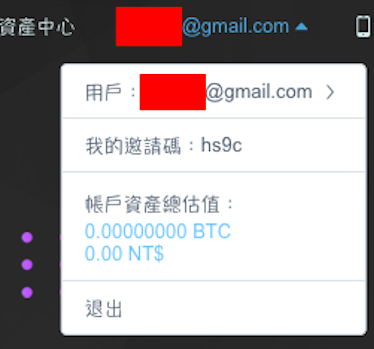
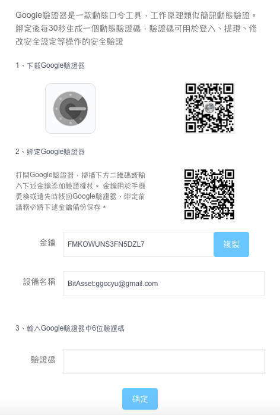

# 註冊 BitAsset 帳號

想買賣 LikeCoin，首先得註冊一個交易所帳號，申請過程需要些許時間，但只需經歷一次，便一勞永逸了。

以下是註冊 BitAsset 帳號的步驟，請點擊此[連結](https://www.bitasset.com/reg)，或到 BitAsset 網站點擊註冊。

### 步驟一：確認密碼，及電子郵箱或手機號碼 

請輸入電子郵件信箱、自選密碼及邀請碼（可選填）。你也可以選擇用手機號註冊，見下圖紅圈位置

成功驗證郵件地址後，會回到 BitAsset 交易所的首頁。點擊右上角你的電郵地址

然後你會跳進至「個人訊息」頁面。

### 步驟二：基礎及高級認證 

若你是非中國大陸用戶，必需一併完成基礎及高級認證。

請在「個人訊息」頁面的上方，點擊「基礎認證」

你會見到以下的弓彈出視窗。請注意，這裡的「用戶名」是指在你的證件上的**姓名**。

輸入資料後，點擊「下一步」，會彈出以下視窗，要求上載身份證正、反兩面，及一張手持身份證和一張寫上指定資料的紙張

身份證的正反兩面應該不難處理，要特別留意的是第三項「手持身份證及紙條合照」這一項。看看以下這位朋友的示範：

提交文件後，請耐心等候 BitAsset 官方批核，一般需要一至兩個工作天。

#### BitAsset 官方教學

> [如何进行实名认证（KYC）？
](https://bitasset.zendesk.com/hc/zh-cn/articles/360011731332-%E5%A6%82%E4%BD%95%E8%BF%9B%E8%A1%8C%E5%AE%9E%E5%90%8D%E8%AE%A4%E8%AF%81-KYC-)

### 步驟三：手機驗證及 Google 驗證 

完成高級認證後，基本上已能用大部份交易所功能了。但為了安全性起見，強烈建議你完成 Google 驗證。畫面上已有詳細的指示，你需要用手機下載  Google Authenticator 應用程式。

[安卓版下載鏈結](https://play.google.com/store/apps/details?id=com.google.android.apps.authenticator2&hl=zh_TW)  
[蘋果版下載鏈結](https://apps.apple.com/hk/app/google-authenticator/id388497605)

#### BitAsset 官方教學

> [如何設定Google 驗證器?](https://bitasset.zendesk.com/hc/zh-tw/articles/360018687671-%E5%A6%82%E4%BD%95%E8%A8%AD%E5%AE%9AGoogle-%E9%A9%97%E8%AD%89%E5%99%A8-)

### 如有疑難，聯絡 BitAsset 客服

若你在開戶或任何交易所服務的過程中遇到困難，請參考 [BitAsset 常見問題（繁體中文）](https://bitasset.zendesk.com/hc/zh-tw/categories/360000754651-%E5%B8%B8%E8%A6%8B%E5%95%8F%E9%A1%8C)、[BitAsset 常见问题（简体中文）](https://bitasset.zendesk.com/hc/zh-cn/categories/360000754651-%E5%B8%B8%E8%A7%81%E9%97%AE%E9%A2%98)或直接聯絡 BitAsset 客服。點擊 BitAsset 畫面右下角藍色的對話圖示即可獲得支援。

