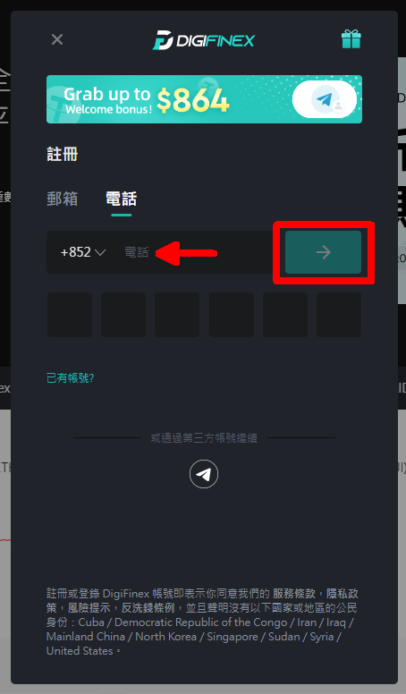
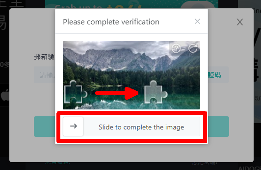

# 註冊 DigiFinex 帳號

在 DigiFinex 買賣 LikeCoin，請先註冊帳號。請到 [DigiFinex 網站](https://www.digifinex.com/)並按以下步驟註冊：

### 步驟一：確認密碼，及電子郵箱或手機號碼 

於網站右上角，按註冊


留意你必須承諾不是來自美國或新加玻用戶


請輸入電子郵件信箱、自定登錄密碼及邀請碼（可選填）。你也可以選擇使用手機註冊（下圖紅圈位置）

留意無論你使用電郵或手機註冊，你也必須要先按「發送」（上面箭咀位置），並完成安全認證，方可取得驗證碼 。在電郵或手機收取驗證碼後，按「提交」，帳號便會即時開立。在接下來的開戶步驟中，你必須要經常收取驗證碼進行驗證，而驗證碼只有十分鐘使用時限，故此請確保閣下在網絡環境穩定時才進行註冊

成功開戶後，會回到 DigiFinex 交易所的首頁。點擊右上角的人像，進入用戶中心

然後會跳進至「基本訊息」頁面，你必須要進行身份證認及雙重驗證方向使用 DigiFinex 的服務

#### DigiFinex官方教學

> [【新手教程】- 如何注册帐号
](https://digifinex.zendesk.com/hc/zh-cn/articles/360006576493-%E5%A6%82%E4%BD%95%E6%B3%A8%E5%86%8C%E5%B8%90%E5%8F%B7)

### 步驟二：身份認證 

在「基本訊息」頁面的雙重驗證欄按「未認證」，出現下圖，按「下一步」

若你是非中國大陸用戶，必需一併完成基礎及高級認證

請在「個人訊息」頁面的上方，點擊「基礎認證」

你會見到以下的彈出視窗。請注意，這裡的「用戶名」是指在你的證件上的**姓名**

輸入資料後，點擊「下一步」，會彈出以下視窗，要求上載身份證正、反兩面，及一張手持身份證和一張寫上指定資料的紙張

身份證的正反兩面應該不難處理，要特別留意的是第三項「手持身份證及紙條合照」這一項。看看以下這位朋友的示範：

提交文件後，請耐心等候 BitAsset 官方批核，一般需要一至兩個工作天。

#### DigiFinex 官方教學

> [如何进行实名认证](https://www.digifinex.com/zh-cn/school/course/KC000038.html?topic=ZT000002)

### 步驟三：手機驗證及 Google 驗證 

你必須要設定雙重驗證碼否則將不能提幣，請使用手機下載  Google Authenticator 應用程式

[安卓版下載鏈結](https://play.google.com/store/apps/details?id=com.google.android.apps.authenticator2&hl=zh_TW)  
[蘋果版下載鏈結](https://apps.apple.com/hk/app/google-authenticator/id388497605)

在「基本訊息」頁面的雙重驗證欄按「未認證」，出現下圖，按「下一步」

以 Google Authenticator 掃描頁面中的二維碼，再按「下一步」

按「發送」獲取驗證碼，並填寫從 Google Authenticator 獲得的 6 位雙重驗證碼，再按「開啟」。假如你希望在登入時也使用雙重驗證，可選取「雙重驗證碼用於登錄」選項。否則你也可以在「安全中心」的「雙重驗證」設定該選項

#### DigiFinex官方教學

> [【谷歌验证】- 如何开启谷歌验证](https://digifinex.zendesk.com/hc/zh-cn/articles/360007869553--%E8%B0%B7%E6%AD%8C%E9%AA%8C%E8%AF%81-%E5%A6%82%E4%BD%95%E5%BC%80%E5%90%AF%E8%B0%B7%E6%AD%8C%E9%AA%8C%E8%AF%81)

> [【谷歌验证】- 开启谷歌验证有什么作用？
](https://digifinex.zendesk.com/hc/zh-cn/articles/360000511061-%E5%BC%80%E5%90%AF%E5%8F%8C%E9%87%8D%E9%AA%8C%E8%AF%81%E6%9C%89%E4%BB%80%E4%B9%88%E4%BD%9C%E7%94%A8-)

### 如有疑難，聯絡 DigiFinex 客服

若你在開戶或任何交易所服務的過程中遇到困難，請參考 [DigiFinex 幫助中心](https://digifinex.zendesk.com/hc/zh-cn)或直接聯絡 DigiFinex 客服。點擊 DigiFinex 網站畫面右下角綠色的對話圖示即可獲得支援。

